# Lecture 11: Edge linking and line detection

How to describe those edges mathematically.
- search for long straight lines


Edge Linking
- Connect edges with similar orientation

Edge searching
- Start with edge pixels and correspond M(x,y) a(x,y)
- locates a boundary box around that pixel (window) 


Find neighbor pixels
- Link pixels if the difference in magnitude is beyond some threshold
- And same for angle

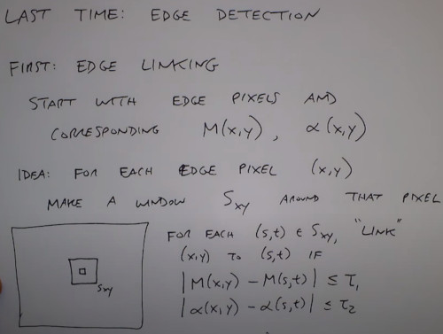

Boundary Following
- We have edge points around a closed contour 
- 
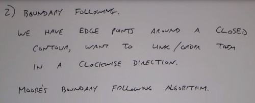

Moore's algorithm for Boundary following
0. Initial position: 1 = Edge position, 0=None
1. Let the starting point b0 be the uppermost, leftmost point labeled '1'
2. Let c0 be the left neighbor of b0

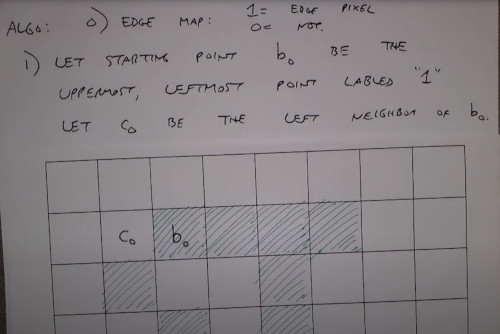

3. Examine the 8 Neighbors of b0, starting at c0 and going clockwise
4. Let b1 be the first pixel labeled 1, and c1 be the preceding 0.

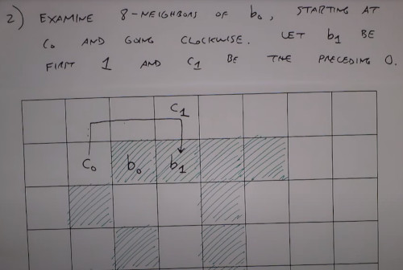

5. Repeat the process of updating b and c

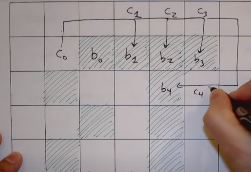

6. Continue until arrival starting point AND you start repeating the pattern. b=b0 & next = b1

![] (moore_algorithm_4.jpeg)

8. The ordered list of 'b' is the boundary
9. Collect the chain code

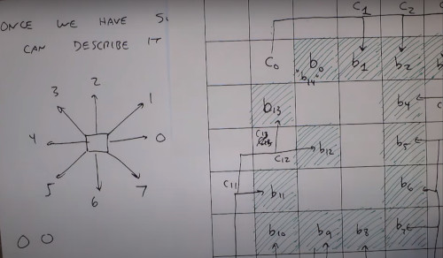

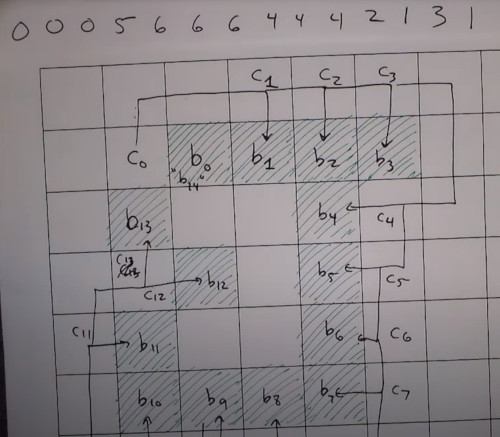

Issues of the chain code. (same shape)
- The starting point change changes the sequence order
- The order of direction can be 90º degrees rotated from the other code.
- So its not invariant to rotation nor translations

To be able to match shapes of different orientations we can 
1. order the chain code so it always start with the minimum magnitude integer.
  (so shift the list until start with 0)
2. Just encode the difference between directions 
  (relative vs absolute) 

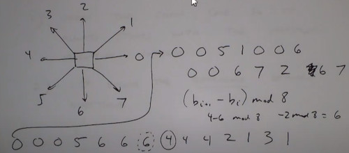

```
%matlab
bwtraceboundary
```

Note. Derivative <-> Code invariance

### Polygon fitting algorithm
- instead of following indivual pixels, we want to match pixels with a parametrized line
- Convert from RGB to vector image

First Approach: Connect the dots

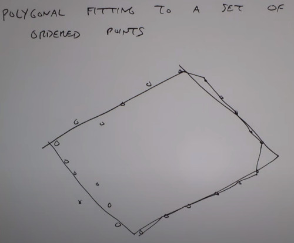

Algorithm:
- P: Sequence or ordered distinct points (ie. ordered edges after boundary following)
- Specify 2 starting points A, B, 
  -  if the curve is open, A,B are the natural endopoints
  -  if the curve is closed,  A,B are the left and rightmost points
- Specify a threshold T (pixel distance), how close every point is going to have to be to one of these boundary lines.

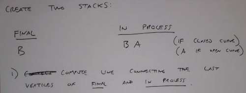

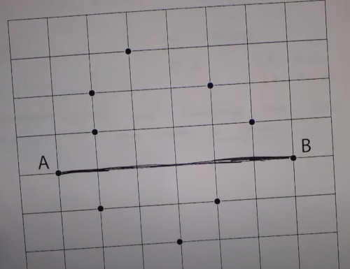

Now compute the distances, from this line to all the vertices
- Select the vertex further away

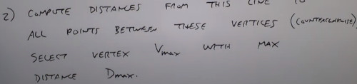

Stack that point if its above the threshold

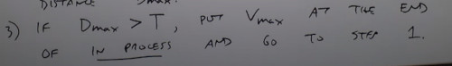

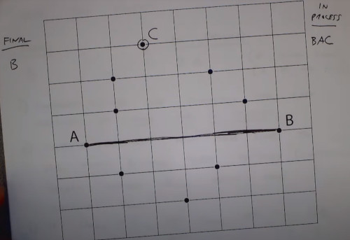

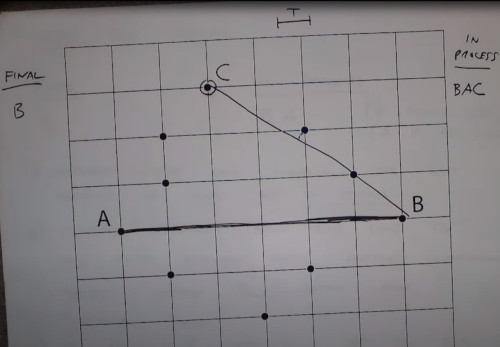

Otherwise, remove the last vertex from 'in process' stack, and make it the last vertex of the 'final' stack.

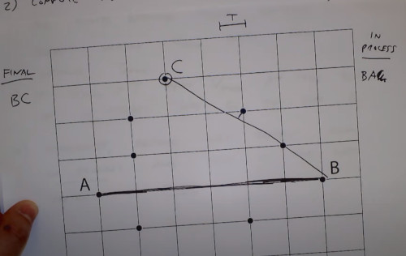

If 'in process' not empty go step 1, else done.
- vertices in my final list are the ordered vertices of my polygon


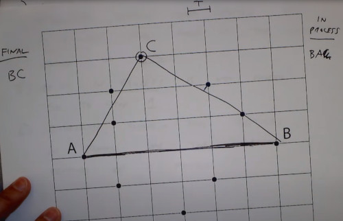

Now you have to connect from B to A, but its already drawed (same line as A to B but the other direction)

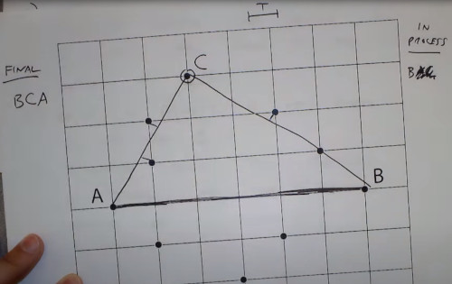

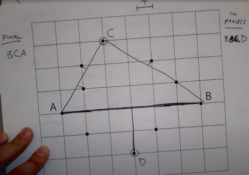

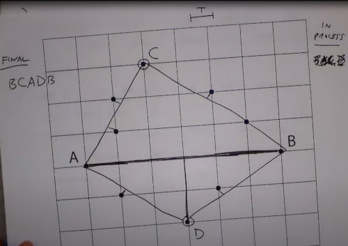

If you choose a Threshold T small, then you end up connecting all points.

### Other methods. for connecting dots into smooth curves
Cubic B Splines
Splines families
Other extensions.

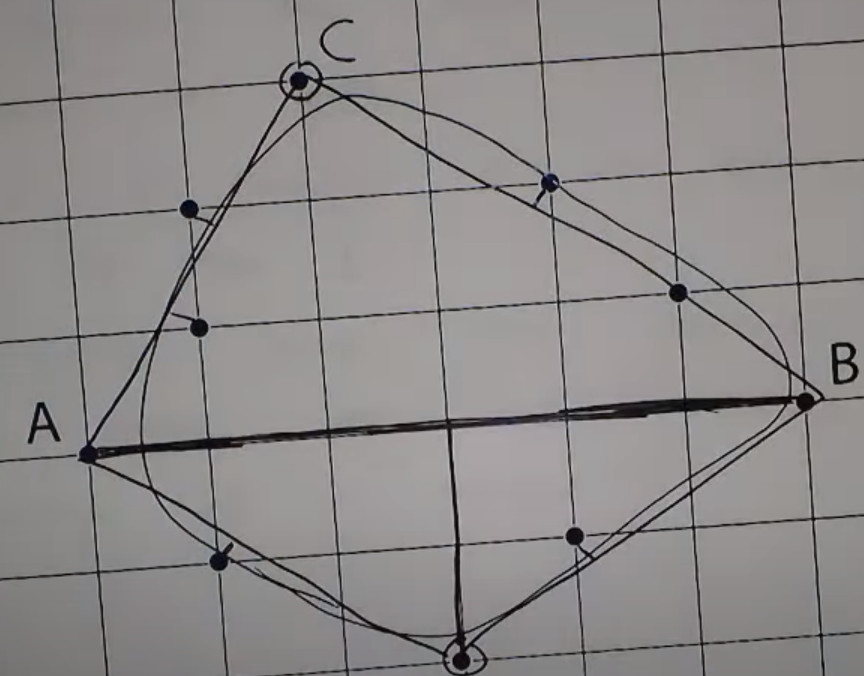

Limitations, only works for closed lines, it doesn't fill the gaps
- See next lecture (morphological image cross)
- or extra blobs
- Require some pre-processing

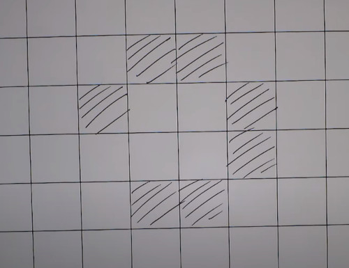

you don't want to mess arround jumping 3 pixels ahead or you will end connecting everything


