https://www.youtube.com/watch?v=_con6DnhkaA&list=PLuh62Q4Sv7BUf60vkjePfcOQc8sHxmnDX&index=11
# Lecture 11: Edge linking and line detection

How to describe those edges mathematically.
- search for long straight lines


Edge Linking
- Connect edges with similar orientation

Edge searching
- Start with edge pixels and correspond M(x,y) a(x,y)
- locates a boundary box around that pixel (window) 


Find neighbor pixels
- Link pixels if the difference in magnitude is beyond some threshold
- And same for angle


Boundary Following
- We have edge points around a closed contour 


Moore's algorithm for Boundary following
0. Initial position: 1 = Edge position, 0=None
1. Let the starting point b0 be the uppermost, leftmost point labeled '1'
2. Let c0 be the left neighbor of b0


3. Examine the 8 Neighbors of b0, starting at c0 and going clockwise
4. Let b1 be the first pixel labeled 1, and c1 be the preceding 0.


5. Repeat the process of updating b and c


6. Continue until arrival starting point AND you start repeating the pattern. b=b0 & next = b1

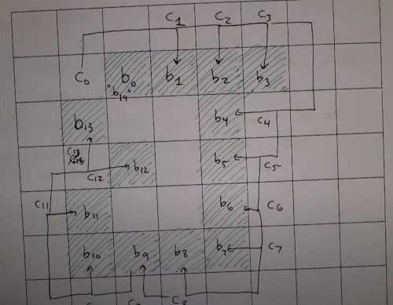

8. The ordered list of 'b' is the boundary
9. Collect the chain code


Issues of the chain code. (same shape)
- The starting point change changes the sequence order
- The order of direction can be 90º degrees rotated from the other code.
- So its not invariant to rotation nor translations

To be able to match shapes of different orientations we can 
1. order the chain code so it always start with the minimum magnitude integer.
  (so shift the list until start with 0)
2. Just encode the difference between directions 
  (relative vs absolute) 


```
%matlab
bwtraceboundary
```

Note. Derivative <-> Code invariance

### Polygon fitting algorithm
- Find triangles, rectangles, polygons in the picture
- instead of following indivual pixels, we want to match pixels with a parametrized line
- Convert from RGB to vector image

First Approach: Connect the dots


Algorithm:
- P: Sequence or ordered distinct points (ie. ordered edges after boundary following)
- Specify 2 starting points A, B, 
  -  if the curve is open, A,B are the natural endopoints
  -  if the curve is closed,  A,B are the left and rightmost points
- Specify a threshold T (pixel distance), how close every point is going to have to be to one of these boundary lines.


Now compute the distances, from this line to all the vertices
- Select the vertex further away


Stack that point if its above the threshold


Otherwise, remove the last vertex from 'in process' stack, and make it the last vertex of the 'final' stack.


If 'in process' not empty go step 1, else done.
- vertices in my final list are the ordered vertices of my polygon

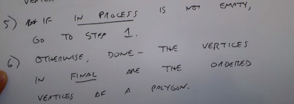


Now you have to connect from B to A, but its already drawed (same line as A to B but the other direction)


If you choose a Threshold T small, then you end up connecting all points.

### Other methods. for connecting dots into smooth curves
Cubic B Splines
Splines families
Other extensions.


Limitations, only works for closed lines, it doesn't fill the gaps
- See next lecture (morphological image cross)
- or extra blobs
- Require some pre-processing


you don't want to mess arround jumping 3 pixels ahead or you will end connecting everything

### Fitting straigth lines
- its easy to do with previous algorithm when there's one line.
- What if there are multiple lines?
- Or many edge pixels not on any line.

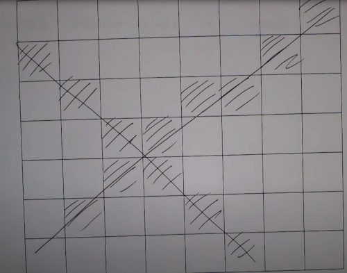


### The Hough Transform
- Each possible line through and edge pixel can be represented as an equation
- y = mx+b, except you cannot draw a vertical line at x=0
- you can do instead is describing as x cos(theta) + y sin(theta) = rho
- Rho how far away is your pixel from the center of the image

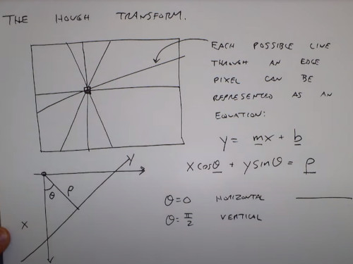

A single edge point (x1,y1), could belong to many possible lines in the (theta, rho) plane
- piece of cosine

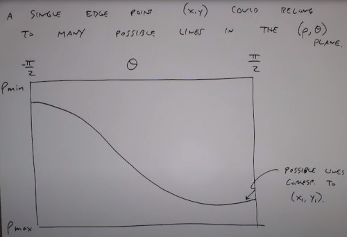

Now i add another point (x2, y2)
- I have another set of curves
- The crossing point between the 2 plots is the line who connects those points.

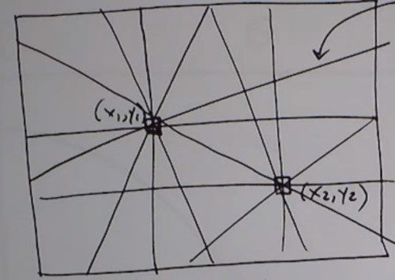

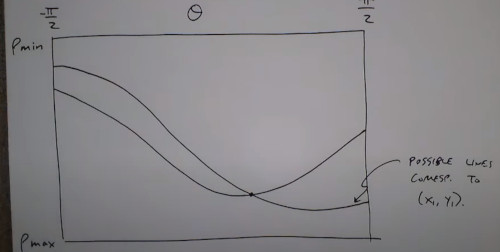

Algorithm
1. Detect Edge points (binary image)
2. Subdivision of the (rho, theta) plane
3. For each edge point, increment the corresponding (rho, theta) cell by +1
4. Look for (rho, theta) cells with large pixel counts (voting peaks)
5. Select highest peaks
6. Map The corresponding (rho, theta) points into lines in the (x,y) plane

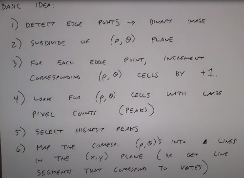

```
%matlab
[H, theta, rho] = hough(bw)
peaks = houghpeaks(H, num_peaks)
lines = houghlines(BW, theta, rho, peaks)
```

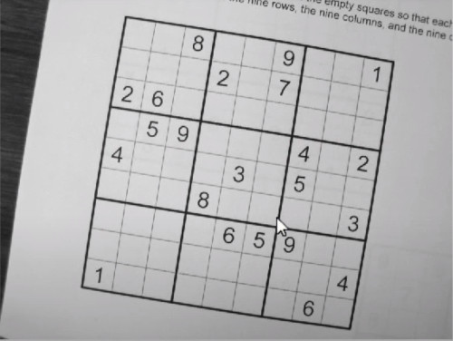

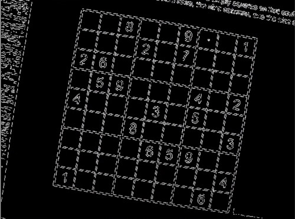

Sudoku's Numbers acts as a clutter

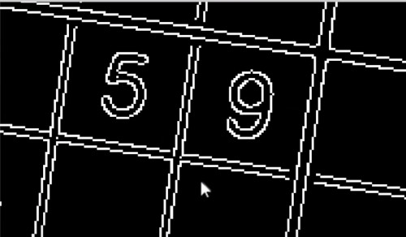

Hough array plane (theta, rho)

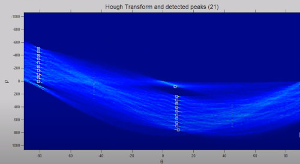

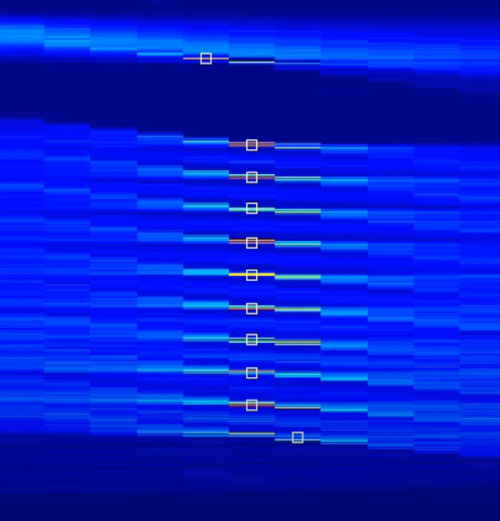

Best scenario
- There's nothing else in the image that is distracting me from finding these lines
- You have to find the right threshold

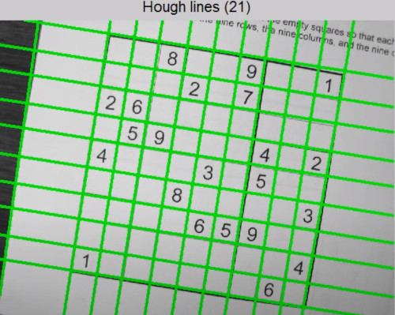

Another example
- you can start reasoning in the geometry of objects
- Or the camera who took the photo

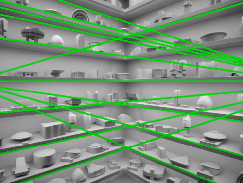

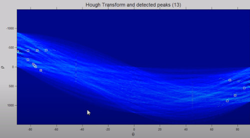

if i threshold for the lines that i missed
- things are starting to get a little bit crazy
- You can do some post-processing

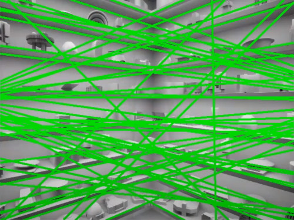


Another example
- Why didn't it pick up that long line of the building?
- Because you are searching literally for straight lines
- you can still filter by some orientation

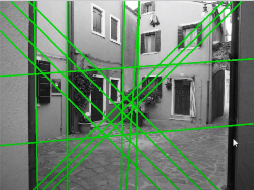

Through a low pass filter (LoG) you can improve the hough detector.

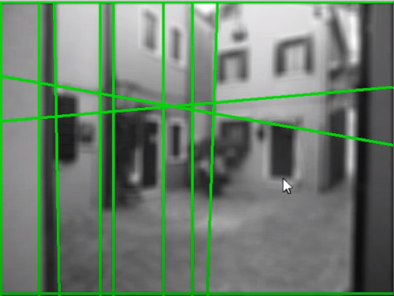

(Next time, morphological operations)
