# Lecture 12: Thresholding
- Image segmentation
- How to separate foregroud from background


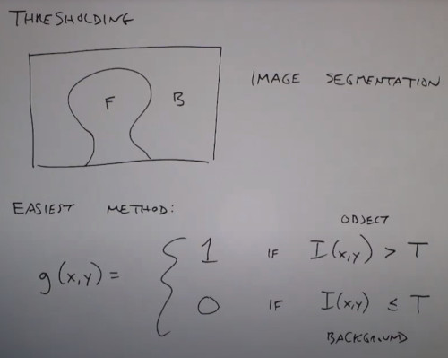

If the foreground is dark you can threshold it

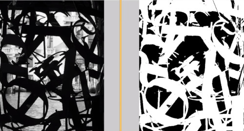

If the background image has a different brightness from the foreground you can threshold from histogram

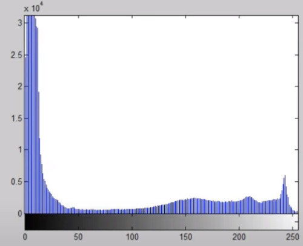

How to automatically select the threshold.
How to automatically fill the holes in the foreground (morphological image processing)

The idea is to separate / classify the brightness into 2 groups
- The quality of the processing relies on the quality of the histogram

- 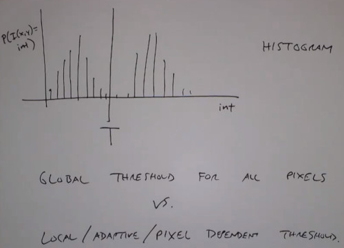

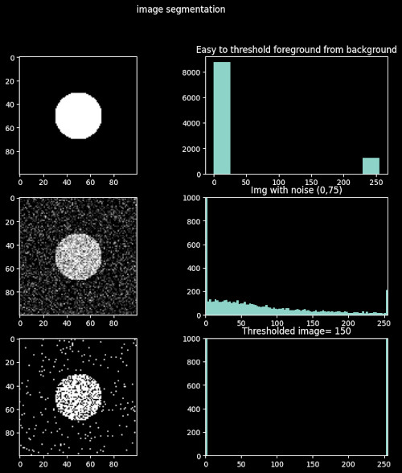

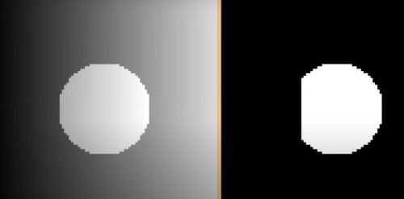

So this is an argument for local thresholding.

Global Thresholding
- Assume you are using the same threshold T for the whole image.
- How to find the best threshold?

Otsu's algorithm
- Split the image of the image into 2 classes
- Choose a threshold, that makes those classes the most separated as possible
Maximize the between-class variance
- A good threshold should separate pixels into tight clusters

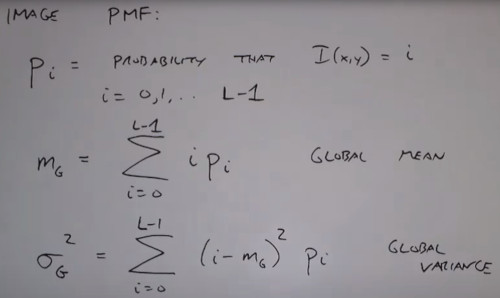

Those pixels above/below the threshold

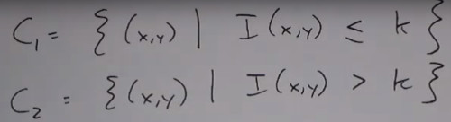

Probability of each class

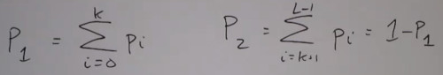

Mean and variance for each class

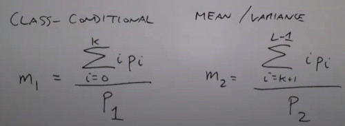

Otsu's criterion is to maximize the between class variance:

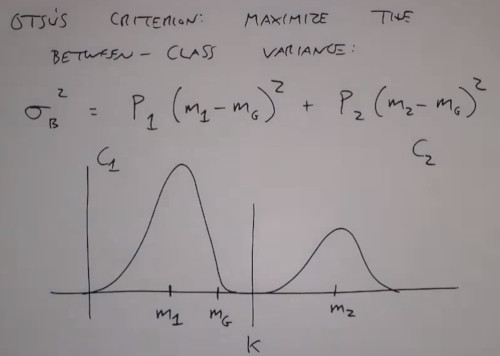

So look at the ratio of variance as a measure of separability
- Higher ratio means more separable

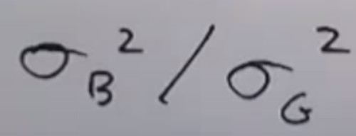

In practice we just consider all possible K and choose T as the k that maximizes variance

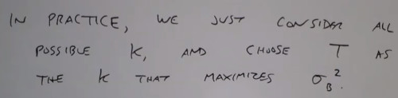

```
%matlab
graythresh
```

Original Image:

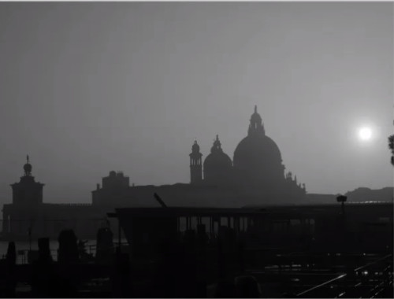

Background mask

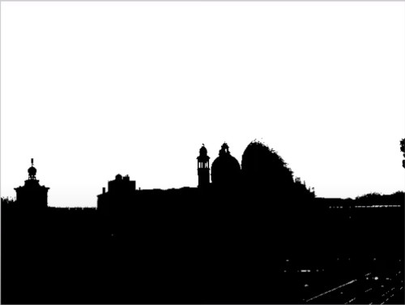

Histogram 

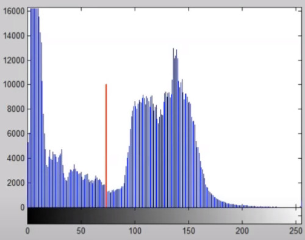

Cost Function
- The circle shows the threshold value

good for text images

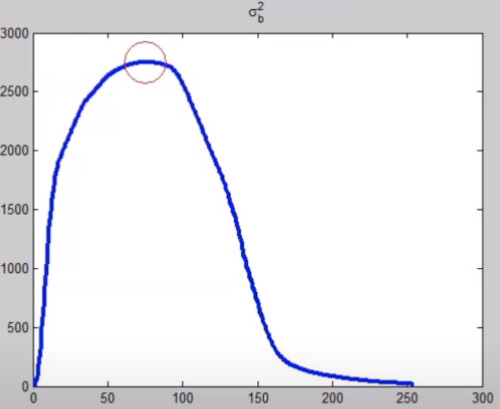


This algorithm can be extended for finding K-1 Classes
- The implementation is more tricky as you only can separate 2 classes and iterate
- Or using numerical optimization

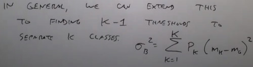

Otsu can fail when there's no strong pixel in the histogram
- like the circle in the iluminated background
- Or if the object is small respect the background

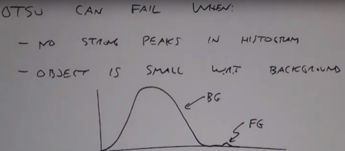

Remedies:
- Low pass filter, then apply otsu
- Only consider pixels near edges when computing the threshold (draw a boundary)

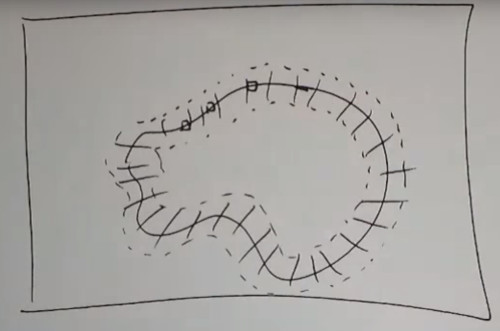

# Adaptive Threshold
Blockproc
- Apply a specified function to each MxN Block
1. Split image into blocks
2. Find the threshold locally to each block

```
blockproc(img, [M,N], func)
```

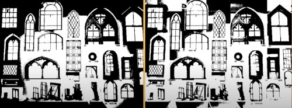

it apears some artefact (edges of blocks)
- Blocksize is tricky

Another approach is to get away of the blocks
- Adapt threshold for each pixel
- At each pixel build a neighborhood, compute mean and variance

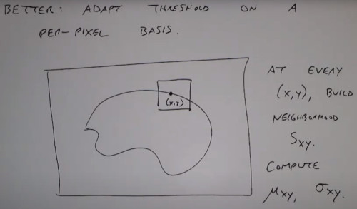

Apply a decision rule to each block

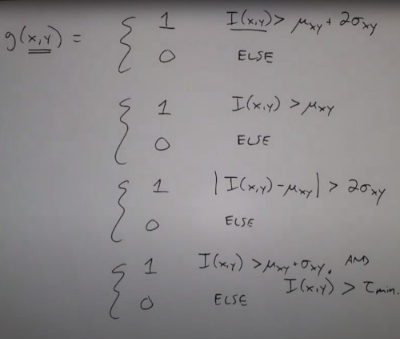

Can also be applied to different channels

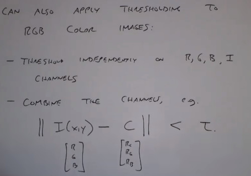

If applied with multiple clusters you can apply machine learning methods

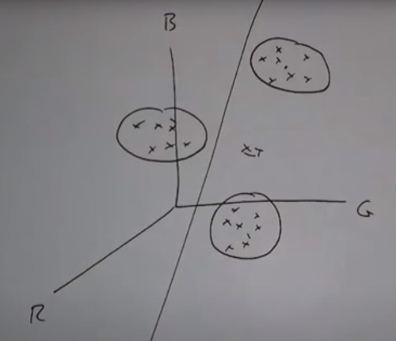
