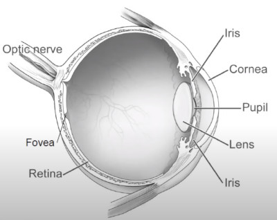

NOTES of the Digital Image Processing course by Ruch Radke

Source: Rich Radke Youtube channel: https://www.youtube.com/watch?v=UhDlL-tLT2U&list=PLuh62Q4Sv7BUf60vkjePfcOQc8sHxmnDX

## Lecture 2. Human perception
How Humans perceive color

