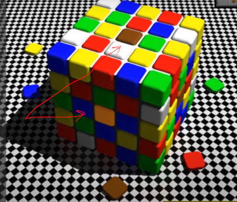
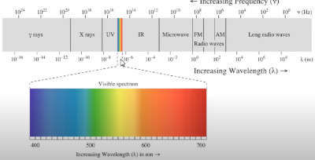
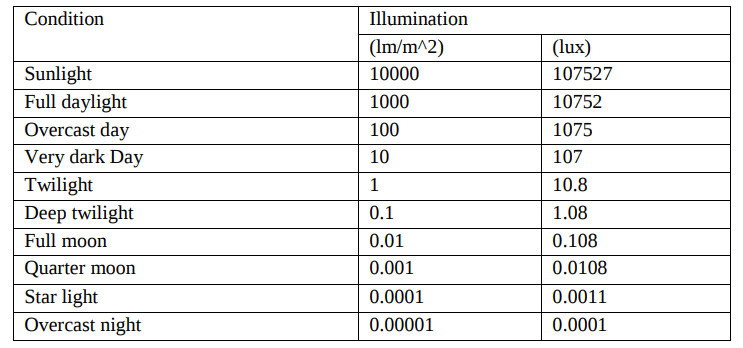
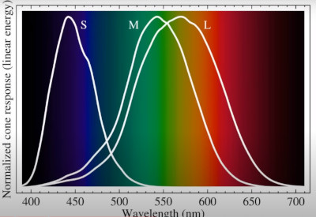

NOTES of the Digital Image Processing course by Ruch Radke

Source: Rich Radke Youtube channel: https://www.youtube.com/watch?v=UhDlL-tLT2U&list=PLuh62Q4Sv7BUf60vkjePfcOQc8sHxmnDX

## Lecture 2. Human perception

How Humans perceive color
- **Cornea**, clear durable part, to protects you from germens also it contributes as a fixed lens.
- **Pupil**, it's a moving window.
- **Iris**, is the muscle who contracs/expands to controls the aperture of the pupil.
- **lens** (crystalline), biconvex lens who can change shape used to focus light. When op
- **retina**, Nerveous tissue sensitive to light (rods and cones). 
- **Fovea**, central part of the retina, where the color sensitive cells (cones) reside
- **Optic Nerve**, The wire of information towards the brain, (region without sensitive cells)
Notes:
- The Fovea is just 1.5mm square with 350k color sensitive cells. 
- A 24 megapixels at 24mmx16mm chip size, you would have 62500 pixels
Digital Cameras Sensor size:
- Full frame, 36mm x 24mm 
- APS-C, 22mm x 15mm
- Micro Four Thirds, 17mm x 13mm
- One-inch sensor, 13.2mm x 8.8mm
- Compact, 11mm x 11mm
- 

Brigthness
- Brightness is logarithmic as a function of incident intensity
- Iris can adapt the brightness adaptively
Dynamic Range (highest brightness/ darkest brightness)
- Eye: O(10^10)
Sensitivity to brightness (small changes in intensity)
- do you percieve the dot from the background?

Sensitivity to color

More optical ilusions classified
- https://michaelbach.de/ot/
- https://www.ritsumei.ac.jp/~akitaoka/index-e.html

Moving image ilusions:
- Critical fusion Ilusion (Aliasing)

## Light

- **Radiant flux**, Emited radiation (Wats)
- **Luminous Flux**, Recieved (perceived) by your eyes (Lumens = 1cd x 1sr)
- **Brightness** or **luminance**, intensity of light for a given puntual direction (Candela)
- **Density of Energy**, Energy per area (lux = cd*sr/area = lumen/m^2)

## Color
- **Rods**, sensitive to light intensity, night 'scotoptic' vision
  - Achromatic
  - Many rods per single nerve
  - Periphereal Vision
  - Very sensitive
  - Slow responses
  - 75-150 Millions per retina
- **Cones**, sensitive to direct light, photoptic vision
  - Chromatic 
      - L sensitive to Red (65%)
      - M sensitive to Green (33%)
      - S but most sensitive to Blue (2%)
  - Concentrated in fovea
  - One per nerve end
  - High Visual Acuity, spatial resolution
  - Fast response
  - 6-7 Millions per retina

