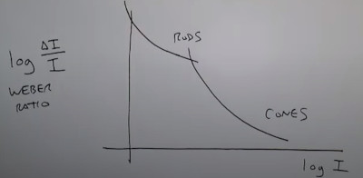

NOTES of the Digital Image Processing course by Ruch Radke

Source: Rich Radke Youtube channel: https://www.youtube.com/watch?v=UhDlL-tLT2U&list=PLuh62Q4Sv7BUf60vkjePfcOQc8sHxmnDX

## Lecture 2. Human perception

How Humans perceive color
- **Cornea**, clear durable part, to protects you from germens also it contributes as a fixed lens.
- **Pupil**, it's a moving window.
- **Iris**, is the muscle who contracs/expands to controls the aperture of the pupil.
- **lens** (crystalline), biconvex lens who can change shape used to focus light. When op
- **retina**, Nerveous tissue sensitive to light (rods and cones). 
- **Fovea**, central part of the retina, where the color sensitive cells (cones) reside
- **Optic Nerve**, The wire of information towards the brain, (region without sensitive cells)
Notes:
- The Fovea is just 1.5mm square with 350k color sensitive cells. 
- A 24 megapixels at 24mmx16mm chip size, you would have 62500 pixels
Digital Cameras Sensor size:
- Full frame, 36mm x 24mm 
- APS-C, 22mm x 15mm
- Micro Four Thirds, 17mm x 13mm
- One-inch sensor, 13.2mm x 8.8mm
- Compact, 11mm x 11mm
- 

Brigthness
- Brightness is logarithmic as a function of incident intensity
- Iris can adapt the brightness adaptively
Dynamic Range (highest brightness/ darkest brightness)
- Eye: O(10^10)
Sensitivity to brightness (small changes in intensity)
- do you percieve the dot from the background?

Sensitivity to color

More optical ilusions classified
- https://michaelbach.de/ot/
- https://www.ritsumei.ac.jp/~akitaoka/index-e.html

Moving image ilusions:
- Critical fusion Ilusion (Aliasing)

## Light

- **Radiant flux**, Emited radiation (Wats)
- **Luminous Flux**, Recieved (perceived) by your eyes (Lumens = 1cd x 1sr)
- **Brightness** or **luminance**, intensity of light for a given puntual direction (Candela)
- **Density of Energy**, Energy per area (lux = cd*sr/area = lumen/m^2)

## Color
- **Rods**, sensitive to light intensity, night 'scotoptic' vision
  - Achromatic
  - Many rods per single nerve
  - Periphereal Vision
  - Very sensitive
  - Slow responses
  - 75-150 Millions per retina
- **Cones**, sensitive to direct light, photoptic vision
  - Chromatic 
      - L sensitive to Red (65%)
      - M sensitive to Green (33%)
      - S but most sensitive to Blue (2%)
  - Concentrated in fovea
  - One per nerve end
  - High Visual Acuity, spatial resolution
  - Fast response
  - 6-7 Millions per retina

Obs. Many animals have different types of cones, what you see as a red flower maybe a bird perceives as two differents colors.
There's also Womans with 4 types of cones, and mans with colorblindness

Standard CIE Primary colors
- Red 700nm
- Green 546nm
- Blue 436nm

Combining colors.
- Additive (leds)
- Substractive (paints)

Color Terms
- Brightness/Intensity/Value, How much light there is
- Hue, Dominant Color
- Saturation, Purity/Strength color

Hue & Saturation defines the Chromaticity of a color
- encodes the color space

Tristimulus model
- Encodes the color via its proportion of Red, Green and Blue
X, Y, Z = R/(R+G+B) , G/(R+G+B) , B/(R+G+B)

X  = \int_0^\infty I(\lambda) · X(lambda) dlambda
I(\lambda) = spectral power distribution
X(lambda) = Color matching function, the official red

Chromaticity Diagram

You can combine differnt sources of light. So you got:

Color spaces
- RGB (monitors)
- CMYK (printers)
- HSV, HSI (describing colors)

Changing light color in the ceiling of the room
- Adaptive to external changing room light
- Controls human comfort & productivity
- Color Control

The color you percieve is the sum of the frequencies of your cones responses multiplied by the source intensity.
You can match that sum to the value you want to be to trick into a fake color as supermarckets does.

This works best in the red channel.
- You can also ramp the colors for a PWM wave and control each color

Matlab Crazy Coords

