```
Author: Eichenbaum Daniel
Email: eichenbaum.daniel@gmail.com
```
This is a practical demo to understand the theory behind:
```
DIP Lecture 17: Image restoration and the Wiener filter ¬Rich Radke
  https://www.youtube.com/watch?v=GE3_4acUrO4&list=PLuh62Q4Sv7BUf60vkjePfcOQc8sHxmnDX&index=20

Textbook: Sections 5.1-5.8 of Digital Image Processing
  Gonzalez and Woods, 3th ed.  
  https://www.amazon.com/-/es/Rafael-Gonzalez/dp/0133356728  
```

# Lecture 20: Image Restoration and the Wiener filter
How to improve the visual quality of an image
So far we've talked about
- Low pass filtering (avg to remove gaussian noise)
- Median filtering (to remove salt and pepper noise)
- Unsharp masking to enhance details

Today we will talk about a method to automatically undo the corruption done to the image

Basic model of degradation
- Given an Image
- it goes through some degradation filter (point spread function H) (linear like blunder)
- next we are going to add some noise
- what comes out is a degraded image
  
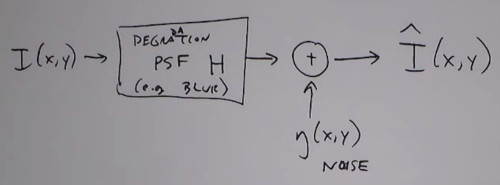

what's we are going to do is 
- put the degraded image to some restoration filter

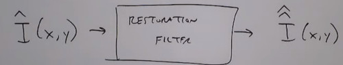

In spatial domain vs frequency domain

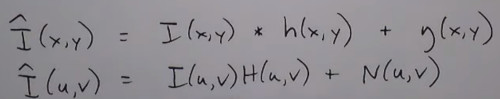

Easier case is when there's no degradation filter. Just random noise.
- Noise is described through its PDF
  
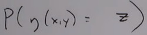

Noise may be due to 
- non ideal sensor elements
- Environemntal conditions (light level, temp)
- Corruption during transmission/compression (i.e. jpeg)
- We assume noise to be I.I.D. 


Gaussian Noise 
- Thermal noise, Sensor noise
  
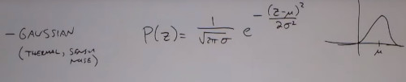

Rayleigh
- Range imaging (radar)
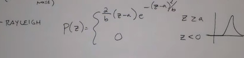

Exponential 
- Laser imaging
  
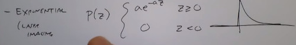

Salt and Pepper
- Probability of white /black
- Delta functions
  
Uniform

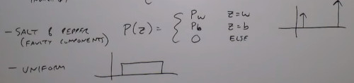

Also you can have periodic Noise or Correlated Noise

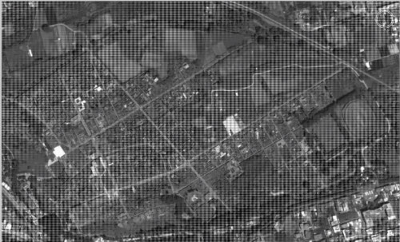

Its 2D Fourier Transform is

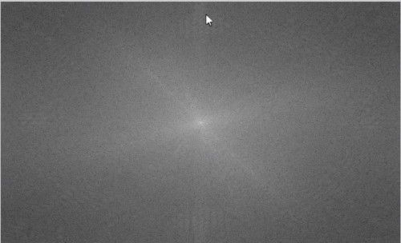


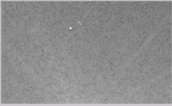

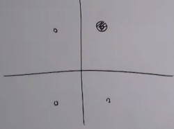


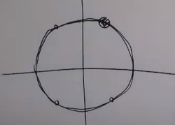
