```
Author: Eichenbaum Daniel
Email: eichenbaum.daniel@gmail.com
```
This is a practical demo to understand the theory behind:
```
DIP Lecture 17: Image restoration and the Wiener filter ¬Rich Radke
  https://www.youtube.com/watch?v=GE3_4acUrO4&list=PLuh62Q4Sv7BUf60vkjePfcOQc8sHxmnDX&index=20

Textbook: Sections 5.1-5.8 of Digital Image Processing
  Gonzalez and Woods, 3th ed.  
  https://www.amazon.com/-/es/Rafael-Gonzalez/dp/0133356728  
```

# Lecture 20: Image Restoration and the Wiener filter
How to improve the visual quality of an image
So far we've talked about
- Low pass filtering (avg to remove gaussian noise)
- Median filtering (to remove salt and pepper noise)
- Unsharp masking to enhance details

Today we will talk about a method to automatically undo the corruption done to the image

Basic model of degradation
- Given an Image
- it goes through some degradation filter (point spread function H) (linear like blunder)
- next we are going to add some noise
- what comes out is a degraded image
  


what's we are going to do is 
- put the degraded image to some restoration filter


In spatial domain vs frequency domain


Easier case is when there's no degradation filter. Just random noise.
- Noise is described through its PDF
  


Noise may be due to 
- non ideal sensor elements
- Environemntal conditions (light level, temp)
- Corruption during transmission/compression (i.e. jpeg)
- We assume noise to be I.I.D. 


Gaussian Noise 
- Thermal noise, Sensor noise
  


Rayleigh
- Range imaging (radar)


Exponential 
- Laser imaging
  


Salt and Pepper
- Probability of white /black
- Delta functions
  
Uniform


Also you can have periodic Noise or Correlated Noise


Its 2D Fourier Transform is


There are some frequencies out of place.


Periodic Noise (non-iid) manifest as unusual peaks in the FFT
- can be removed through notch filter
- Or high pass filter


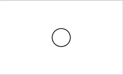
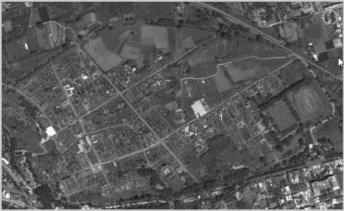

How to determine what kind of noise is present
- You can select some flat region
- Analyze the PDF of that region

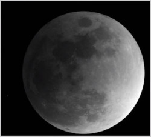
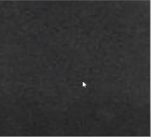

Histogram of the flat region
- A gaussian has been fitted to that histogram
  
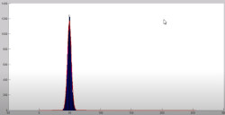

Other model of noise could be possible, in our case gaussian fits well

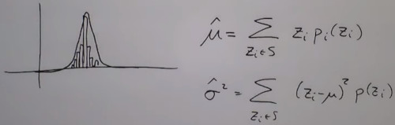

You can't substract noise
- in the IID case, there's no much we can do beyond we already know
- Mean filter
- Median filter

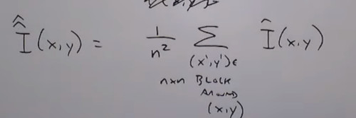

How agressive should be my filter?

### **Adaptive Filter**
Changes depending on the noise characteristics in a local window around the pixel

Suppose we know: 
- The corrupted image
- The noise variance across the entire image
- We can estimate the local mean around the pixel
- and the Local variance

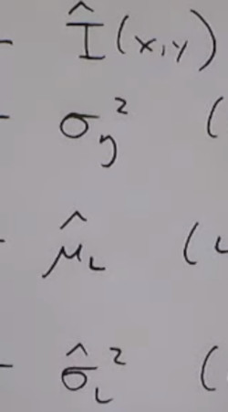

A way of doing reconstruction is taking the corrupted image minus that term.
- Decision comparing the local noise variance to what i think is locally added to the image

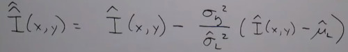


If local variance is zero, the reconstruction image is the corrupted image
If the local variance is bigger than the global variance, then my estimated output is close to my estimated input.
- High local variance means an edge, we want to preserve edges
If the local variance is about the same my global variance, that means that my estimated output is basically the mean.
- Avg intensities in kind of normal regions
  
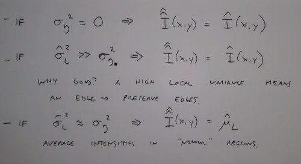


We need an estimate of the global variance to this method to work.
- Like using the flat region characteristics

`wiener2()`


In the left the original image, in the right the wiener filter.

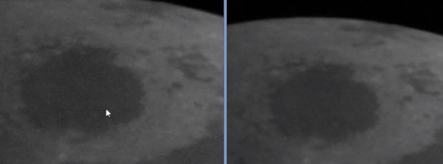

Compared with applying a smoothing filtering
- Left is wiener filter, righr is smoothing filter
  
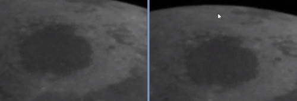


### What happens when we also have degradation
How to estimate the blur? $H(u,v)$
- i have not access to the original image.
  
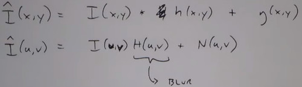

Guessing, take a piece of the degraded image and guess what the original image should have looked like

- Look at the fourier transform of a **Guess Area** and compare it with our manual guess

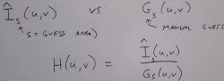

Experimentation
- if you have access to the imaging device
- Directly adquire the impulse response (dark room with a pinhole of light) (point spread function)

Estimate or model $H(u,v)$ (i.e. gaussian noise)


Here we have luck capuring a star

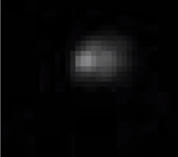


### Inverse Filtering 
so,
- we have a degraded image, $\hat{I}(x,y)$
- we have the estimated blur, $H(x,y)$ (the star cropped from the original image is the impulse response H)

Then apply the inverse filter of the blur

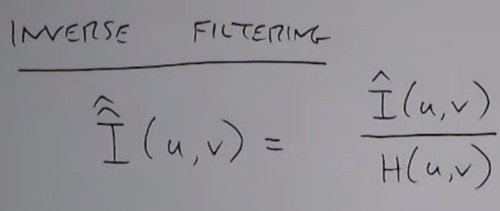

`deconvwnr()`

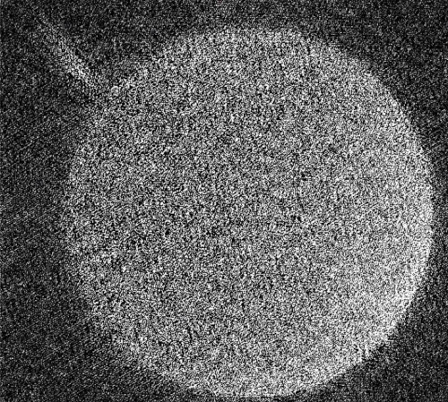

However this process doesn't work in real life,
- Because there's also this noise inside the corrupted image

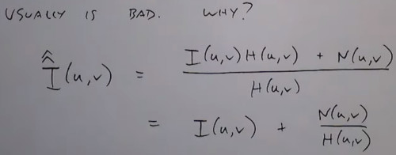

If $H(u,v)$ is small for some u, v. 
- Then the ratio $\frac{N}{H}$ is very large, then you would have a poor reconstruction

One solution is to apply inverse filter at low frequencies.
- given a frequency radius $r$

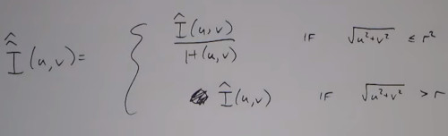


### Wiener Filter
The right to do is minimizing the mean squared errorfunction.
Take the original image, and the reconstruction image
- We have a model for how the corrupted image is produced from the original image

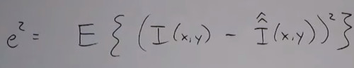

Where 
- $S_F=|I(x,Y)|^2$
- $S_n=|N(u,v)|^2$
  
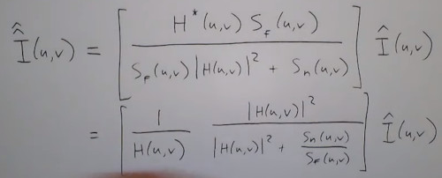


The problem before was if the inverse filter $H$ is zero, it blows up. Which doesn't occur now
- if the noise is zero, we got the inverse filter
- Practically we try to tune the $\frac{S_F}{S_n}$ number

We may be able to estimate the power spectrum of the noise $S_n(u,v)$  but we don't know $S_f(x,y)$ because it requires the original image.

Instead, we usually use something simpler.
- with K a tunable parameter until get a good result
  
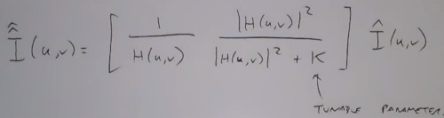

`deconvwnr(IM, H, K)`


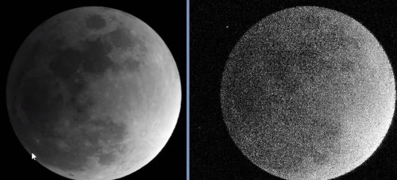

Result of increasing K

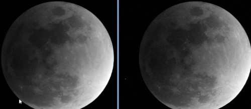

If i pick the star is so much clear now.

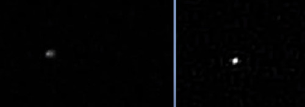

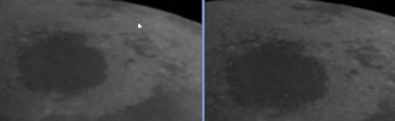


Modern reasarch with machine learning
- Remove Camera Shake from a single Photograph (automatic deshaking of the camera)
