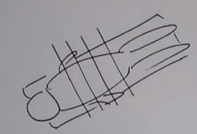
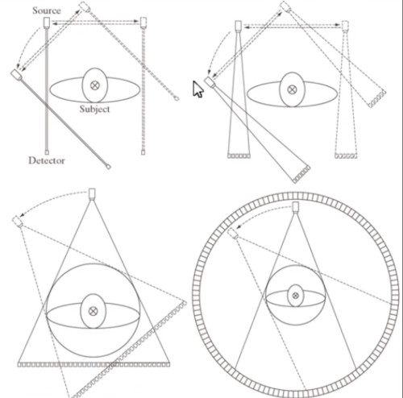
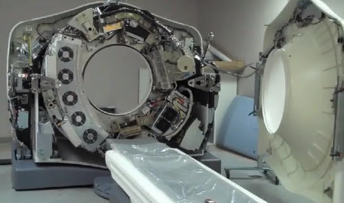
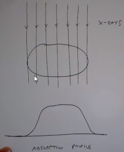

```
Author: Eichenbaum Daniel
Email: eichenbaum.daniel@gmail.com
```
This is a practical demo to understand the theory behind:
```
DIP Lecture 18: Reconstruction from parallel projections and the Radon transform ¬Rich Radke
  https://www.youtube.com/watch?v=ZgcD4C-4u0Q&list=PLuh62Q4Sv7BUf60vkjePfcOQc8sHxmnDX&index=21

Textbook: Sections 5.11 of Digital Image Processing
  Gonzalez and Woods, 3th ed.  
  https://www.amazon.com/-/es/Rafael-Gonzalez/dp/0133356728  
```

# Lecture 21: Image Reconstruction from projections
This is the foundation for Compute Axial Tomography (CAT scan) 

The idea is you are the patient lying in the table and the scan crossection your body with x-ray



There are different geometries for how this process x-ray going through the patient can occur, the dotted arrows represent incremental linear motion
- Generation 1: Beams are parallel to the detector
- Generation 2: The detector is a plane
- Generation 3: Is a fan beam, where the rays are pushed out from its central source
- Generation 4: Also a fan beam
  


The inside of the CAT scan, behind the fan are the x-ray detectors. Opposite there is the x-ray source
- https://www.youtube.com/watch?v=2CWpZKuy-NE



## RADON transform (1917, nobel in 1979 for medical application)
Principles of how this work. 

Consider one cross section of the patient.
- if the x-ray doesn't hit the patient at all, the ray its Energy is not attenuated
- As the x-ray is going through the patient, its Energy gets attenuated.



Taking the image intensities, adding them up you get different profiles of the patient
