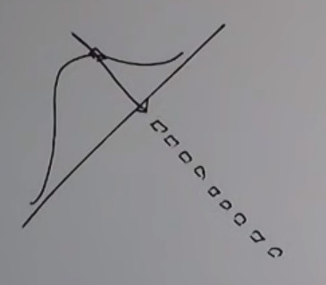
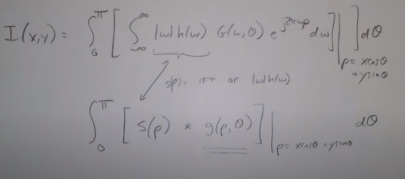

```
Author: Eichenbaum Daniel
Email: eichenbaum.daniel@gmail.com
```
This is a practical demo to understand the theory behind:
```
DIP Lecture 18: Reconstruction from parallel projections and the Radon transform ¬Rich Radke
  https://www.youtube.com/watch?v=ZgcD4C-4u0Q&list=PLuh62Q4Sv7BUf60vkjePfcOQc8sHxmnDX&index=21

Textbook: Sections 5.11 of Digital Image Processing
  Gonzalez and Woods, 3th ed.  
  https://www.amazon.com/-/es/Rafael-Gonzalez/dp/0133356728  
```

# Lecture 21: Image Reconstruction from projections
This is the foundation for Compute Axial Tomography (CAT scan) 

The idea is you are the patient lying in the table and the scan crossection your body with x-ray


There are different geometries for how this process x-ray going through the patient can occur, the dotted arrows represent incremental linear motion
- Generation 1: Beams are parallel to the detector
- Generation 2: The detector is a plane
- Generation 3: Is a fan beam, where the rays are pushed out from its central source
- Generation 4: Also a fan beam
  


The inside of the CAT scan, behind the fan are the x-ray detectors. Opposite there is the x-ray source
- https://www.youtube.com/watch?v=2CWpZKuy-NE


## RADON transform (1917, nobel in 1979 for medical application)
Principles of how this work. 

Consider one cross section of the patient.
- if the x-ray doesn't hit the patient at all, the ray its Energy is not attenuated
- As the x-ray is going through the patient, its Energy gets attenuated.


Taking the image intensities, adding them up you get different profiles of the patient


Matlab example
- The radom transform is the integral of that object in any particular angle.
```
%matlab
plot(radon(im,90))
```
Simple example


Another example 


Now let's apply the transform with an angle of 90


In the context of Radon transform, the dual transform is commonly called 'back-projection' as it takes a function defined on each line in the plane and 'semars' or project it back over the line to produce an image.

```
p = randon(im, 0)
imshow(iradon(p, 0, 'none'), [])
```

Smearing it out the projected image (a.k.a. iradon)
- where high values are in the center


Now adding the projection for any angle we get
```
th = 0:90:179;
p=radon(im, th)
imshow(iradon(p, th, 'none'), [])
```


Maybe i can do better if my theta step is smaller
- slowly you get approaching to the real object


There's a problem, we have an halo bluring the image.
- The doctor shouldn't overestimate the size of a tumor for example
  


For the second image you could have missed the second disk


So can we do better?

## Mathematics of projection
related to the hough transform
- lines going through an image
- parametrizing a line is important

A fix rho and a fix theta represent a particular line.


Suppose we project the object into the plane, we have to figure it out which (rho, theta) corresponding to each of these lines.
- for a particular $\theta_k$ i got a bunch of $rho_j$ projections.
  


I'm thinking the image as the integral of the image across the projected line
- in the discrete world the integral is replace by a summation
- The delta function is telling that we want to evaluate the image where its content is true.
  


**Sinogram** (name isn't from sine waves but for 'whole image')
Just as the Hough trasnform we can visualize $g(\rho, \theta)$ as an image

`sinogram' 


Say we have a set of projections $g(\rho, \theta_k)$ for a set of angles $\{\theta_k\}$ between 0 and $\pi$
- now we want to take our projection and smear it
- For each row, copy that pixel along that angle



For a fixed value of $g(\rho_j, \theta_k)$ just copy this value into the image along the corresponding line. ($x cos(\theta) + y sin(\theta) = \rho$)


Then if we sum all of these projections we get the **laminogram**
- as our first attempt to reconstruct the original image
  


### Fourier Slice Theorem (also called projection-slice theorem)

this theorem is going to give us the relation between the fourier transform of each of these projections and the original image we are trying to reconstruct.

So each image $g(\rho, \theta_k)$ has its own fourier transform, where each ray has its own 1D fourier transform with respect to $\rho$

$\rho$ is going to be our time domain for a fixed particular angle.


Now let's plug what we know about our radon transform.


Switch the rows and the x's and y's.


Then we apply the delta function only when $\rho' = x cos(\theta) + y sin(\theta) - \rho$


Now lets rewrite in a different way


And this is the fourier transform of the original image along the line


what it means is that my projected Fourier transform is the original fourier transform at that fixed angle $\theta$


I should be able reconstruct from projection, if i sample good enought i would be able to get all the slices that i need.

So why i got the blurry effect?
- in practice what i have are slices of the transform
- and if i add all the slices directly and the middle is kind of over-represented


The intuition is that we should down weight the middle.

### Filtered Back projection
We want to get back the original image 


We make a change of coordinates to polar


So this is good just because it's the fourier transform of the projected image 


Then by the **Fourier-Slice Theorem** whose states that
- $G(\omega, \theta) = F(\omega cos(\theta), \omega sin(\theta))$


And applying a bit of substitution.
- I know that i only have to go half the circle (the other half has the exactly same attenuation)
- As the image is Real its fourier transform is simetric so the following is true.
  


So the inverse radon transform is not the sum as though before, but its scaled by the $\omega$ factor


So this factor is just the inverse fourier transform of $G(\omega, \theta)$ but multiplied by a filter function "$|\omega|$"


This is called the filtered backprojected transform. (taking place of the actually $F_\theta$ from before)

This is the mathematically correct thing to do.


Overall:
1. Compute 1-D FFT of each projection
2. Multiply each projection $G(\omega, \theta_k) by $|\omega|$
3. Take 1-D IFFT
4. Integrate (sum all) angles  to get I(x,y)


So what's the $|\omega|$ looks like?
- we usually multiply by a gaussian window
  


To prevent possible FT, numerical issues, artifacts.

Examples

```
imshow(iradon(radon(im, th), th),[])
```

for step 20º projections


For step 10º projections


For step 1º projection
- there are some artifacts in the circunference
  


Matlab has a built-in phantom of some size
```
%Matlab
p = phantom(128)
imshow(p)
```

it's an approximation of the human body.


### Further implementation notes.
Matlab implements all in the FFT domain.
But most CAT SCANS do everything in the spatial domain with convolutions.


We included the window function $h$




No need to store all the back projection, just add them up as they come in.

- Since $|\omega|=0$ at $\omega =0$ we loose the DC component in the Filter Back Projection algorithm.
so just scale them or just guess.

So if you are also interested in the DC value, modern systems use the FAN-BEAM geometry (or more complicated)
- instead of shooting parallel ray across the patient
- we apply a cone beam of rays getting closer the source.
- a different projection algorithm can be derived using a similar reconstruction theorem
