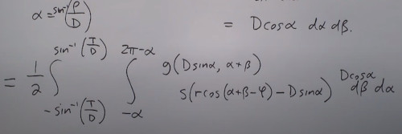

```
Author: Eichenbaum Daniel
Email: eichenbaum.daniel@gmail.com
```
This is a practical demo to understand the theory behind:
```
DIP Lecture 19: Fan-beam reconstruction ¬Rich Radke
  https://www.youtube.com/watch?v=ETlgxFcxelw&list=PLuh62Q4Sv7BUf60vkjePfcOQc8sHxmnDX&index=22

Textbook: Sections 5.11.6 of Digital Image Processing
  Gonzalez and Woods, 3th ed.  
  https://www.amazon.com/-/es/Rafael-Gonzalez/dp/0133356728  
```

# Lecture 22: Fan-Beam reconstruction

Last lecture we've seen how to reconstruct an image from a parallel beam.
- The radiation source is moving in a line
- Parallel beams to each others.

In this lecture we'll reconstruct an image from a fan beam.
- Instead we have a fix radiation source that kind of rotates around the patient.
- Then each beam is projected to a plane
- The patient can also be inside a rotating machine
  


So i can't apply the same equation from last time to this geometry. 
- we will try a combination of change of coordinates and trig identities.


Last time we have discused how to describe that line.
- But this time we are going to parametrize differently
- We are going to define 2 new angles.
- $\beta$ tells me how different is that ray from vertical (As i change the source around the patient i'm changing beta)
- $\alpha$ tells me how far am i from the center line (How spread is the beam)
  


Each beam $\rho(\alpha, \beta) corresponds to some parallel beam $L(\rho, \theta)$


So how to convert to new coordinates?


## Revisiting last time for Filtered Back Projection


Rho was the distance from beam to beam. And it was bounded to a certain width $T$.
And Theta was bounded from 0 to pi. (now we take half integral going to 2pi)


Now what we are going to do is to go from the XY world to polar coordinates.
- remember (x,y) is a fixed pixel in the image


Substituting variables.


Now with a change of coordinates




Now i'm going to give the radon transform a new meaning
- $\alpha_m = sin^_{-1}(\frac{\rho}{D})$ maximum alpha (don't confuse $\alpha_m$ with the variable $\alpha$
- As $\beta$ is periodic, i can choose it's 0-2pi range


Let a point (x,y) in coordinates (r,$\phi$)


Now let the source ray be a distance D perpendicular to that point which is at distance R
- let $\alpha'$ being the angle of that point respect of the source.
- Also draw the perpendicular of that point into the ray axis, it denotes angle $\beta$.


We complete the trigonometric properties


Now lets try to determine distance (1)


Now Lets try to determine distance (2)


Expanding that term we get.. 


Which using the previous analysis we get.


Now the thing to observe is that 
- R and $\alpha$ are both functions of r, $\phi$ and $\beta$


Remember that $S$ was defined as the inverse fourier transform of the window function.


So now what we have is


Now, let's make a change of coordinates.


Plugging into the window formula
- we found that we just got the same window function transform as a function of $\gamma$
  


Putting all together


The idea  is that the inner integral is the convolution with $\alpha$ (beam size) as the dummy variable.
- of the projection for a fixed $\beta$ and a window function $h$


It's a different type of filter back projection.

The outside thing says sum up all of these back projections as they go all around the circle.


Also there's a less accurate way of dealing with fan beam projections.
- you can notice that these beams can be resorted to produce parallel beams.
- so once you have all the data, select those beams who are at certain angle from the detector plane.


Which fan beam correspond to which parallel beam? ($\alpha, \beta)\ to\ (\rho, \theta)$


If fan beams are Equally spaced
- n'th ray in the m'th radial projection, is the same as the n'th ray in the (n+m)'th parallel projection.
  


However there's no guaranteed that the rays that i take are going to be equally spaced.


$\rho$ is not going to be spaced at the increment $\gamma$ 
- so we need to do some interpolation to get all the values of $\rho$ (not an issue is $\gamma$ is small)

```
% matlab
para2fan()
fan2para()

fanbeam()
ifanbeam()
```

### In a modern hospital, there might be other geometries.
Helicoidal geometry
- Instead of slicing the patient one slice at a time.
- The patient is moving to the entrance while the detector is rotating around.


Cone Beam slicing (called generation 7)
- So instead of slicing a cross section, you are taking a cone sample with an horrendous math derivation
- Instead of 1-dimensional detector you have a 2-dimensional detector.
- Then you have to reconstruct the 3D geometry of the patient
  


