```
Author: Eichenbaum Daniel
Email: eichenbaum.daniel@gmail.com
```
This is a practical demo to understand the theory behind:
```
DIP DIP Lecture 20: Dithering and halftoning ¬Rich Radke
  https://www.youtube.com/watch?v=UJtV3DdjCVY&list=PLuh62Q4Sv7BUf60vkjePfcOQc8sHxmnDX&index=23


```

# Lecture 23: Dithering and halftoning
We try to answer the question about "How to print a grayscale image?"

Printer's doesn't paint shades of grays. Just points.

An old newspaper photograph.
- Different size black dots, denotes the color intensities.

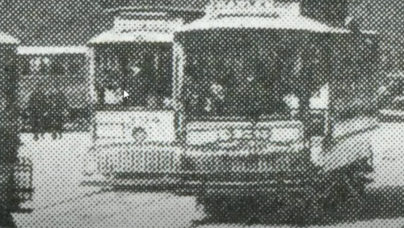

Even modern refrigerator's manual use the very same pattern idea.

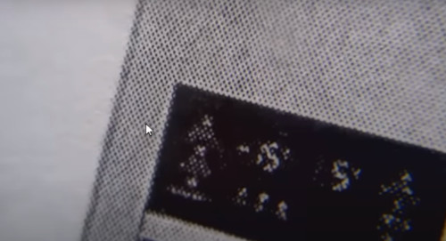


### Image rendering 

What is the right way to render a grayscale image into a piece of paper?
- Spots of black ink.

Why don't just threshold the image?
- and get a binary image!
```
%matlab
B = (I>t)
```

In this example, all textures have dissapear

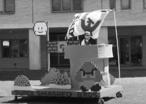
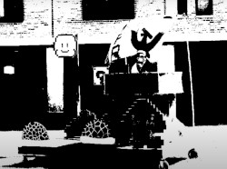

False contouring, if i use just 2 quantization levels i end up seeing few banding in the image.
- looks terrible


### Dithering
Just add some random noise to the image, before quantizing
- Here the thresholding will be 1 bit, but it could be more

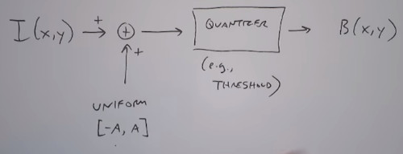

The image is much better now even its kind of crappy.
- Dark regions with possitive noise should saturate, same happens with light regions.

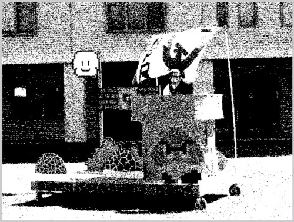

In this example without saturation, noise has switched dark pixels into light ones and viceversa.

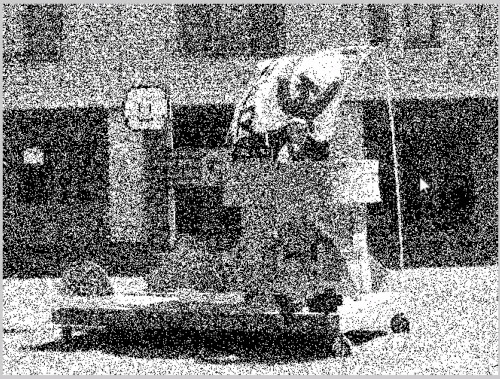

The **A** parameter of the Uniform distribution should be closer to the least significant bit of the quantizer.
- to avoid changing the image structure


Diagonal Example
- Thresholding at 128 is just a triangle
  
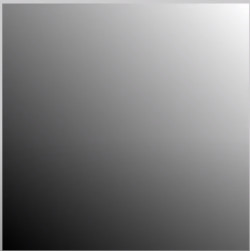
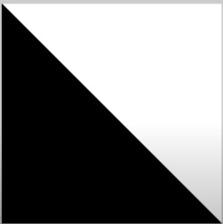

If i dither first with noise of amplitude A=64 i get:
- Then repeat for noise amplitude of 16
- Then repeat for noise amplitude of 128
    
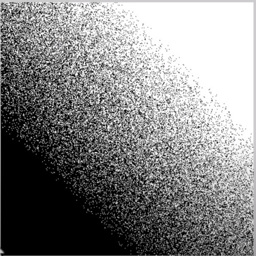
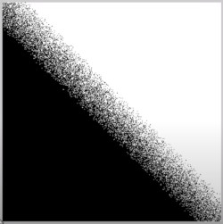
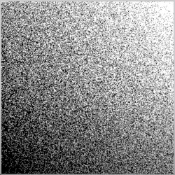


### Halftoning
An alternative to dilthering

The idea is:
- Take the projector
- Get the negative of the image
- Send to a perforated screen (silk-screen)
- Go through a photosensitive plate, which is discretizing the patterns
- Next go Develop the plate and get the inverse of that material
- Light area corresponds to huge dots, while dark areas corresponds to tiny dots


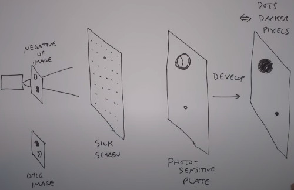

So What's the digital of this process?
- Take your image
- Divide it into blocks

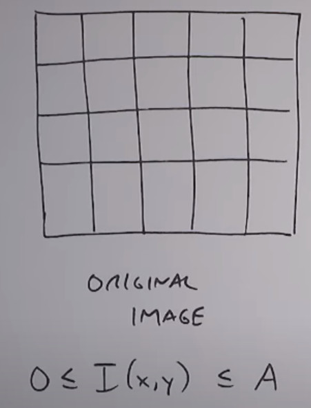

- Assume its in the range of zero to some amplitude A
- Then **ADD** TO a Halftone Array: (repeating block pattern where each block has a maximum amplitude of A)

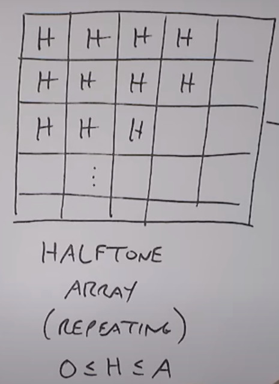

- Then pass it to a binary quantizer

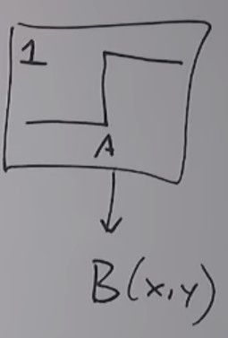

So What's a good candidate for H?
- numbers from 10 to 250 in units of 10's
- if you look carefully there's a pattern on it. (like a spiral)

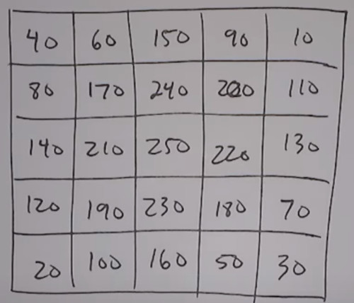

If i've got a constant intensity block of 50. So i'm going to add 50 to each of the pattern and then threshold it to 255.
- above 255 is white-
- Approx 50/255 = 20% of pixels should be turned on.

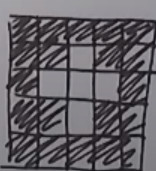

If you instead have a constant block of intensity 140 you would have.
- Approx 140/255 = 60% of pixels should be turned on.

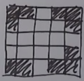


For the diagonal image i get:

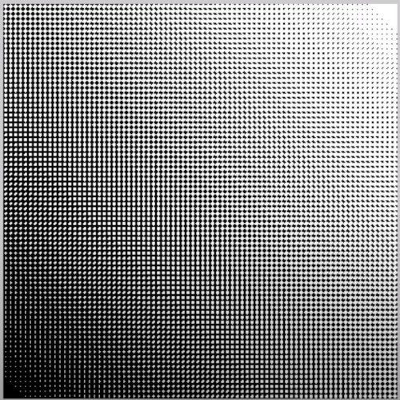

The darker region has fewer dots

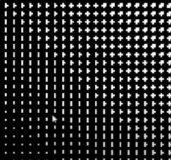

A real image example.
  
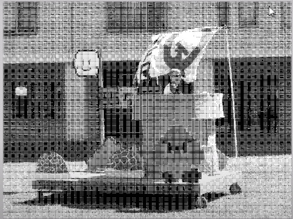

unfortunately you have some artifacts
- Text is illegible
  
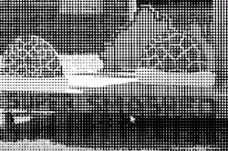

### How to choose the right halftonning array H?
In essense you are coding a grayscale image into a binary image. 
- if you were a machine with 8 bits you would be able to code full range of 256 tones.
- here you are using 9 bits to represent just 9 colors.

Its like flattening the channel array of an image. 
Also its like a multi resolution solution. Increase resolution to improve grayscale color.

Your eyes should be able to filter each H pattern and translate to a gray porcentage.


The perceptual quality depends on several factors
- Halftone Matrix size (resolution of your printer)
- Shape of the blob when you construct the H matrix
- Matrix angle

You could tesselate to nonsquare tiles.

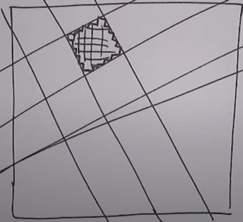

Used in comics for example

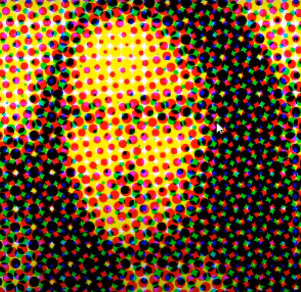

The idea is take different patterns of Cyan, Magenta, Yellow and Black to produce all combination of colors
- Cyan is oriented in one angle
- Magenta is oriented in different angle
- Yellow is up and down
- Black is diagonal

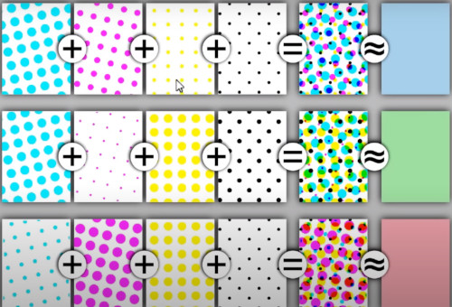

When you add this things up i get a mixture of colors that not make your eyes think there's a regular pattern


Here you can see all orientation angles, and you can see which patterns works and which not.
- Pay attention to the center of the mixture

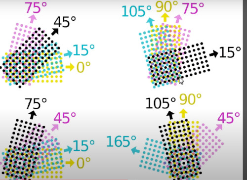


The result is something like this

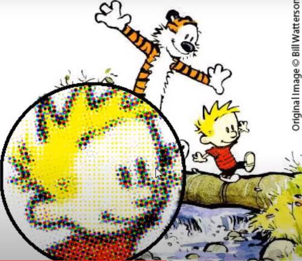


### Color Computer printer
Here there is a 4x4 H matrix
- We multiply by 16 to have the range 0 - 255

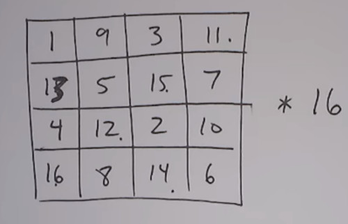

This maximizes the distance between on-off dots.

CROSSHATCH ARTIFACT vs BLOB ARTIFACT
- 'Bayer dithering'
  
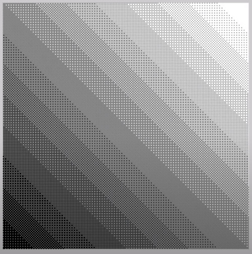

Instead of seeing blobs, i'm seeing a checker pattern

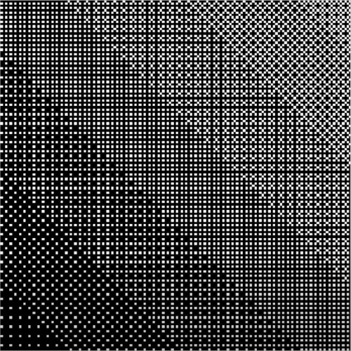

Also what you see is a muaré pattern

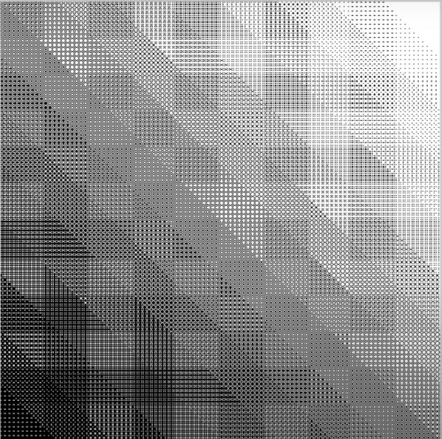

Applied to the origial image gives:

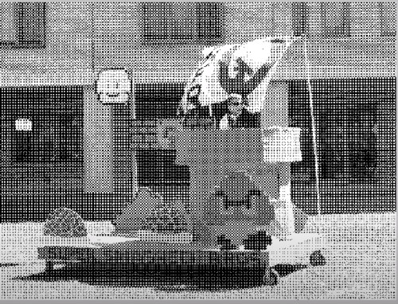

Looks like old video games sprites

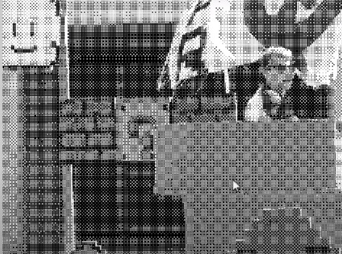

