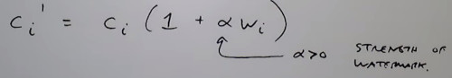

```
Author: Eichenbaum Daniel
Email: eichenbaum.daniel@gmail.com
```
This is a practical demo to understand the theory behind:
```
DIP DIP Lecture 21: Digital watermarking ¬Rich Radke
  https://www.youtube.com/watch?v=O2RwWHWHQlM&list=PLuh62Q4Sv7BUf60vkjePfcOQc8sHxmnDX&index=24

```

# Lecture 24: Digital Watermarking

Related terms:
- Cryptography. Having some clear information, Encrypt it with a key and get some useless information that can only be undone with the key
  


- Steganography: embedding a secret message into an innocent cover object. (hide the fact the communication is happening at all)

- Watermarking is in-between: Embed information into an image so that:
1. Image seems unchanges
2. Watermark can be extracted even after prccessing
3. Remaining watermark should destroy the image.

## Watermarking
Its name comes from watermarks on paper (fancy tissue paper)


If you want to buy this image i will undo those watermarks.


The content provider is trying to corrupt the image so you can't undo the process.

It happens in tv shows too.


The watermark is semi-transparent so you can't undo the watermark that easily.
- you don't want to show your watermark that easily.
- you will try to hide that mark once the movie starts. (its in there but you don't know where)


Another example
- five dots that appears in a lot of currencies
- This prevents you from making color photocopies of currency.
- A high quality scan, the printer will give you a dark area
  


High end color printers have these patterns of yellow dots.
- they encode the serial code and the serial number of the printer 


Insertion or Embedding


If you are the content creator and you want to proove that its your property
- You want to prove the authenticity of that copy


Before posting your image in flickr-or facebook, you want to keep the authenticity of that copy.

- we  don't want placing the metadata in the header that can be manipulated. you want to embed the mark into the data.

### Desirables properties of a watermark
- visualy imperceptible
- Statistcally imperceptally (not changing the mean of variance of the pixels)
- Robust to either inadvertant or intentional attacks

Techniques
- Cropping, resizing, compression, enhancement, rotation,
- Print the image in high quality and rescan
- Collusion (if we buy a couple of copies, and we average those copies we dilute each individual mark so it looks anything marked when i send it out)
- Random Noise attack
  
- Alternative Fragile. The watermark breaks as soon the image is modified. (Used in forensics)
- 
Ab Issue is 
- High capacity, how much information can i embed
- Speed, don't want to take forever to place or detect the watermark

### 1. Spatial Watermark

You can probably undo this process.


### 2. Mark the least significant bits of the image
Divide the original image by 4, and add to the watermarking
  


- It's extremely easy to remove. just cut the last 2 least significant bits.
- Not robust to noise
- Useful for printed images
  
### Pseudo random noise
Encode the watermark.
- split the image into blocks
- Define 2 pseudorandom noise patterns $w_0$, $w_1$ same size as blocks
- To encode bit K, $I_w(block\ k)\ =\ I(block\ k) +\alpha * W_k $
If i want to encode a cero, add a bit of w_0, if i want to encode a 1, then use the other pseudonumber generator.

Decode the watermark
- split image into blocks
- correlate each block with $W_0$ and $W_1$, extract bit K corresp to higher correlation.

So a marked document will give you a high correlation while the unmarked one should give you totally random.

Not robust
- It's still sensitive to cropping and scaling. You loose the correct edges.

## FREQUENCY DOMAIN WATERMARKING

Most effective watermarking algorithms opperate in the frequency domain.
- Hide information in the frequency domain.
- In the DCT we can change coefficient without changing our perception of the image.

The idea is to hide information in the important visual frequency bands.
- so you cannot remove it through a passband filter.


### Simple Frequency flipping method (block-based)
- Choose 2 DCT coefficient locations that are expected to have almost the same average values / ranges.

In Jpeg 


For every 8x8 block, compute the DCT C(u,v)
- if the C(4,1) location is greather than the C(2,3) location, then code as 0.
  


Then if coefficients don't already match w, then flip them.

Not robust
- If the attacker knows how this works, he can undo the process.

### A more robust approach by cox et all.

Encoding,
1. Compute DCT of entire image
2. Find K largest magnitude coefficients $c_1...c_k$, not include DC.
3. Watermark is K-length random vector $w_1 .. w_k ~ N(0,1)$
4. Embed the watermark



5. Replace $c_i$ with $c_i'$ and take IDCT

Decoding
1. Compute DCT of the entire image
2. Extract K coefficients in the know locations (side-information)

$\hat{c_1} ... \hat{c_k}$

3. Compute, 


(arrows shows the side information)

4. Compute


It turns that these number, is shown to be normally distributed under some assumptions

If that number is greather than 6, then this normal random variable is greather than 6 deviation from the mean.

This number is telling you how likely those numbers are. (correlation)

5. Threshold last number to make decision.


### Example
Original image


- Specifying how many cosine coefficients i'm going to flip, and the strength $\alpha$ of the watermark.
```
%matlab embed function
function [out, ind, cw,w] = embed(im, k , alpha)

[m, n] = size(im);
d  = dct2(im);
dvec = d(:);

[c,ind] = sort(abs(dvec, 'descend'));
ind = ind(2:k+1);
cw =  dvec(ind);

w  = randn(k,1);
ci = cw.*(1+alpha*w)

dvec (ind) = ci;

dhat  = reshape(dvec, [m, n]);
out = uint8(idct2(dhat));
```

```
%matlab detect function
function gamma = detect(test, ind, cw, w, alpha)

d = dct2(test);
dvec = d(:);

testc = dvec(ind);

what = ((testc./cw)-1)/alpha

%if using cross correlation
% g = corrcoef(what, w);
% gamma = g(1,2);
% gamma(isnan(gamma)) = 1;

gamma = (what' *w) / norm(what) %Gamma is the threshold
```


Lets try it

```
wim = embed(im, 1000, .1)
```

They look pretty much the same.


computing the difference
```
d = double(im - wim)
average (d(:))

--> 2.399

max(d(:))

---> 26

imshow(d,[])
```

So i'm not changing any bit too much

Where are those differences?


If now i'm going to detect
```
[wim, ind, cw, w] = embed(im, 1000, .1)

detect(wim, ind, cw, w, .1)

--> 31
```

The result is a big number, meaning the watermark is in there.
The threshold is set to 6.


### Now lets try to make list of ways to screw the image

```
function [out, names] = attack (im)

[m, n] = size(m)

names{1} = 'contrast stretch';
out{1} = imadjust(im);

names{2} = 'Histogram equalization';
out{2} = histeq(im);

names{3} = 'Drop least significant bits';
out{3}   = 4*(im/4);

names{4} = 'Enlarge/shrink';
out{4} = inresize(imresize(im, 1.3), [m,n]);

names{5} = 'Shrihk/enlarge'
out{5} = imresize(imresize(im,.5), [m,n])

names{6} = 'Crop/Noise'
out{6} = imresize(im(5:end-5, 5:end-5), [m,n])

names{7} = 'Low Noise';
out{7} = imnoise(im, 'gaussian',0,0.001);

names{8} = 'Heavy Noise';
out{8} = imnoise(im, 'gaussian',0,0.05);

names{9} = 'Jpeg moderate compression';
imwrite(im, 'temp.jpg', 'quality', 50);
out{9} = imread('temp.jpg');

names{10} = 'High compression';
imwrite(im, 'temp.jpg', 'quality', 25);
out{10} = imread('temp.jpg');

```


Now lets apply all these attacks to our watermarked image

```
[at, names] = attack(wim)

attackshow(at, names)

attackreport(im, 1000, .1)
```

```
function attackshow(out, names)
for i=1:length(names)
  imshow(out{i})
  title(names{i})
  pause
end
```

```
function out = attackreport(im, k, alpha)

[out, in, cw, w] = embed(im, k, alpha);
diff = double(out) - double(im);
diff = diff(:);
disp('-------------------------)
disp(['Average difference:' , num2str(mean(diff)) ]);
disp(['Maximum difference:' , num2str(max(diff)) ]);

[attacked names] = attack(out)
```

Original image
- avg diff = 0.003
- max diff = 19

Contrast stretch
- detection score: 23.361


Histogram equalization
- detection score: 10.55


Drop least significant bits
- detection score: 31.84
  


Enlarge/Shrink
- detection score: 30.13
  


Shrink/Enlarge
- it should be a little bit blurried than before, because of pixel interpolation
- detection score: 31.83
  


Crop resize
- detection score: 7.61

Adding up low noise
- detection score: 31.586
  


Adding lot of noise
- detection score: 17.25
  


Moderate compression
- detection score: 31.77
  


Heavy compression
- detection score: 31.59


10x collusions
- detection score: 9.67
- take 10 different watermarks and average to dilute the mark

The watermark has survived all the attacks.

- you can still make the mark a little bit stronger

A strong watermark cloud can be viewed at the bottom left corner of the image


The payload is usually low, because the watermark is strong.


Collusion attack where you average the image from the same sources is the dangerous one, however this method still works fine.
