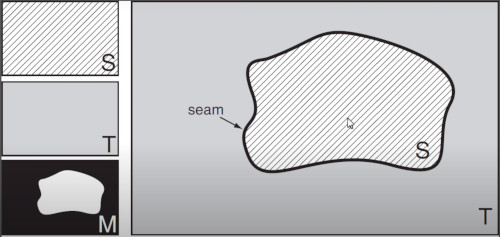

```
Author: Eichenbaum Daniel
Email: eichenbaum.daniel@gmail.com
```
This is a practical demo to understand the theory behind:
```
DIP Lecture 25: Image Blending ¬Rich Radke
  https://www.youtube.com/watch?v=UcTJDamstdk&list=PLuh62Q4Sv7BUf60vkjePfcOQc8sHxmnDX&index=25


Follows Sections 3.1-3.2 of the textbook, http://cvfxbook.com/

Key references:

P. J. Burt and E. H. Adelson. A multiresolution spline with application to image mosaics. ACM Transactions on Graphics, 2(4):217--36, Oct. 1983.  
http://dx.doi.org/10.1145/245.247

P. Pérez, M. Gangnet, and A. Blake. Poisson image editing. In ACM SIGGRAPH (ACM Transactions on Graphics), 2003. 
http://dx.doi.org/10.1145/1201775.882269
```

# Lecture 25: Image blending
For more information, go to his Visual Effect course.

Image Blending, 
- Given a source image you want to copy into the target image or composite.
- Seen in 'image mosaicing'


Just cutting the source image into the target looks bad. what can we do?

Another conection to visual effects.


The image was a glass painting with the hailway composed for the characters


Here is a painting of the pompey Volcano


So how does this work?
- You have a source, and a target.
- Also you want a Mask to select which part of the source is getting into the composed image.




It can blend smoothly or sharp


In this example we want to place a black cow altogether the brown ones.


However this blending gives you some 'halo' 
- you can really tell its fake
  


So what can we do to improve blending quality.


### Hard Composite
So lets start with a Binary Mask M


Not a good image, 
- The Seam / Matte finish is visible

For a while this was the best you can do (old movies)
- always a strong line you cannot avoid,
- If you are smart, You may disguise that line.

### Smooth Composite
What if we make a smooth weighted transition
- can i build some kind of band to blend from 1 to 0
- for example a Linear transition
- or even other polynomial fit

So lets start with a Binary Mask M


A smart way to do this is applying a Gaussian blur filter, to smooth edges.
- however the effect is not that good neither.
  


Maybe trying a bigger transition region
- still visual artifact are still visible


### Multiresolution Blending with a Laplacian Pyramid

Laplacian means detecting edges.
- There are going to be high frequency edges, and low frequency edges.
- I don't want to blend edges across a wide transition band because those can change spatially very close together
- Where the color is varying slowly i can use a wide band

So Wider transition regions for low frequencies
And Narrower transition regions for high frequencies components (edges).

Laplacian Pyramid is related to Gaussian Pyramid.

#### Gaussian Pyramid,
Choose some gaussian blurring filter. 

Then build a hierarchy of filters.

$K$, Given a Kernel like 5x5.

$G_0$ Original image at full resolution.

Then

$G_i$ is what i get if i convolve the kernel with the higher resolution image and downsample by 2 in both dimension


So all i'm doing is making a series of smaller blurier images.

- G0 is the original image,
- G1 is the blurrier image half of size


Next what i'm doing is finding the edges that are important at each of the scales.

#### Laplacian Pyramid
Difference of Gaussians at each scale.


Recall that substracting the image, to its blurried filter gives you a high frequency image.


The set $\{L_i\} form a set of Laplacian Pyramid.


Biggest Laplacian's images shows all kind of edges, as the image gets blurrier, only the important edges survives.

Note that Everytime i get a smaller image in the Gaussian Pyramid it's getting Blurrier.


It's like a detail decomposition of the edges.

Can i take the Blurriest image L4 and make this bigger and add edges at that scale.

Like to reconstruct the original Image by adding the edges back at different scales.


We can Recover the Original Image by upsampling all its Laplacian's pyramid up to full size.
- upscale the blurriest laplacian, ... until $L_0$ then summ up all those edges.


And the base image that i start with is the blurriest image.

$G_N = L_N$


#### MULTIRATE FILTERING
To do Image Composition, 

- Compute Laplacian Pyramids for Source $L^S$ and Target $L^T$.
- Compute Gaussian  Pyramid for Mask $M$ called G

Then The Laplacian Pyramid for Compossite image is:


Recall for hard composite:


So i'm going to combine each edge images at a given scale 'i' with a varying in size mask $G_i$.
- Then Add up to get Final Composite

As i work down to the lowers levels of the pyramid i'm going to have a very blurried image.


The result looks good but something is odd... the texture doesn't match because the grass has different densities.


Each row correspond to different scales.
- First column is the blurriest source image upsampled.
- Second column is the blurriest target image upsampled.
- Third column is the blurriest Mask upsample.
- Fourth column is the blurriest composition upsampled.

The last one has the narrower mask


