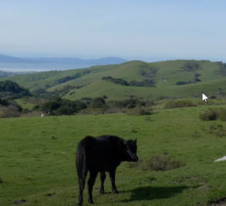
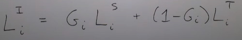
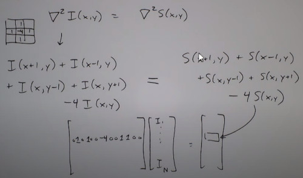
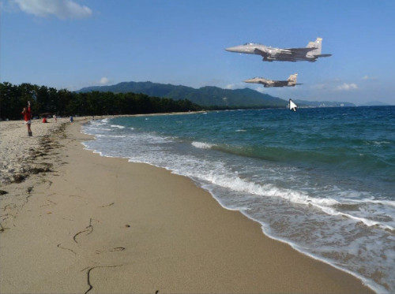

```
Author: Eichenbaum Daniel
Email: eichenbaum.daniel@gmail.com
```
This is a practical demo to understand the theory behind:
```
DIP Lecture 25: Image Blending ¬Rich Radke
  https://www.youtube.com/watch?v=UcTJDamstdk&list=PLuh62Q4Sv7BUf60vkjePfcOQc8sHxmnDX&index=25


Follows Sections 3.1-3.2 of the textbook, http://cvfxbook.com/

Key references:

P. J. Burt and E. H. Adelson. A multiresolution spline with application to image mosaics. ACM Transactions on Graphics, 2(4):217--36, Oct. 1983.  
http://dx.doi.org/10.1145/245.247

P. Pérez, M. Gangnet, and A. Blake. Poisson image editing. In ACM SIGGRAPH (ACM Transactions on Graphics), 2003. 
http://dx.doi.org/10.1145/1201775.882269
```

# Lecture 25: Image blending
For more information, go to his Visual Effect course.

Image Blending, 
- Given a source image you want to copy into the target image or composite.
- Seen in 'image mosaicing'


Just cutting the source image into the target looks bad. what can we do?

Another conection to visual effects.


The image was a glass painting with the hailway composed for the characters


Here is a painting of the pompey Volcano


So how does this work?
- You have a source, and a target.
- Also you want a Mask to select which part of the source is getting into the composed image.


It can blend smoothly or sharp


In this example we want to place a black cow altogether the brown ones.




However this blending gives you some 'halo' 
- you can really tell its fake
  


So what can we do to improve blending quality.


### Hard Composite
So lets start with a Binary Mask M


Not a good image, 
- The Seam / Matte finish is visible

For a while this was the best you can do (old movies)
- always a strong line you cannot avoid,
- If you are smart, You may disguise that line.

### Smooth Composite
What if we make a smooth weighted transition
- can i build some kind of band to blend from 1 to 0
- for example a Linear transition
- or even other polynomial fit

So lets start with a Binary Mask M


A smart way to do this is applying a Gaussian blur filter, to smooth edges.
- however the effect is not that good neither.
  


Maybe trying a bigger transition region
- still visual artifact are still visible


### Multiresolution Blending with a Laplacian Pyramid

Laplacian means detecting edges.
- There are going to be high frequency edges, and low frequency edges.
- I don't want to blend edges across a wide transition band because those can change spatially very close together
- Where the color is varying slowly i can use a wide band

So Wider transition regions for low frequencies
And Narrower transition regions for high frequencies components (edges).

Laplacian Pyramid is related to Gaussian Pyramid.

#### Gaussian Pyramid,
Choose some gaussian blurring filter. 

Then build a hierarchy of filters.

$K$, Given a Kernel like 5x5.

$G_0$ Original image at full resolution.

Then

$G_i$ is what i get if i convolve the kernel with the higher resolution image and downsample by 2 in both dimension


So all i'm doing is making a series of smaller blurier images.

- G0 is the original image,
- G1 is the blurrier image half of size


Next what i'm doing is finding the edges that are important at each of the scales.

#### Laplacian Pyramid
Difference of Gaussians at each scale.


Recall that substracting the image, to its blurried filter gives you a high frequency image.


The set $\{L_i\} form a set of Laplacian Pyramid.


Biggest Laplacian's images shows all kind of edges, as the image gets blurrier, only the important edges survives.

Note that Everytime i get a smaller image in the Gaussian Pyramid it's getting Blurrier.


It's like a detail decomposition of the edges.

Can i take the Blurriest image L4 and make this bigger and add edges at that scale.

Like to reconstruct the original Image by adding the edges back at different scales.


We can Recover the Original Image by upsampling all its Laplacian's pyramid up to full size.
- upscale the blurriest laplacian, ... until $L_0$ then summ up all those edges.


And the base image that i start with is the blurriest image.

$G_N = L_N$


#### MULTIRATE FILTERING
To do Image Composition, 

- Compute Laplacian Pyramids for Source $L^S$ and Target $L^T$.
- Compute Gaussian  Pyramid for Mask $M$ called G

Then The Laplacian Pyramid for Compossite image is:



Recall for hard composite:


So i'm going to combine each edge images at a given scale 'i' with a varying in size mask $G_i$.
- Then Add up to get Final Composite

As i work down to the lowers levels of the pyramid i'm going to have a very blurried image.


The result looks good but something is odd... the texture doesn't match because the grass has different densities.


Each row correspond to different scales.
- First column is the blurriest source image upsampled.
- Second column is the blurriest target image upsampled.
- Third column is the blurriest Mask upsample.
- Fourth column is the blurriest composition upsampled.

The last one has the narrower mask


### Poisson Image Editing

I have the same sett up, a Source and a Target, and still have a mask.

I'm going to specify a region called $\Omega$

Now i'm going to keep a special attention to $d\Omega$ which is the boundary of the Mask Region.


Part of the problem is that there going to be distracting Color Missmatching.
- I'm going to try place the plane inside the beach


The idea is to reduce color Missmatch between source and target.
To create the composite in Gradient Domain.

In some sense i want the edges of the source put into the target to they look realistic.

- We want the gradient of the composite inside this transition region $\Omega$ to be as close as possible to the source image gradients.

- Also the composit must match the target image on a boundary of region $d\Omega$


So i want to minimize, 
- for all of the pixels of the composite inside the composite region.
- we want to integrate all of the composite area, the difference between gradients.
- I want the gradient to be as small as possible
- Subject to the constrain that the image that i create, has to agree with the target colors right around the boundary region.


This is starting to look like a Heat Equation with constrains. What is the temperature inside an area over a metal.

The solution to this problem is asking
- The Laplacian of the composite
- Equal
- To the Laplacian of the source inside this region
- And make the composite equal to the target in the boundary region


This is basically the Poisson equation.


If the right side turns to be zero its the Laplace Equation. (conservative field)


I have to deal with 2 kinds of pixels,
- Inside the region
- In the Boundary


Discretizing and solving the problem.
1. For a pixel P inside of $\Omega$ (like 'a')

- I can approximate
- It can be solved by a linear system



- Where the right matrix is the entire image with all zeros except in the interior Region $\Omega$
- While the left side is the laplacian of the source image.
- Variable $I_i$ are the composite unknowns


That equation has only 5 nonzero elements, even if the image has lots of pixels. 
This is a sparse linear equation which is easy to solve.


2. For a pixel p whose neighborhood is not inside $\Omega$

Suppose that the stripped squares are my boundary pixels.
- Lets compute the Laplacian at that centered pixel. It will include a couple of pixels from the original target that i know
- My Laplacian at that point
- I already know these darker pixels to agree with the target.
  


I still have a set of linear equations, the only difference is that now we are dealing with 3 unknows and those Target pixels are known.
- another equation in unknowns $I_i$


The result is an algorithm that can be run.
```
%matlab
delsq() %makes that sparse matrix
```


```
function T0 = poisson(S0, T0, mask0, guidflag)
%s0 = RGB source image
%T0 = RGB target image (same size as source)
$mask0 = binary mask (same size as source)
  % 1s where target is to be overriten by source
$guidflat = 1 is using mixed gradients (see perez paper)
$ Rich Radke, Nov 2010

if nargin < 4
  guidflat = 0
end

[x, y] = find(mask0);
minx = min(x)-1;
maxx = max(x)+1;
miny = min(y)-1;
maxy = max(y)+1;
n = length (x);

mask = mask0(minx:maxx, miny:maxy);
loc = find(mask(:));
grid = zeros(size(mask));
grid(loc) = 1:n;

A = - delsq(grid); %The critical matrix, its known as laplacian matrix, in this case the laplacian square

maske = imerode(mask, [0, 1, 0; 1, 1, 1; 0, 1, 0]); %Getting the boundary by morphological operators
maskb = xor(mask, maske);
block = find(maskb(:));
bgridloc = grid(maskb);

for i = 1:3
  S = double(S0(minx:maxx, miny:maxy, i));
  T = double(T0(minx:maxx, miny:maxy, i));

  Tz = T;
  Tz(mask) = 0;
  Tf = imfilter(Tz, [0, -1, 0; -1, 0, -1; 0, -1, 0]);

  gradxS = imfilter(S, [-1, 1, 0]);
  gradyS = imfilter(S, [-1, 1, 0]');

  guidx = gradxS;
  guidy = gradyS;

  if guidflag
      gradmagS = gradxS .^2 + gradyS.^2;
      gradxT   = imfilter (T, [-1, 1, 0]);
      gradyT   = imfilter (T, [-1, 1, 0]');
      gradImagT = gradxT .^2 + gradyT.^2;
      maxind = gradmagT >= gradmagS;
      guidx(maxind) = gradxT(maxind);
      guidy(maxind) = gradxT(maxind);
  end

  guiddiv = -imfilter(guidx, [0, 1, -1]) - imfilter(guidy, [0, ]);
  rhs = guiddiv(loc);
  rhs(bgridloc)  = rhs(bgridloc) + Tf(block);
  ivec = A  \ rhs;
  T(loc) = ivec;

  T0(minx:maxx, miny:maxy, i) = uint8(T);
end
```


Lets try it

```
T = imread('hand.jpg');
S = imread('eye.jpg');
M = imread('eye-mask.jpg');
M = logical(M);

C = poisson(S, T, M, 0);
imshow(C);
```


The final blending result of the original image is:
- even planes looks lighter, the background fit perfectly
- The gradients of the plane, matches with the source ones.
  


- Less effort to preserve the color
- More to preserve the edge structure.


Ignore this code.
```
%matlab lapblend

function [out, hard] = lapblend(im1, im2, mask, n1);

mask = double(mask);
gpm{nl+1} = mask;
for i = nl:-1:1
   gpm{i} = impyramid(gpm{i+1}, 'reduce')
end
out = zeros(size(im1));
hard = zeros(size(im1));

for i = 1:3
  [gp1, lp1] = glpd(double(im1(:,:,i)), 'Burt', nl);
  [gp2, lp2] = glpd(double(im2(:,:,i)), 'Burt', nl);

  for j=1:nl+1
    lpout{j} = gpm{j}.*lp1{j} + (1-gpm{j}).* lp2{j};
  emd

  out(:, :, i) = lpr(lpout, 'Burt');
  hard(:,:, i) = mask .* double(im1(:, :, i)) + (1-mask) .*do
end


```

### Mixed gradient compositing

Things could possible go wrong if i move my mask from one region to another one.
- to somwwhat overlaps to some gradients in the original image.
  


There's something i can still do to mitigate that, 
- i can modify my equation


We are assuming a matching of laplacian. 
- But there's an implication that these is what i take by taking the double derivative of a real image.
  


we can still make this more general
- i can say that i want the laplacian of that image to looks like the divergence of some arbitrary vector field.


The difference is that the right hand side doesn't need to arise from the laplacian of a real image.

(Also called a non-conservative vector field)


I can ask for example that, the vector field that i'm seeking could be as follow
- Compare which Souce or target has the greater magnitude gradient, and choose that one for the laplacian of the blending.
  


Note that the quality of the composite depends strongly in the boundary that you choose.




### Drag and drop algorithm
There are algorithms that tries to improve the boundary automatically.
- suppose you manually selected the $d\Omega$ boundary.
- let the system choose a better $\hat{d\Omega}$


You loosely draw the boundary, using object segmentation.
Let the algorithm to optimize between those inner and outer regions to find the best composite region.


We'll talk more about in the visual effect class.
