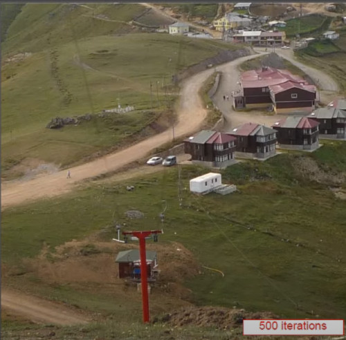
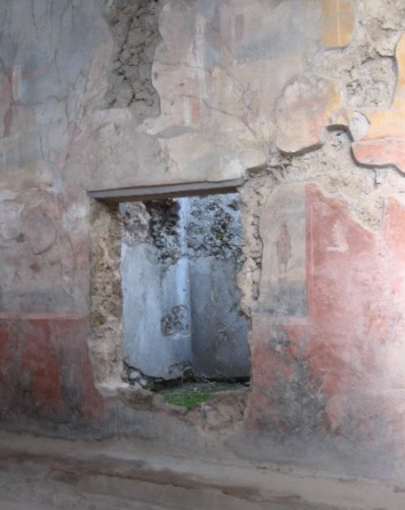

```
Author: Eichenbaum Daniel
Email: eichenbaum.daniel@gmail.com
```
This is a practical demo to understand the theory behind:
```
DIP Lecture 23: Photomontage and inpainting ¬Rich Radke
  https://www.youtube.com/watch?v=XTRO6yQOvJc&list=PLuh62Q4Sv7BUf60vkjePfcOQc8sHxmnDX&index=26

Follows Sections 3.3-3.4 of the textbook.  http://cvfxbook.com/

Key references:

A. Agarwala, M. Dontcheva, M. Agrawala, S. Drucker, A. Colburn, B. Curless, D. Salesin, and M. Cohen. Interactive digital photomontage. In  ACM SIGGRAPH (ACM Transactions on Graphics), 2004. 
http://dx.doi.org/10.1145/1015706.101...

M. Bertalmio, G. Sapiro, V. Caselles, and C. Ballester. Image inpainting. In  ACM SIGGRAPH (ACM Transactions on Graphics), 2000. 
http://dx.doi.org/10.1145/344779.344972

A. Criminisi, P. Pérez, and K. Toyama. Region filling and object removal by exemplar-based image inpainting.  IEEE Transactions on Image Processing, 13(9):1200--12, Sept. 2004. 
http://dx.doi.org/10.1109/TIP.2004.83...

```

# Lecture 26: Photomontage and inpainting

Last time we talked abouut image compositing and forensic.

Now we want to find a dividing line to blend both images


we are not trying to disguise the dividing line we are calling the 'seam'.

In this occasion we are trying to find the least obtrusive seam possible  

This operation is kind the oposite of what we were doing before, 
- Before we've tried blending images
- Here we want to know what were the original image and where is the seam line.
  
## Photomontage
The goal is to find a good seam (dividing line) between 2 images so that intensity differences across the seam is imperceptible
- The idea is to compare the colors of adjacent pixels across the line


So the 'COST' of drawing a line between pixels i and j, are the difference:
- ||Pixel of source - Pixel of target|| for each side should be minimized
  


Another possible idea is to modify this respect to respect to image gradients
- we have a cost between pixel 'i' and pixel 'j'
- Same as before for the numerator
- but then we weigth the denominator by all gradients magnitude


- The numerator says that pixel color should be the same for either side.
- Tne denominator 'd' is a vector pointing from i to j
  - Weigth should be small as seam passes through gradients
   


### GRAPH CUTS
How do i actually minimize this whole thing

We can find the best seam using minimal **GRAPH CUTS**


- Black pixels correspond to the source image
- White pixels correspond to the target image
- And grey pixels is undetermined

Any time the cut passes throught the boundary between 2 pixels i'm accumulating the cost of those weigthed edges.


Graph cuts is also used in image segmentation (background / foreground)

Idea:
- scribbling on regions of images what we want to keep in the final composite, let graph cut algorithm decide what to do with other pixels.

It can be used to delete some objects in the scene.


Another Example:
- I have 3 images and you can choose which pixels to fuse in the other image


Note that the camera should't move, or maybe you can track point features.

Here the image shows from which image the algorithm is deciding the pixels are going to stay.


Digital forensic, is the image that you see being manipulated?
- analyzes noise structure, of compression structure


### Alpha extension
A note there is that the demostration shown before works with many images like 3 instead of 2.
- So there's an $\alpha$-extension for 2 or more images.

You cannot simultaneously find the best seam for more than 2 images, so a strategy is to cylce the procedure.

In the next lesson we will learn how to resize image, by removing pixels from the image in a way you don't notice they are gone.


---
IDEAS:
- Games where background moves at different speed that foreground
- Old Disney movies where each background is modeled diferently
- Can you segment objects with this techique? Isn't like a neural network?
    - For example spliting if the cost function goes above some threshold
- Segment a document by text, graph, structure


## Image inpainting
Another manipulation idea, that instead of trying to put 2 images together, 
- what we want to do is to take a single image
- And fix it up somehow. Like an hallucination

For example given a performer hanging by some wires, what we want to do is to erase the wires. (and make them look like they never existed)


Examples
- wire removal
- Removing Artifacts
- removing creases from old portraits

This school of thought comes from art conservation
- there's an Art theory studing how to fix this kind of problems

Two approaches
- Partial Diferential Equations
- Patch based

## Partial Diferential Equations
As seen with Poisson equation, imagine you fill the image with black where i want to remove.
- The idea is to push outside pixels and trying to fill it up.


- Trying to push good colors from the boundary into the hole.

What are the most important thing about the image?
- Well the edges are, they give structure and they are particulary important.
- We want to make them continuous into the hole

- i want to make sure that the horizontal line continues to the other side.


Those edges i want to keep moving along preserving direction.
- The key equation looks complicated but it's the following.


- The isophote direction is moving along the edges.
- We have also the laplacian of the image, which means kind of edges

So this equation is trying to tell you that the change of edges in the direction of the edges should be zero.


parc c is showing the isophote direction.
- so i want to keep pushing my edges in the same direction.


For example i want to delete the wires of the utility pole.


Here is the mask that was used


After 500 iterations we have, 



After 4000 iterations of that equation we have, 


Eventually after 10000 iterations you probably don't notice the difference


You probably would have a similar effect when ussing the Poisson effect


However This method doesn't work very well when you are trying to remove things that are not long and thin.
- for example when trying to remove those trailers and those houses.
  


you are not able to hallucinate those high detail structures like windows, grass.


PDE-BASED METHOD works ok for thin holes, low texture image. But it can't hallucinate high detail.


## Patch based method

Here is the idea, instead of flowing all the stuff in at the same time. 
- What you can do is eating the around of edges by taking another path from the image and kind of putting it in some boundary of the hole.


- The Omega region is the hole
- you want to choose one area that overalps with the hole
- And you are going to find another path in the image that looks like it
- And then you are going to cut and paste that area into the hole.


1. First is to determine a priority for each pixel on the hole boundary
2. Then Select the patch around pixel 'p' with highest priority called $\Phi_p$
3. Search the remainder of the image for the best matching patch called $\Phi_q$
4. And then just overrite  the whole pixels in $\Phi_p$ with corresponding pixels from $\Phi_q$
5. Then shrink the hole and update priorities.


How to choose the best way to fill in the patches?
- i can go clockwise around in the hole.
- But it might not be the best option
- So that's why the priority thing arise.

Which pixels should have highest priority, Two aspect to meassure priority
- if i draw a box around the pixel in the boundary,
  - how much of that box would have known pixels in it
  - And how much of that box you have unknown pixels


For example, Pixel 'A' is sticking out in a region of known image has 70% of pixels that are already known.
- in thoery it should be easy to fill in these pixels there.
In the other hand, Pixel 'B' is not so good, i don't know many of his surroundings

Kind of what i'm going to do is to have one term that is dependant on nothing more than a fraction of how many pixels are around the boundary.

The other term, has to do with the edginess of the image.
- It's important to push edges from outside the hole into the hole.
- So i need to define a measure of what's the relationship between normal to the hole.

For example $n(p)$ is perpendicular to the boundary of the whole.

And by the other side $\nabla ^T I(p)$ is exactly the direction we talk before.

i'd like to choose those pixels, where edges outside the image, are heading into the boundary hole.

So best case scenario is when i've got an edge coming into the hole and the hole is directly perpendicular to it.
- just keep pushing through
By the other hand, regions where there are no edges
And also there's an edge who is tangent to an edge.

2 considerations:
- High confidence, if pixel is surrounded by known pixels $C(p)$
- Data term, which is high if strong edges from outside the hole hit the hole at the right angles


I want the gradient to be strong, and i want the edge to be aligned to the normal to the hole at that pixel.


For example i want to delete the window of this picture


The green part is eating away in order of priorities.
- strong edges are first
  


Gradients where there's not a lot of action are saved for later.


Probably you wouldn't notice there's something odd with the tree over there


It works in places where you have some texture.


Here's another example of a wall





And another example.
- The closer you get to the middle of a really big hole, the more possibilities there are for things to go wrong
  


Another example
- Once things starts to go wrong, once you made a bad choice it propagates and won't stop.


Photoshop also uses the corn brush for a similar effect.


It is possible that these lines maybe doesn't match after i do the ending, unless there's something explicitly telling how to be done.


Patched based idea will be extended next time (patchmatch)


Also there's something to make the algorithm better user guided
- i'm going to draw something manually, and make sure that those lines connect first.
- So first fill along those lines, across some guidance
- Once you get those key structures filled in, maybe i want the automatic algorithm to take over.
  


One computer algorithm for computer graphics is **PAINT BY NUMBERS**
- i want to take these and crudely label it as sky, grass, beach...
- so i have all these flickr photographs that have been annotated by users


Then instead of picking patches within the image i can do it so with pixels across the internet.

Image retargeting,
- the idea of how do i change the size or shape of the image by removing individual pixels.

