```
Author: Eichenbaum Daniel
Email: eichenbaum.daniel@gmail.com
```
This is a practical demo to understand the theory behind:
```
DIP Lecture 24: Image Retargeting ¬Rich Radke
  https://www.youtube.com/watch?v=w8pjvtnjRPs&list=PLuh62Q4Sv7BUf60vkjePfcOQc8sHxmnDX&index=27

Key references:
Y.-S. Wang, C.-L. Tai, O. Sorkine, and T.-Y. Lee. Optimized scale-and-stretch for image resizing. In ACM SIGGRAPH Asia (ACM Transactions on Graphics), 2008.
http://dx.doi.org/10.1145/1457515.140...

S. Avidan and A. Shamir. Seam carving for content-aware image resizing. In ACM SIGGRAPH (ACM Transactions on Graphics), 2007. 
http://dx.doi.org/10.1145/1276377.127...

M. Rubinstein, A. Shamir, and S. Avidan. Improved seam carving for video retargeting. In ACM SIGGRAPH (ACM Transactions on Graphics), 2008. 
http://dx.doi.org/10.1145/1399504.136...

D. Simakov, Y. Caspi, E. Shechtman, and M. Irani. Summarizing visual data using bidirectional similarity. In IEEE Computer Society Conference on Computer Vision and Pattern Recognition (CVPR), 2008.
http://dx.doi.org/10.1109/CVPR.2008.4...

C. Barnes, E. Shechtman, A. Finkelstein, and D. B. Goldman. PatchMatch: a randomized correspondence algorithm for structural image editing. In ACM SIGGRAPH (ACM Transactions on Graphics), 2009. 
http://dx.doi.org/10.1145/1576246.153...
```

# Lecture 27: Image Retargeting
Image retargeting is a general category
- Resizing
- Recompositing
- Reshufling
- Inpainting

### Image resizing
For example you want a thumbnail for youtube which is a small image with high density of information
- What if i don't want necessary keep the same aspect ratio?
- The wide screen of the movie theater is not the same of the one for your tv.

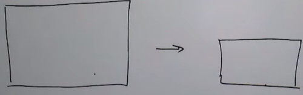

Suppose i want to make this image squared

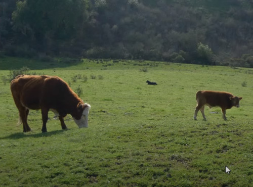

One possibility is to crop out a square of the image 
- A good thing is i'm not compromising any aspect of the image quality
- The bad news is that you are missing a lot of information
  
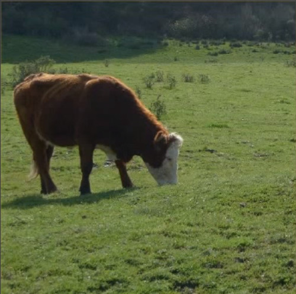

Another option would be to shrink the image.
- But you are missing the shapes of the objects
  
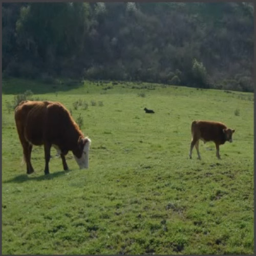

Another common thing to do is letter boxing
- i don't throw anything
- But the padding is a waste of pixels i could use

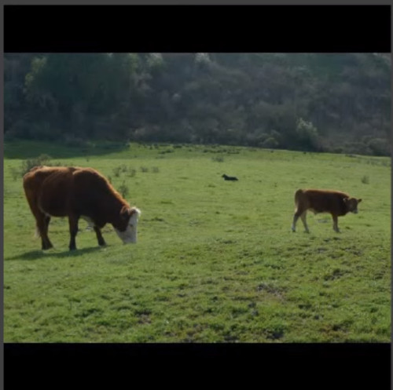


### NON UNIFORM WARPING

A better approach
- Letting the user outline the region of interest into 9 blocks
- Keep the region of interest in proportion
- And the squeeze the other boxs
  
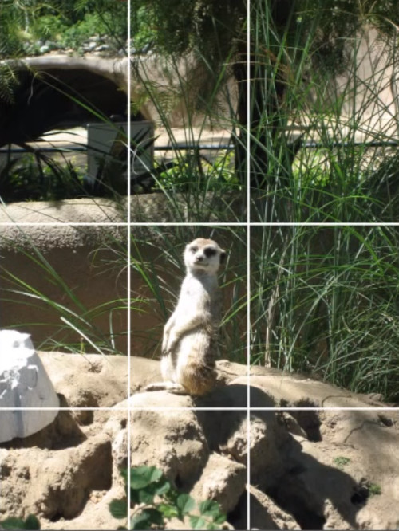


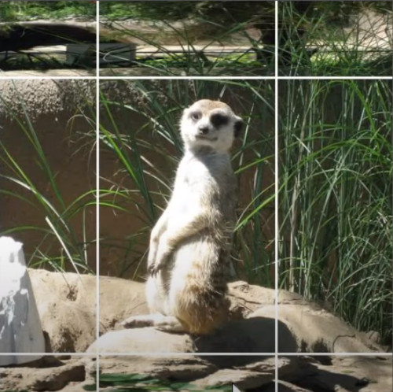

Different pieces of the image are treated in a fundamental different way.

### SALIENCY
Can we design automatically algorithms to guess where is the region of interest?
- uses studyes of people looking for images and tracking their eyes

For example,
- eyes are attracted to color contrast
- attracted to faces
- attracted to edges


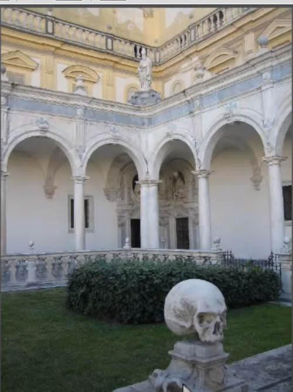

Appling the saliency estimator we get the following

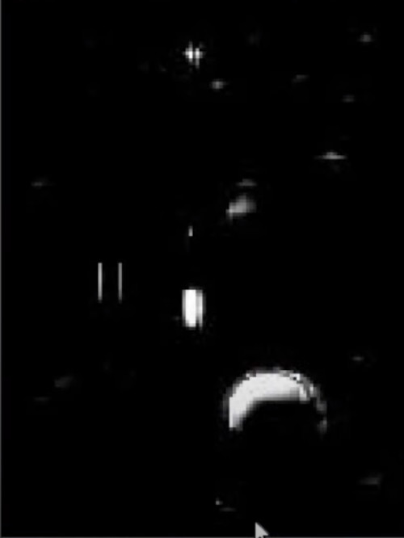


### Optimized scale and stretch
Another approach is instead of having a single region of interest, applying a map of interest.
- within each rectangle i have a meassure of how important that rectangle is.
- A simple metric is edginess
  
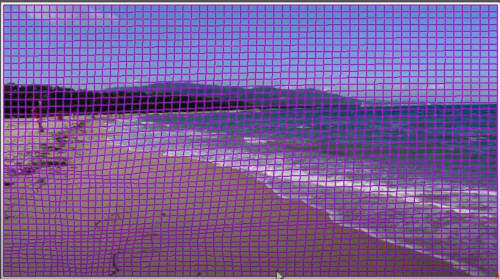


So what's the importance of each pixel?
- using the magnitude of the gradient to measure that.

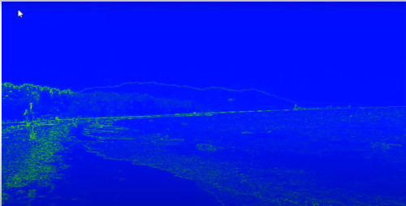

The sky elements are more squishable than the ground

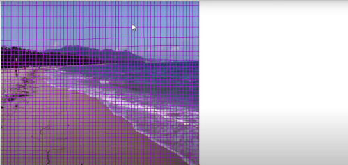

The boxes are still together, but the algorithm tries to move all of those vertex

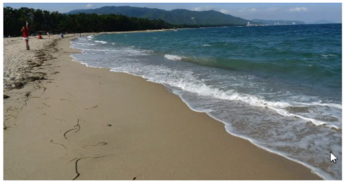

There's a cost function that says,
- for important boxes make it kind stay a square
- for non important boxes, don't distort them too much


### SEAM CARVING
Suppose you want to make the image skinnier, reducing the number of columns
There are a number of possibilities i can do.
- i can chop columns out of the image
- it can be from the edges, or it can be from the middle
- Each time i remove a column it makes 1 column narrower.

It's a 'non uniform downsampling' technique


But instead of removing columns, i can be removing SEAMS.
- a one pixel wide path, that goes from the top of the image to the bottom
   
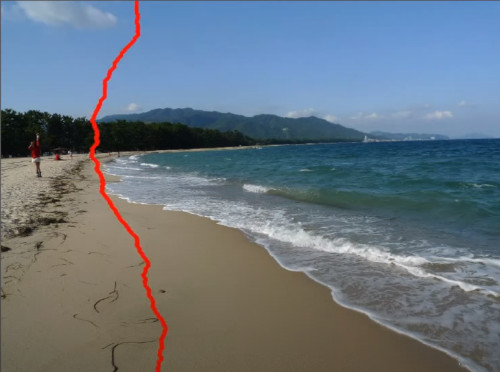


The trick is choosing a good seam, that when i remove those pixels, the image looks preety the same as before.

The cost function to my seam is related with the gradients.

Seam Energy for seam S 
- Compute the gradient of the image through the seam in both axis

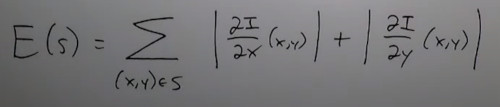

IDEA: instead of removing pixels, it can be used to hallucinate new ones?

Then if you want 10 pixels narrower, then remove the 10 low energy seams.

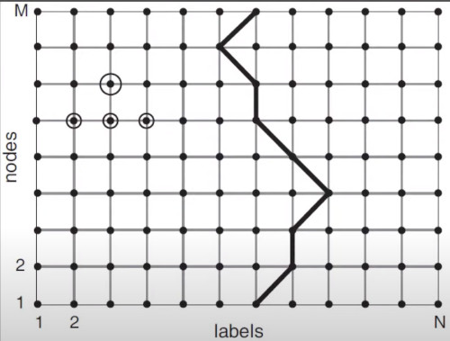

So i have a cost function, but how do i minimize that cost function?
- You can do it through DYNAMIC PROGRAMMING

I want the seam to be connected, so you have to choose the top 3 pixels for a particular central pixel.


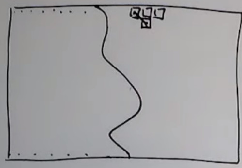

The result i get is something like that.
- Note that people are not deleted from the image
- Also the seam is dodging around the seawed on the beach
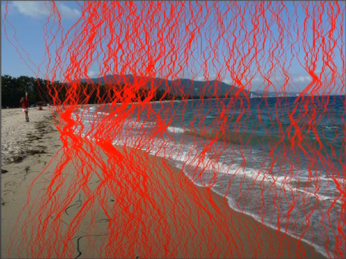

If i remove those pixels then i get an image like that.

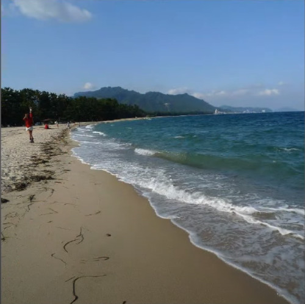

IDEA: Could the cost function be improved through a machine learning algorithm? 
- Would the algorithm learn which pixels are important?
- Would the algorithm learn how to connect pixels?


I can do the same technique to make images larger.

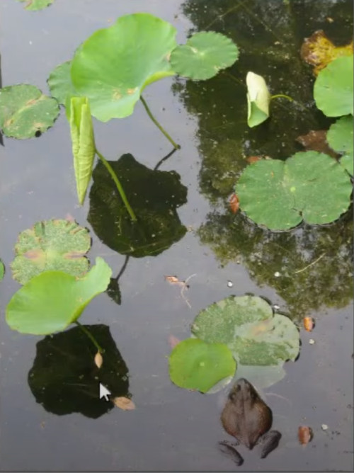

So find the lowest path seeam and add stuff

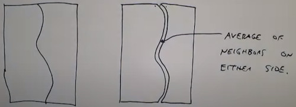

So those are the lowest cost seams

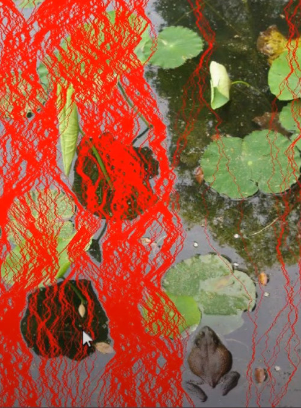

The frog has been avoided
- There are some distortions, shadows doesn't match anymore
  
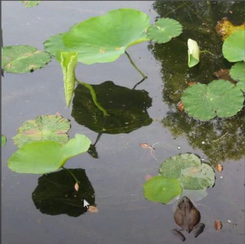


### SEAM CARVING for INPAINTING
It can be used to do INPAINTING, that is removing things i don't want.

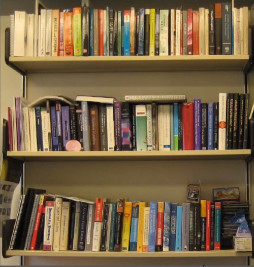

It won't work in this scene, because the books have regular structure
- there's no pixel i can steal


I can tell the algorithm to get rid of that object, 
- i can tweak the algorithm to remove the K seams, that are forced to go through that object
- Then i can resize it, and add K seams to get back the original size


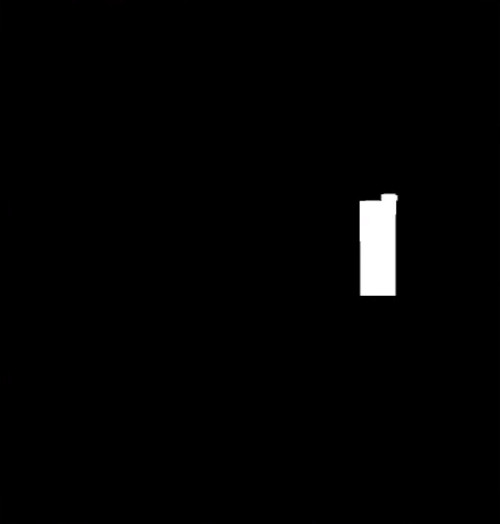


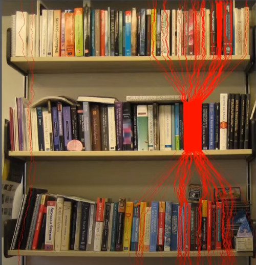

Removing those seams

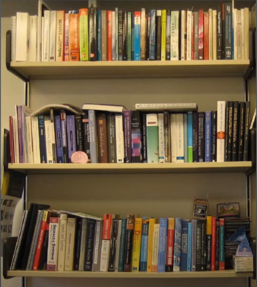

Then fatten up, to get the original size

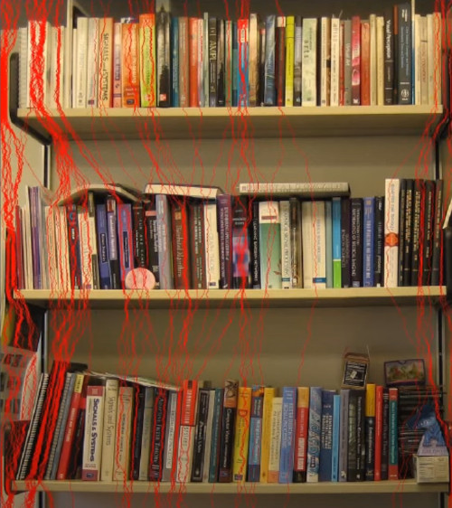

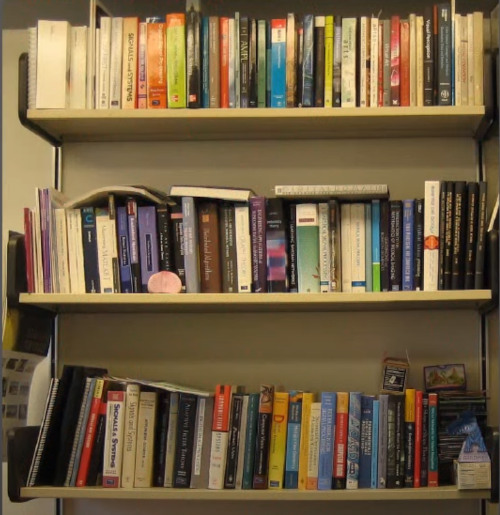


Conversely to protect a region, give it an infinite cost

This algorithm is usefull if you have a web app, then you always have the right size for images even if its mobile.
 
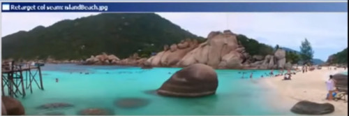

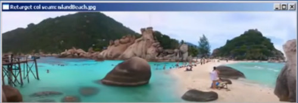


If you just remove the cheapest columns you get a distorted image

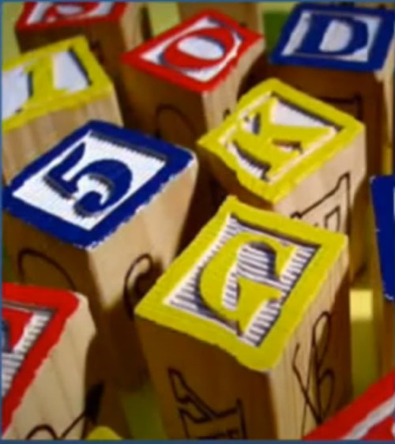

If i resize this image, i get several distortion, that's why you might need to protect some areas.

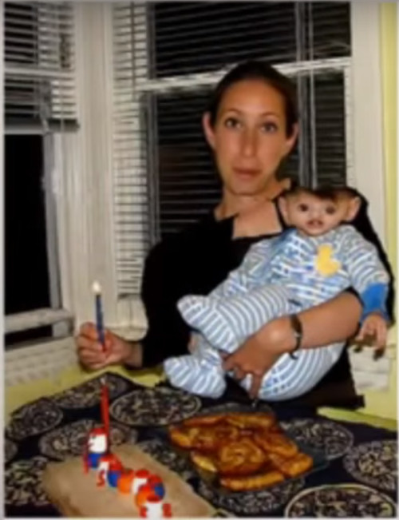


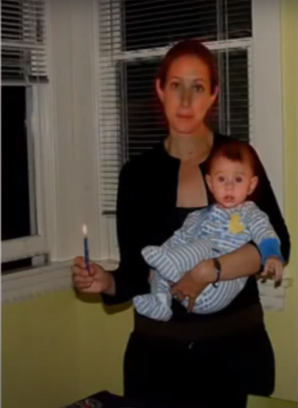


One thing that can go wrong is
- What makes a good scene is not much of what you remove
- What i should care is what new gradients i'm introducing.

The Original SEAM CARVING looked backward. But Better is to look forward.

What new edges we introduce if we remove the seam?

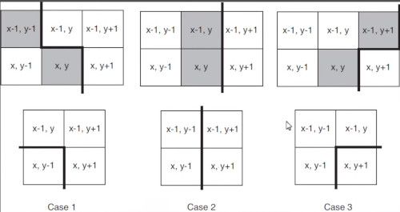

If i'm going to remove these shaded pixels along a seam i'll be generating some new pixels that were now close together that weren't adyacent in the previous image.

Here is a simple case, case 2.
- if i remove the central column, now the rest will become neighbors
- and i should have a cost that says, well, what's the gradient between those 2 new neighbors.
- How much energy i'm introducing into the image by removing those pixels.

So instead, a simple twist is removing those pixels according with the energy that will going to be.

Here is the original image

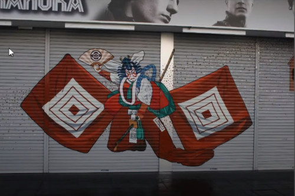

Applied the original seam carving algorithm

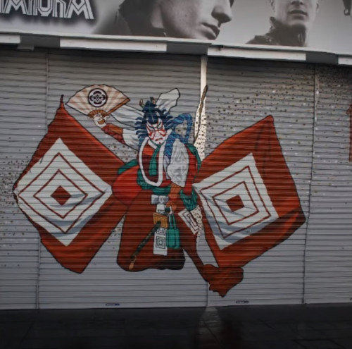

Applied the backwards seam carving algorithm

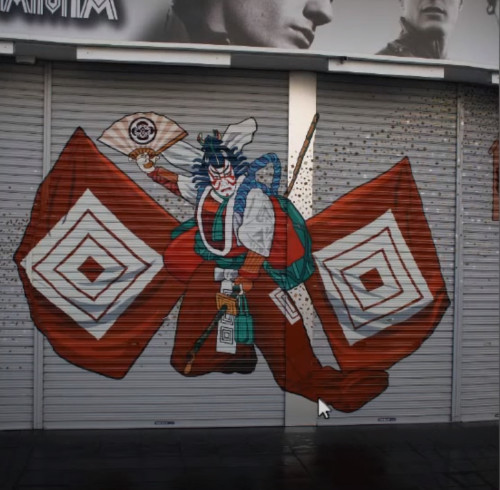
