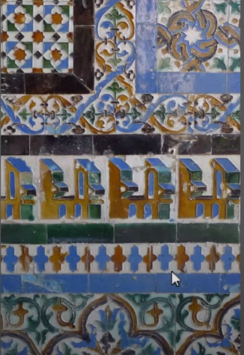

```
Author: Eichenbaum Daniel
Email: eichenbaum.daniel@gmail.com
```
This is a practical demo to understand the theory behind:
```
DIP Lecture 24: Image Retargeting ¬Rich Radke
  https://www.youtube.com/watch?v=w8pjvtnjRPs&list=PLuh62Q4Sv7BUf60vkjePfcOQc8sHxmnDX&index=27

Key references:
Y.-S. Wang, C.-L. Tai, O. Sorkine, and T.-Y. Lee. Optimized scale-and-stretch for image resizing. In ACM SIGGRAPH Asia (ACM Transactions on Graphics), 2008.
http://dx.doi.org/10.1145/1457515.140...

S. Avidan and A. Shamir. Seam carving for content-aware image resizing. In ACM SIGGRAPH (ACM Transactions on Graphics), 2007. 
http://dx.doi.org/10.1145/1276377.127...

M. Rubinstein, A. Shamir, and S. Avidan. Improved seam carving for video retargeting. In ACM SIGGRAPH (ACM Transactions on Graphics), 2008. 
http://dx.doi.org/10.1145/1399504.136...

D. Simakov, Y. Caspi, E. Shechtman, and M. Irani. Summarizing visual data using bidirectional similarity. In IEEE Computer Society Conference on Computer Vision and Pattern Recognition (CVPR), 2008.
http://dx.doi.org/10.1109/CVPR.2008.4...

C. Barnes, E. Shechtman, A. Finkelstein, and D. B. Goldman. PatchMatch: a randomized correspondence algorithm for structural image editing. In ACM SIGGRAPH (ACM Transactions on Graphics), 2009. 
http://dx.doi.org/10.1145/1576246.153...
```

# Lecture 27: Image Retargeting
Image retargeting is a general category
- Resizing
- Recompositing
- Reshufling
- Inpainting

### Image resizing
For example you want a thumbnail for youtube which is a small image with high density of information
- What if i don't want necessary keep the same aspect ratio?
- The wide screen of the movie theater is not the same of the one for your tv.


Suppose i want to make this image squared


One possibility is to crop out a square of the image 
- A good thing is i'm not compromising any aspect of the image quality
- The bad news is that you are missing a lot of information
  


Another option would be to shrink the image.
- But you are missing the shapes of the objects
  


Another common thing to do is letter boxing
- i don't throw anything
- But the padding is a waste of pixels i could use


### NON UNIFORM WARPING

A better approach
- Letting the user outline the region of interest into 9 blocks
- Keep the region of interest in proportion
- And the squeeze the other boxs
  


Different pieces of the image are treated in a fundamental different way.

### SALIENCY
Can we design automatically algorithms to guess where is the region of interest?
- uses studyes of people looking for images and tracking their eyes

For example,
- eyes are attracted to color contrast
- attracted to faces
- attracted to edges


Appling the saliency estimator we get the following


### Optimized scale and stretch
Another approach is instead of having a single region of interest, applying a map of interest.
- within each rectangle i have a meassure of how important that rectangle is.
- A simple metric is edginess
  


So what's the importance of each pixel?
- using the magnitude of the gradient to measure that.


The sky elements are more squishable than the ground


The boxes are still together, but the algorithm tries to move all of those vertex


There's a cost function that says,
- for important boxes make it kind stay a square
- for non important boxes, don't distort them too much


### SEAM CARVING
Suppose you want to make the image skinnier, reducing the number of columns
There are a number of possibilities i can do.
- i can chop columns out of the image
- it can be from the edges, or it can be from the middle
- Each time i remove a column it makes 1 column narrower.

It's a 'non uniform downsampling' technique


But instead of removing columns, i can be removing SEAMS.
- a one pixel wide path, that goes from the top of the image to the bottom
   


The trick is choosing a good seam, that when i remove those pixels, the image looks preety the same as before.

The cost function to my seam is related with the gradients.

Seam Energy for seam S 
- Compute the gradient of the image through the seam in both axis


IDEA: instead of removing pixels, it can be used to hallucinate new ones?

Then if you want 10 pixels narrower, then remove the 10 low energy seams.


So i have a cost function, but how do i minimize that cost function?
- You can do it through DYNAMIC PROGRAMMING

I want the seam to be connected, so you have to choose the top 3 pixels for a particular central pixel.


The result i get is something like that.
- Note that people are not deleted from the image
- Also the seam is dodging around the seawed on the beach


If i remove those pixels then i get an image like that.


IDEA: Could the cost function be improved through a machine learning algorithm? 
- Would the algorithm learn which pixels are important?
- Would the algorithm learn how to connect pixels?


I can do the same technique to make images larger.


So find the lowest path seeam and add stuff


So those are the lowest cost seams


The frog has been avoided
- There are some distortions, shadows doesn't match anymore
  


### SEAM CARVING for INPAINTING
It can be used to do INPAINTING, that is removing things i don't want.


It won't work in this scene, because the books have regular structure
- there's no pixel i can steal


I can tell the algorithm to get rid of that object, 
- i can tweak the algorithm to remove the K seams, that are forced to go through that object
- Then i can resize it, and add K seams to get back the original size


Removing those seams


Then fatten up, to get the original size


Conversely to protect a region, give it an infinite cost

This algorithm is usefull if you have a web app, then you always have the right size for images even if its mobile.
 


If you just remove the cheapest columns you get a distorted image


If i resize this image, i get several distortion, that's why you might need to protect some areas.


One thing that can go wrong is
- What makes a good scene is not much of what you remove
- What i should care is what new gradients i'm introducing.

The Original SEAM CARVING looked backward. But Better is to look forward.

What new edges we introduce if we remove the seam?


If i'm going to remove these shaded pixels along a seam i'll be generating some new pixels that were now close together that weren't adyacent in the previous image.

Here is a simple case, case 2.
- if i remove the central column, now the rest will become neighbors
- and i should have a cost that says, well, what's the gradient between those 2 new neighbors.
- How much energy i'm introducing into the image by removing those pixels.

So instead, a simple twist is removing those pixels according with the energy that will going to be.

Here is the original image


Applied the original seam carving algorithm


Applied the backwards seam carving algorithm


### Patch based algorithms
Suppose we have a really complicated image, 


you will see that using seam carving will immediately go bad. The reason is that there's no low cost seam.

This image has a lot of repetetitive patterns.
- Maybe we should do is keep every part of the image, but get a smaller representation




- Suppose you have to resize a building with many windows. maybe you want to squeeze it back and have fewer windows.


 ### Bidirectional Similarity
 - I have an original Image $I$
 - And a retargeted image $I'$

There are 2 principles.
- I' should be **Complete** (should contain as much visual information form I as possible)
- I' should be **Coherent** (No new visual information that wasn't in I)

We don't want to introduce any artifacts

We want to perform a cost function that encapsulate those principles.
- The distance or difference between both images is


- I'm going to look to a whole bunch of patches in the original image
- And i find the bset corresponding patches in the new image
- And i compute that average distance

This is the completeness criteria.
- Everything in the old image should be represented in the new image.
- Every patch should be represented in the new image.


The Coherence Criteria
- Take patches in the newly generated image
- and look for best patches in the old original image.


So i have 2 directions, and that's why this is called bidirectional similarity.

Patches are blocks of pixels at multiple scales (sizes).

Minimize this cost function is not that simple.

Suppose i want to make the image a little bit smaller, 
- i can initialize the new image with a rescaled version of the original image.
- and then i can refine those pixels intensities to be aligned with my cost function.

Its not that hard to update.

How do i know how much every pixel in the new image contributes to the cost function?


Pixej 'j' is going to contribute to a bunch of patches over there.
- for a 3x3 patches, that pixel is going to contribute to 9 patches
- so i have 9 cost function terms dependent of pixel 'j'
  


I don't know which patches over an image I are going to have pixel 'j' in their best matching block.

HOW DOES PIXEL 'j' in I' CONTRIBUTE TO THIS COST FUNCTION?
- it will be a member of $w^2$ w x w patches in I'

And the way this is going to contribute to the cost function is the following.
- for every block it contains that pixel in I'
- there's going to be a best matching block in I
- and then i'm comparing both colors in both positions 


If not i'm looking at the other patch in I', there's some other block in I
- and we want to compare


Kind of what i have is, 
- the contribution is the sum over all this blocks,
- of some pixel value over image I
- minus a pixel in image I'


The other way, which is completeness is less certain

Here is my pixel J in I
- it is possible that it never matches in image I'
- Or it could be indeed matched
- 


Then the original function was to sum both weights.

Then, to find $I'(j)$ take derivative of D with respect of that pixel and set it equal zero.
- Its going to be a bunch of averages of the original image
- Bunch of terms because the completeness term and a bunch of terms for the coherent term.
- And then some weigthed average.


The idea is if knew which blocks do match between the two images it's easy to generate a new color.


The general approach is an Iterative Algorithm to produce I'.
1. Initialize I' with a rescaled version of I
2. Match blocks from I' to I
3. Match blocks from I to I'
4. Update with formula above
5. Iterate 2

Works well but it's time consuming.

### Patch Match
A fast implementation of minimizing this bidirectional similarity cost function.
- you are constantly matching patches which are time consuming.
- A lot of time you don't have to match all patches.
- Sometimes you can approximate those matches.

This approaches enables:
- Resizing an image
- Recomposing
- Reshufling

In this example, it shows that when resizing it preserve the structure removing repetitive windows.
`youtube: Adobe Photoshop CS6 - content aware fill, move, patch`


This paper is doing interactive reshufling


Move those pixels in there, and fix the image


Moving the ceil of that building is like saying those pixels are nailed in I', fixed.
- Then iterate along to reconstruct the rest of the image

You can also copy those pixels multiple times.


Can be used to inpainting and remove some person in the image
- so i can also prohibit to use those pixels in image I skipping their patches before going to I'.


Retargeting, i have some constraints.
- the boundary of the image has to be like maybe 5 or 10 pixels wide window around the original image.
- That fixes some pixels in I'
- and then all pixels have to follow in to make a same size image.


Another thing they do is to force those lines to remain in the new image.


You can also force some perspective lines to be fixed, and keep the boy before resizing
- Many of the bottles have dissapeared
  


It still not fully automatic.

It can also be applied to video.
