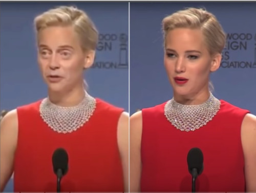
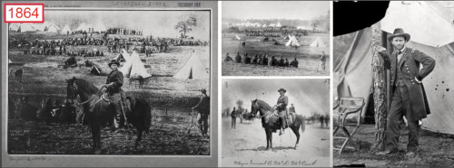
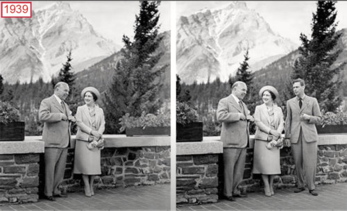
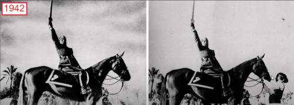
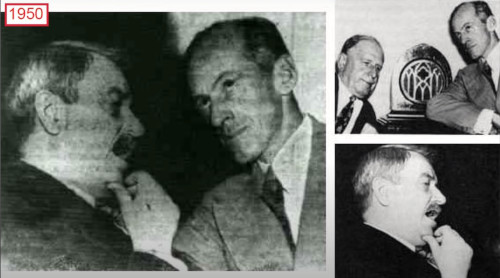
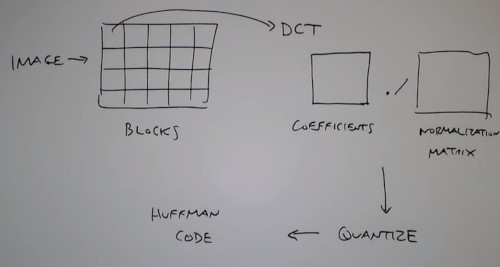
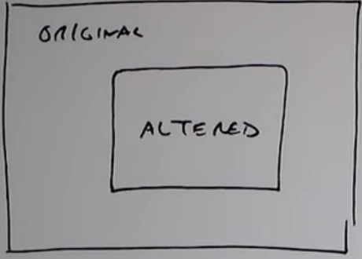
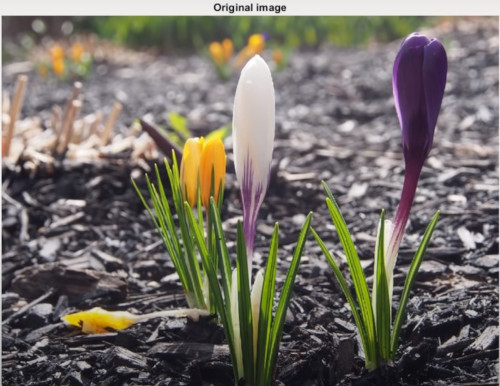

```
Author: Eichenbaum Daniel
Email: eichenbaum.daniel@gmail.com
```
This is a practical demo to understand the theory behind:
```
DIP Lecture 24a: Digital Image Forensics ¬Rich Radke
  https://www.youtube.com/watch?v=z0FUg_RQJ04&list=PLuh62Q4Sv7BUf60vkjePfcOQc8sHxmnDX&index=28

Key references:
An overview of the book Photo Forensics by Hany Farid, https://mitpress.mit.edu/books/photo-...

```

# Lecture 28: Digital Image Forensic
We've talked about how image can be manipulated 
- There's a whole generation of legal issues
  


So How Old is this photograph?
- it was composited 200 years ago
  


In this image we have the queen of england with the prime minister of canada and in the right her husband the king 1939
- The king was removed and replaced with background



it could be done by painting over the photograph and taken the photograph over that.


This is Mussolini who looks fearful alone in his horse instead of being asisted



Same here, the artist were trying to fake those guys so people believe they were together.
- guilt by assosiation



### Digital Image Forensic
- Hany Farid (darhmouth -> Berkeley) is an expert who has written many books

How you can tell if one image was manipulated or not.


- There are some clever Jpeg related stuff you can watch to know if the image was corrupted or not
- Camera Related cues, How do the image gets acquired by the sensor of the camera. Each camera has a unique signature.
- Light and physics related things. (reflection, shadows)


### JPEG Issues
- You take an image
- You divide it into 8x8 blocks
- Then apply DCT you get coefficients
- Then apply a normalization/quantization matrix
- Then Huffman code the result



Somehow the program who is reading the file, has to know some information about the compression. 
- JPEG has a header which contains:
- How big the image is (resolution)
- Also the Normalization matrix.




JPEG Header has
- Image dimensions
- Quantization table
  - 8x8 arrays x 3 colors YCbCr channels = 192 numbers
- Huffman code representation (how many codeworks of each length there are)
  - codewords of 1-15 length for each of 3 channels, and x2 (factor of 2) for DC/AC (encode different DC from AC, because DC and AC have different distribution and huffman code looks for same distribution to work)
- JPEG Thumbnail (optional, miniature of the image)
  - it also has its own coding = 192+90 more
- on top of that, there's some EXIF metadata, like aperture for the camera, gps.
  - the metadata can be faked, but a true image usually has more information
  - the distribution of folders or how much information does it contains could be usefull too.
- Each camera has its own metadata, how much to store, how to organize information.

So add up all these header numbers form 576 values that form a signature. Hopefully every camera has a different signature.
- One study of over 9000 cameras, 70% has unique signature.
- Almost 88% has 3 or less in same bin

Each version of photoshop has also a unique signature.

`JPDUMP` an application to read that metadata


### JPEG ghost

How do you want to alter an image
- compiste images, put stuff
- Then save to a jpeg

I alter one region, then stick it back into the original. Two pieces are often compressed with different JPEG parameters / quality / factors.


This can be revealed by saving the candidate image at different compression level as you approach the quality level of the tampered part, a ghost appear.


Here is some example.



```
%matlab
function jpegghost(im1)

close all;

b= 16; %block size
q1=90; %JPEG quality for first image
q2 = 60; %JPEG quality for second image (q2<q1)
qrng = [15 : 5 : 90]; %Range of qualities
sz = 500; %size of altered region (in pixels

[ydim, xdim, zdim] = size(im1);

%%% Save to different JPEG qualities
imwrite( im1, 'tmp1.jpg', 'quality', q1);
imwrite( im1, 'tmp2.jpg', 'quality', q2);
%%% Make new image as combination of im1 and im2
im1 = imread('temp1.jpg');
im2 = imread('temp2.jpg');
xrng = round( [xdim/2-sz/2 : xdim/2+sz/2-1] );
yrng = round( [ydim/2-sz/2 : ydim/2+sz/2-1] );
im1(yrng, xrng,:) = im2(yrng, xrng, :); %splice

imwrite(im1, 'temp3.jpg', 'quality', q1);

figure(1);
imshow(im1);
title('original image')

%%% Load altered image
im3 = imread('temp3.jpg')

figure(2)
imshow(im3)
title('altered image')

[ydim, xdim,zdim] = size(im3)

%%% Compute the difference between im3 and jpeg
nQ = length(qrng);
map = zeros(ydim, xdim, length(qrng));

...
```

