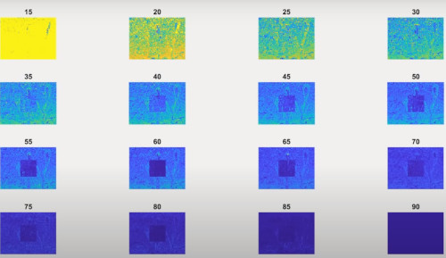
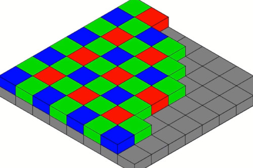

```
Author: Eichenbaum Daniel
Email: eichenbaum.daniel@gmail.com
```
This is a practical demo to understand the theory behind:
```
DIP Lecture 24a: Digital Image Forensics ¬Rich Radke
  https://www.youtube.com/watch?v=z0FUg_RQJ04&list=PLuh62Q4Sv7BUf60vkjePfcOQc8sHxmnDX&index=28

Key references:
An overview of the book Photo Forensics by Hany Farid, https://mitpress.mit.edu/books/photo-...

```

# Lecture 28: Digital Image Forensic
We've talked about how image can be manipulated 
- There's a whole generation of legal issues
  


So How Old is this photograph?
- it was composited 200 years ago
  


In this image we have the queen of england with the prime minister of canada and in the right her husband the king 1939
- The king was removed and replaced with background


it could be done by painting over the photograph and taken the photograph over that.


This is Mussolini who looks fearful alone in his horse instead of being asisted


Same here, the artist were trying to fake those guys so people believe they were together.
- guilt by assosiation


### Digital Image Forensic
- Hany Farid (darhmouth -> Berkeley) is an expert who has written many books

How you can tell if one image was manipulated or not.


- There are some clever Jpeg related stuff you can watch to know if the image was corrupted or not
- Camera Related cues, How do the image gets acquired by the sensor of the camera. Each camera has a unique signature.
- Light and physics related things. (reflection, shadows)


### JPEG Issues
- You take an image
- You divide it into 8x8 blocks
- Then apply DCT you get coefficients
- Then apply a normalization/quantization matrix
- Then Huffman code the result


Somehow the program who is reading the file, has to know some information about the compression. 
- JPEG has a header which contains:
- How big the image is (resolution)
- Also the Normalization matrix.


JPEG Header has
- Image dimensions
- Quantization table
  - 8x8 arrays x 3 colors YCbCr channels = 192 numbers
- Huffman code representation (how many codeworks of each length there are)
  - codewords of 1-15 length for each of 3 channels, and x2 (factor of 2) for DC/AC (encode different DC from AC, because DC and AC have different distribution and huffman code looks for same distribution to work)
- JPEG Thumbnail (optional, miniature of the image)
  - it also has its own coding = 192+90 more
- on top of that, there's some EXIF metadata, like aperture for the camera, gps.
  - the metadata can be faked, but a true image usually has more information
  - the distribution of folders or how much information does it contains could be usefull too.
- Each camera has its own metadata, how much to store, how to organize information.

So add up all these header numbers form 576 values that form a signature. Hopefully every camera has a different signature.
- One study of over 9000 cameras, 70% has unique signature.
- Almost 88% has 3 or less in same bin

Each version of photoshop has also a unique signature.

`JPDUMP` an application to read that metadata


### JPEG ghost

How do you want to alter an image
- compiste images, put stuff
- Then save to a jpeg

I alter one region, then stick it back into the original. Two pieces are often compressed with different JPEG parameters / quality / factors.


This can be revealed by saving the candidate image at different compression level as you approach the quality level of the tampered part, a ghost appear.


Here is some example.


```
%matlab
function jpegghost(im1)

close all;

b= 16; %block size
q1=90; %JPEG quality for first image
q2 = 60; %JPEG quality for second image (q2<q1)
qrng = [15 : 5 : 90]; %Range of qualities
sz = 500; %size of altered region (in pixels

[ydim, xdim, zdim] = size(im1);

%%% Save to different JPEG qualities
imwrite( im1, 'tmp1.jpg', 'quality', q1);
imwrite( im1, 'tmp2.jpg', 'quality', q2);
%%% Make new image as combination of im1 and im2
im1 = imread('temp1.jpg');
im2 = imread('temp2.jpg');
xrng = round( [xdim/2-sz/2 : xdim/2+sz/2-1] );
yrng = round( [ydim/2-sz/2 : ydim/2+sz/2-1] );
im1(yrng, xrng,:) = im2(yrng, xrng, :); %splice

imwrite(im1, 'temp3.jpg', 'quality', q1);

figure(1);
imshow(im1);
title('original image')

%%% Load altered image
im3 = imread('temp3.jpg')

figure(2)
imshow(im3)
title('altered image')

[ydim, xdim,zdim] = size(im3)

%%% Compute the difference between im3 and jpeg
nQ = length(qrng);
map = zeros(ydim, xdim, length(qrng));

...
```

Now Here is the altered image. Looks the same as the original one.


I Take the altered image and start saving with different JPEG quality factors.
- and look at the difference between the original image and the altered one.
- When the compression factor is the same (90%), the alteration looks the same
- Once i lower compression quality, the ghost is revealing itself.
- If the image has almost no quality, then you also loose that information.
- 



## CAMERA BASED TECHNIQUES

Every camera will form an image in a unique way.
Can we tell based on image formation parameter if that image was conformed with a given camera signature.

Bayer Pattern, a way that most camera store digital images.
- the sensor array has different sensitive pixels.
  


To make an RGB it averages neighbor values.
- in the center i know the red value.
- Then i can average those 4 green values to get that blue component for that red pixel.
- Next to it i can interpolate the 4 blue values.
    


Non-directed sense channels are interpolated.

This process is also called 'Demosaicing'
- The camera probably is smarter than these in a smarter way.

Each camera has its own way of **demosaicing**, usually/probably some kind of linear filter.
- The center pixel is red, and it's filtered through convolution.
  


So that means, that each channel is correlated.
- Every pixel R value is ideally correlated with some of its neighbors.
- Each pixel is not independent

If that correlation is not as we think it is, we can say that the image was tampered.
- i can estimate what is the camera is using.


Take a few pictures with the camera i'm trying to tell, and we can try to estimate the interpolation filters.
- if a candidate image, doesn't have the correlation pattern we expect. Then we expect to be tampered.


### Sensor Noise, Photo-responsive non-uniform noise (PRNU)
Every CCD array has some noise in them.
- It can be modeled by a multiplicative noise, Spatialy variant.
- But it doesn't change for the same camera.
- Plus an additive noise i can't control


If you took too many pictures, you can estimate that multiplicative noise.


### Lens types, Chromatic aberation
When light comes into the lens,
- Different wavelength are bent differently


There's some fringe coming to the lens even when there's no blue or red light.


### Lens distortion
It happens with wide-angle lenses, meaning thet the way straight lines appear to be bent outwards or inwards. 


### Principal point
Is the focus around which distortion occurs, is something you can estimate.
- its like an intrinsic property of the camera.
```
%Matlab
camera calibration toolbox
```


If the image wasn't tampered, then the principal point should basically occur in the same place everywhere.


### Camera Skew
Are the pixels of the image fundamentally square or not.
- are you watching from the size?


You can detect this skewness by looking to a bunch of lines that should be parallel.

--- 

All of this things are related to the intrinsic properties of the camera.
- All of these are difficult to match for an inserted chunk of image.
- Optic related stuff.


## Light and Physics related issues.
Last category we are going to talk is stuff related to light and physics

- People are really bad at judging things that are involving reflections and vanishing points.


In this image is hard to tell which one of those reflections is correct, top or bottom


It can be analyzed mathematically.
- so if i connect the position in the object and the reflection.
  


Are those reflections, consistent with the reality?

Here the top one is correct as it converges to a single point. 


Another example are shadows.

With the same principle, If you connect the location of the object, with the location of the shadows.
- they should converge to the same light source.

The guy in the middle, has a wrong shadow.


Human are bad judges for shadows, which of the images has the wrong shadow? (image c is the wrong one)


Here's some example.


To know if the image has been tampered, a model was proposed. For example to know how is the shadow in his nose.


The environment has also be modeled.


They had a mug shot to make a very concrete model of the guy.


They found out that all shadows were consistent from a single light source.

Humans are bad at noticing problems, that's why you need some sort of algorithm.

In video footage, is motion consistent with physics or gravity?
- You can look things like
- Mass
- Acceleration
- Traveled distance


What is the motion of the ball?


we can construct a model


This video was faked for example.


Those misiles were fake too. 
`dr do photos'


Also text can be faked, which can ve auditored through its ink pattern.


There's also images created with AI.
`ganbreeder`


Even they are good pictures, they don't obey laws of physics.

Like 'this person does not exists'

- The statistics of this kind of images are still different from photos.


They don't have aberration, sensing noise, Jpeg weirdness.


Can you train a neural network to distiguish fake from true networks?


