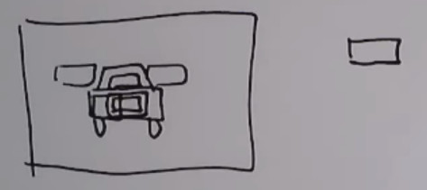
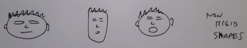

```
Author: Eichenbaum Daniel
Email: eichenbaum.daniel@gmail.com
```
This is a practical demo to understand the theory behind:
```
DIP Lecture 25: Active shape models ¬Rich Radke
  https://www.youtube.com/watch?v=53kx_czs7Es&list=PLuh62Q4Sv7BUf60vkjePfcOQc8sHxmnDX&index=29

Key references:

T.F. Cootes, C.J. Taylor, D.H. Cooper, J. Graham
Active Shape Models - Their Training and Application
http://dx.doi.org/10.1006/cviu.1995.1004
```

# Lecture 29: Active Shape Models

The topic of today is a computer vision problem called 'active shape models'
- So far we've studied the low level of images, computing gradients, connecting edges into lines
- We didn't understood what's really going on in the image
- This lecture is about image understanding or computer vision.

Active Shape Models is a different type of object detection.
- for example, licence plate detection.
- Not template based.


Template base object runs a patch over the image.
- For example a plate over the car image.



That work pretty well for rigid object (they don't change in size)


If you are searching for faces instead, many people have different face features. 
- So this will be usefull for not rigid shapes.



For this to work i need to collect many faces.
- i need to manually assign points to define the face.
- we are trying to find common locations that i can put into correspondance 
 


IDEA:
- Given an image and a mask
- Using a convlutional neural net to search the car plate over the image,
- The mask is telling you the right object position. The true target.
- The task of the neural net is to predict a binary mask for the location of the plate.
