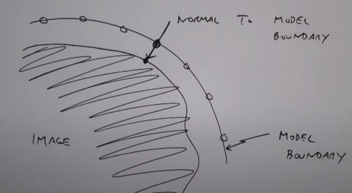
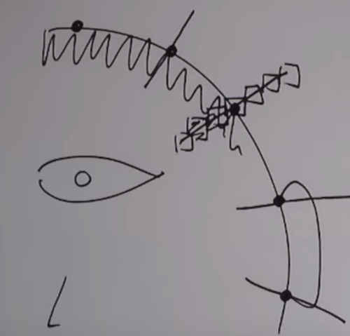

```
Author: Eichenbaum Daniel
Email: eichenbaum.daniel@gmail.com
```
This is a practical demo to understand the theory behind:

```
DIP Lecture 25: Active shape models ¬Rich Radke
  https://www.youtube.com/watch?v=53kx_czs7Es&list=PLuh62Q4Sv7BUf60vkjePfcOQc8sHxmnDX&index=29

Key references:

T.F. Cootes, C.J. Taylor, D.H. Cooper, J. Graham
Active Shape Models - Their Training and Application
http://dx.doi.org/10.1006/cviu.1995.1004
```

# Lecture 29: Active Shape Models

The topic of today is a computer vision problem called 'active shape models'
- So far we've studied the low level of images, computing gradients, connecting edges into lines
- We didn't understood what's really going on in the image
- This lecture is about image understanding or computer vision.

Active Shape Models is a different type of object detection.
- for example, licence plate detection.
- Not template based.


Template base object runs a patch over the image.
- For example a plate over the car image.


That work pretty well for rigid object (they don't change in size)


If you are searching for faces instead, many people have different face features. 
- So this will be usefull for not rigid shapes.


For this to work i need to collect many faces.
- i need to manually assign points to define the face.
- we are trying to find common locations that i can put into correspondance 
 


IDEA:
- Given an image and a mask
- Using a convlutional neural net to search the car plate over the image,
- The mask is telling you the right object position. The true target.
- The task of the neural net is to predict a binary mask for the location of the plate.


### Procrustes Analysis
Greek myth, he was a bandit, he would tie his victims to an iron bed and he would chop off their limbs or stretch them so they fit to bed.
- Scale and stretch

The first thing to do is to scale, rotate and translate each set of points. 
- So the first problem is alignment

Algorithm 1
1. Translate all shapes to be centered at (0,0)
2. Now take one of the shapes $Z^1$, and we are going to scale it, so it has length 1 $||Z^1|| = 1$
3. Scale and rotate everything else (all other shapes) to align with this shape

For each person $a^i$ i'm going to compute the vector for person j and the vector for peson 1.


Then do some manipulations between the X and Y coordinate for person 'j' respect to person 'i'


The magic formula is 
- This is telling me how to scale and rotate person 'j' to align to person number 1
  


My new values for person 'j' will be scale and rotate.


So now, we have $S$ sets of aligned Training sets.

Each of them is described by a 2n-vector of feature points.

### Principal Component Analysis  (PCA)
Clearly these 2n points are not all independant
. I can exploit that correlation

So we want to reduce the dimensionality of this set of vectors $Z$ to a number $K<< 2N$
- Many dimensions are hard to visualize, consider then a cloud of points in 2D
- Along the line is the directions which the data varies the most.
- And the perpendicular is the direction which data isn't varing at all


This also can be seen as a change of coordinates.
- if i only give you one number, i can give you the projection of each point in the new coordinated system.
- If i have to give you just one coordinates i will give you the one who minimizes the error


Algorithm of PCA:
1. Compute Mean of data as $\mu = \frac{1}{N} \sum_{i=1}^S z^i \ \in\ 2n\times1$
2. Compute the covariance Matrix of data as $\Sigma=\frac{1}{s-1} \sum_{i=1}^s (z^i-\mu)(z^i-\mu)^T\ \in\ 2n\times 2n$
    Note, the term $\frac{1}{s-1}$ is what to make to the estimator unbiased for gaussian distribution
3. Compute Eigenvalues and Eigenvectors of $\Sigma$, $(\lambda_i, v_j)$ such that $\lambda_1 \le \lambda_2 \le.. \sum v_j = \lambda_j v_j$
   Lambda is telling me how important is that direction $v_j$.
4. Compute Total Variance $T=\sum_{j=1}^s \lambda_j$

It turns out i don't need that many eigenvectors at all.

5. I can choose the K largest eigenvalues, to account for the $p%$ of the total variance.
   $\sum_{j=1}^K \frac{\lambda_j}{T} \geq 0.99$

Now we can approximate any of the original shapes $Z$ as 


Now i can specify any shape with K numbers by adding up the mean and b.

If i plot the data in the new coordinates i discover that i don't really need the second axis.


The K-dimensional vector **b** defines a small number of parameters for the deformable shape model.

For example, i can have 40 people, with 100 parameters, and i boiled up to just 3 parameters.


This is a demo of shape detection
- The blue dots are maybe the x-y positions of the feature points.
  


As i tune the values of **b** i get different face expressions.


So what i do is choosing the right orientation to match the mask


The mask starts in some random position and then kind of snaps into the face.


What you find is that the mask automatically follows the person's face.


So how do you actually snap the mask to a person's head.


Choosing **b** corresponds to a candidate shape. 
The small set of values from the **b**-vector are like "knobs" we can turn to get the best fit.

The mods (eigenvectors) $v_i .. v_k$ are often intuitive. (for faces they may correspond to $\lambda_1$ for smile, or $\lambda_2$ shaking its head)

The following question is, how do i take my model (knobs) and fit them to an actual new image.
- if you think about this, there's no pixel intensities manipulations.
- i was just choosing locations in my image.

so now i have to figure how to snap that into the person.

### FITTING THE MODEL TO NEW DATA

i'm going to assume i know some points that i want to match to.
- Assume you have a $2n$ vector $y$ and you want to fit the model.
- You want to find the best translation, rotation, scale $(t,s,\theta)$
- and model parameters $b$

So i want to minimize, the original vector, and what i would get if i picked some 'b' 


with M as:




So first i create the model (deformable part), and then try to resize and rotate to snap it into the image.

The natural thing to do is start with the mean shapes.

Algorithm 3. Matching the model to target
1. Initialize $b=0$
2. Generate Model points $x=\mu + P\ b$
3. Find the best scale, rotation and translation, this gives me new Y. (algorithm 1)
4. Project Y into x space, bring the rotation, scale and translation to the compatible with X. ($y=M^{-1}Y$)
5. Project those points into the model parameters, which is undoing the (2.) part. $b=P^T(y-\mu)$
6. Iterate to step 2. until stop changing. (convergence)


How do we know what image points $Y$ should belong to the model.
- Where are the corners of the eye.
- We can try image edges to pull the model into those points.

Suppose i have this model boundary.
- The model is made up of a bunch of points.
- I can image the model connected with a curve

My hypothesis is that The way i choose those points in the first place, hopefully correspond to edges of the image.
- maybe the image edge is not exactly aligned with the model.
- What i can do is for that point i can compute the normal to the model boundary
- And i can search along that normal until i hit a point that has a high gradient


Finally putting all together

### Active Shape Model

Algorithm 4.

1. Initialize my shape model $b=0$, $x=\mu$ (non deformable parameter)
2. Search around each point $x_i$ in the mean shape, for the best nerby image point $y_i$. (search for points that are close to the mean shape that are edges)
3. Fit my new parameters which are scale, translation and rotation $(s, t, \theta, b)$ to $y_i$ which is algorithm 3. (how to find the best match of the model)
4. Enforce some constraint that each deformable part has to be kind $|b_i| \lt 3 \lambda_i$. so shapes are kind of 'reasonable'
   
Its possible when i project some shape into the model that it may have values on these eigenvectors that are really big. thinking as standard deviation, we can search for points along 3 eigenvalues away.

5. then iterate.

Hopefully things will snap together.

You could do better in step 2. by instead of searching for gradients in one direction instead for both directions.

At each point sample (say) 2n+1 pixels along gradients on both sides. 



Maybe in my ear i have gradients in both directions.

The idea is for each point, we have both (x,y) location, and a 2n + 1 grayscale vector.
- Do PCA on the whole concatenated vector

Instead of describing each person by just a bunch of special points, i could also add in a whole gray scale vector on top of that and then
i can simultaneously learn how the positions of the points and these gray scale intensities would be expected to change.


This algorithm is much different than taking a licence plate and correlating across the image, 
instead i've these knobs that i can turn to change the shape and the scale.


Here's another example but as that guy uses glasses this algorithm fails.
- glasses were not seen in the training set.


Another person has double mask.


Those models are used in medical related to radiation therapy.
- When you get threated to a cancer radiation
- you get CAN scanned

The doctor has to outline where's the organ, and where is the tumor.


The problem is, from a CAT scan. Someone has to look to an image like this and decide how to outline the tumor.
- This process takes so long, and it may be automatized with that algorithm.


The shapes of the organs in 3D can be complicated, there's a lot of stuff to worry about.


So why won't we apply this shape model

- So we need training data (we need lot of cancer CT scans data)
- All ages, all sizes
- First thing that they notice is that the number of points
- How do we match different sizes of organs
  


What is we resample Organ's shape
- In one step we have to interpolate to make sure that every training data that we have
- was resample at the same number of slices and the same number of points around each slice.


And that's how they arrive to **shape models**.

Here's an example for the prostate cancer.
- What we are seeing now is the averate prostate of all patients.
  


As we change the **b** parameters we get some sense of a meaninful variation in the data.


All these features are automatically discovered by the model.
- The algorithm tries to change all these parameters to find one suitable to your new data.


Once you have a single organ model, you can also think
- how all organs in your body are coupled together.
- You can build independant models for the prostatte, the bladder, the rectum
- and try to fit each of them by themselves
  


The problem is that there's nothing that would prevent your shape model for compiting for the same pixel.
- The bladder and the prostate shapes you converge to
- might interpentrate right
- they're independently thin

There's a lot of variation of how these three organs looks.
- and you kind of like build a **Joint Shape Model**, where you can just throw all points into a one big vector.
- the shape model doesn't know any better, it just treats it like one big vector.

And then you can see the three modes of variation for these 3 organs simultaneously, 
- to fit all these organs all at one.


To make sure when we trained these knobs, the organs don't go into places they shouldn't inside the body
- you can observe there's kind of cage of bones in your pelvis, that kind of constrains where organs can be.
- So they improve the algorithm by automatically detecting those bones and drawing those color planes to say
- all the organs that you segment have to be inside that box.


Uses DSP to label which bone is which.
- From the cat scan
- using thresholding, define where the bones are
- do some morphological operations to fill inthe bones
- and then, we do some kind slice to slice matching
- to keep track to which bone is which. (see each row)
- eventually those bones are going to fuse inside your pelvis.


More work, Bilinear models
- Not just a PCA models with knobs which change of shapes between patients
- Variation in style and content
- There's a content parameter, is your bledder full or empty? make a patient independant about that
  (Intra-patient, same patient can have different bladder sizes)
  
- And style, which is particular to each patient, Everyone has a different writting
  


