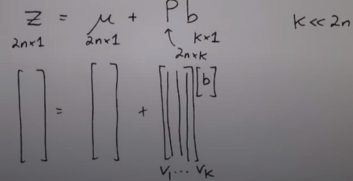

```
Author: Eichenbaum Daniel
Email: eichenbaum.daniel@gmail.com
```
This is a practical demo to understand the theory behind:

```
DIP Lecture 25: Active shape models ¬Rich Radke
  https://www.youtube.com/watch?v=53kx_czs7Es&list=PLuh62Q4Sv7BUf60vkjePfcOQc8sHxmnDX&index=29

Key references:

T.F. Cootes, C.J. Taylor, D.H. Cooper, J. Graham
Active Shape Models - Their Training and Application
http://dx.doi.org/10.1006/cviu.1995.1004
```

# Lecture 29: Active Shape Models

The topic of today is a computer vision problem called 'active shape models'
- So far we've studied the low level of images, computing gradients, connecting edges into lines
- We didn't understood what's really going on in the image
- This lecture is about image understanding or computer vision.

Active Shape Models is a different type of object detection.
- for example, licence plate detection.
- Not template based.


Template base object runs a patch over the image.
- For example a plate over the car image.


That work pretty well for rigid object (they don't change in size)


If you are searching for faces instead, many people have different face features. 
- So this will be usefull for not rigid shapes.


For this to work i need to collect many faces.
- i need to manually assign points to define the face.
- we are trying to find common locations that i can put into correspondance 
 


IDEA:
- Given an image and a mask
- Using a convlutional neural net to search the car plate over the image,
- The mask is telling you the right object position. The true target.
- The task of the neural net is to predict a binary mask for the location of the plate.


### Procrustes Analysis
Greek myth, he was a bandit, he would tie his victims to an iron bed and he would chop off their limbs or stretch them so they fit to bed.
- Scale and stretch

The first thing to do is to scale, rotate and translate each set of points. 
- So the first problem is alignment

Algorithm 1
1. Translate all shapes to be centered at (0,0)
2. Now take one of the shapes $Z^1$, and we are going to scale it, so it has length 1 $||Z^1|| = 1$
3. Scale and rotate everything else (all other shapes) to align with this shape

For each person $a^i$ i'm going to compute the vector for person j and the vector for peson 1.


Then do some manipulations between the X and Y coordinate for person 'j' respect to person 'i'


The magic formula is 
- This is telling me how to scale and rotate person 'j' to align to person number 1
  


My new values for person 'j' will be scale and rotate.


So now, we have $S$ sets of aligned Training sets.

Each of them is described by a 2n-vector of feature points.

### Principal Component Analysis  (PCA)
Clearly these 2n points are not all independant
. I can exploit that correlation

So we want to reduce the dimensionality of this set of vectors $Z$ to a number $K<< 2N$
- Many dimensions are hard to visualize, consider then a cloud of points in 2D
- Along the line is the directions which the data varies the most.
- And the perpendicular is the direction which data isn't varing at all


This also can be seen as a change of coordinates.
- if i only give you one number, i can give you the projection of each point in the new coordinated system.
- If i have to give you just one coordinates i will give you the one who minimizes the error


Algorithm of PCA:
1. Compute Mean of data as $\mu = \frac{1}{N} \sum_{i=1}^S z^i \ \in\ 2n\times1$
2. Compute the covariance Matrix of data as $\Sigma=\frac{1}{s-1} \sum_{i=1}^s (z^i-\mu)(z^i-\mu)^T\ \in\ 2n\times 2n$
    Note, the term $\frac{1}{s-1}$ is what to make to the estimator unbiased for gaussian distribution
3. Compute Eigenvalues and Eigenvectors of $\Sigma$, $(\lambda_i, v_j)$ such that $\lambda_1 \le \lambda_2 \le.. \sum v_j = \lambda_j v_j$
   Lambda is telling me how important is that direction $v_j$.
4. Compute Total Variance $T=\sum_{j=1}^s \lambda_j$

It turns out i don't need that many eigenvectors at all.

5. I can choose the K largest eigenvalues, to account for the $p%$ of the total variance.
   $\sum_{j=1}^K \frac{\lambda_j}{T} \geq 0.99$

Now we can approximate any of the original shapes $Z$ as 



Now i can specify any shape with K numbers by adding up the mean and b.

If i plot the data in the new coordinates i discover that i don't really need the second axis.


The K-dimensional vector **b** defines a small number of parameters for the deformable shape model.

For example, i can have 40 people, with 100 parameters, and i boiled up to just 3 parameters.


This is a demo of shape detection
- The blue dots are maybe the x-y positions of the feature points.
  


As i tune the values of **b** i get different face expressions.


So what i do is choosing the right orientation to match the mask


The mask starts in some random position and then kind of snaps into the face.


What you find is that the mask automatically follows the person's face.


So how do you actually snap the mask to a person's head.


Choosing **b** corresponds to a candidate shape. 
The small set of values from the **b**-vector are like "knobs" we can turn to get the best fit.

The mods (eigenvectors) $v_i .. v_k$ are often intuitive. (for faces they may correspond to $\lambda_1$ for smile, or $\lambda_2$ shaking its head)

The following question is, how do i take my model (knobs) and fit them to an actual new image.
- if you think about this, there's no pixel intensities manipulations.
- i was just choosing locations in my image.

so now i have to figure how to snap that into the person.

### FITTING THE MODEL TO NEW DATA


