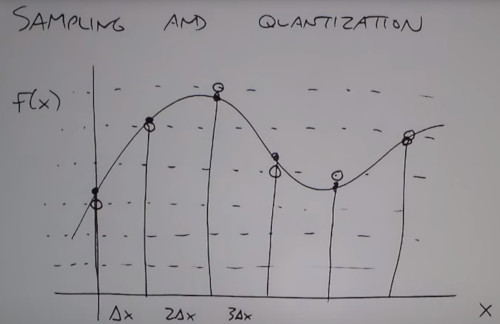

NOTES of the Digital Image Processing course by Ruch Radke

Source: Rich Radke Youtube channel: https://www.youtube.com/watch?v=UhDlL-tLT2U&list=PLuh62Q4Sv7BUf60vkjePfcOQc8sHxmnDX

## Lecture 3: How a camera works

A plane adquire the image as an array, then iterates through next line.

You can meassure an object size through a camera & Trigonometrics
- INPUT: Focal length (mm), OBJ IMG, Z (distance to the object)
- OUTPUT: OBJ SIZE

You can also think the camera is projecting the image

### Quality of an Image

The CCD sizes are:

Depth of field
- Stuff close to the camera super in focus, and background out of focus
- Hard to do it with a tiny camera & tiny sensor
- So an idea is to illuminate infrared camera to get some depth

Image resolution
- If your image has a lot of Megapixels, but your sensor is small then each sensor is gathering less light.
- So the first one to look is the size of the physical sensor, then you worry how that sensor is divided into pixels

Color quality
- Pixel color responses arranged in a **Bayer Pattern**
- Direct Image Sensor, Same proportions of R, G, B
- Color Filter Array sensor, Different proportions of R, G, B
Demosaicing
- Interpolate the right color from neightbors pixels

### Ilumination Model
Given an object O, how much light is coming to the screen F(x,y) with an ilumination source I
- Model each ray, from ilumination source through each point in the screen
- The color of the sensor is a combination of the strength of the ilumination source and the color of the object
- i(x,y): Ilimuninance ray through the screen
- r(x,y): Inherent reflactance of the object
- F(x,y) = i(x,y)*r(x,y)
Limitations (simplified model)
- Color of one pixes is coming from one source of the screen.
- Doesn't work for transparent materials as the light beams don't bounce from its sourface

Daylight
- Clear Sunny day = 90K lm / m^2
- Cloudy day = 10K lm/m^2
- Indoors = 1K lm/m^2
- Full moon = 0.1 lm/m^2

Reflectance
- Snow = 0.93
- Flat white wall = 0.8
- Stainless stell = 0.65
- Black Velve = 0.01

### Sampling & Quantization

Bright Sensors are quantizied (rounded)

The lower the sampling size -> Blockiness
The lower of num of levels  -> False contouringm low detail

We think of an image as a 2D array of numbers.
Color is just a new dimension called channel-

Notation:
- Matlab, (0,0) is the upper left
- Cartesian, (0,0) is the lower left
- Plane projection, (0,0) is the central focal point.

### Matlab
- imshow( ·, []), the second argumetns, states the smallest value to dark and the largest value to white

### Distance between images
- Euclidean distance
- Manhattan distance (city blocks)

### Video
Sampling in the time domain
- Speed visual system perceives a stream of discrete images as being continous
- 30hz / 60 hz

### slow motion
- Old camera, a slight opening in the window is moving instead of a full exposition.
