## Lecture 4: Point operations

### Histograms & Point Operations

Ways to change the image considering the histogram
- Many images with the same histogram. Its not a one-to-one mapping
 
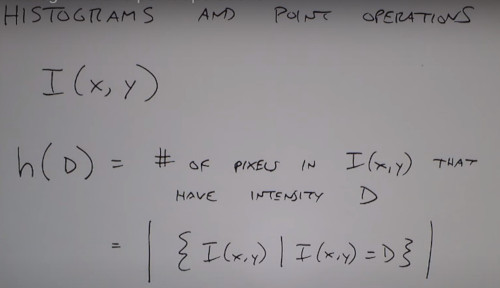

```
img = rgb2gray(img)
imhist(img)
```
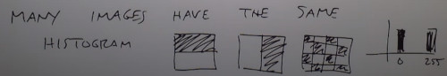

### Point operations
A point transformation of the function, affect every pixel with the same grayscale value in the same way
- Don't change the locations of the pixels
- But redefine its intenisty

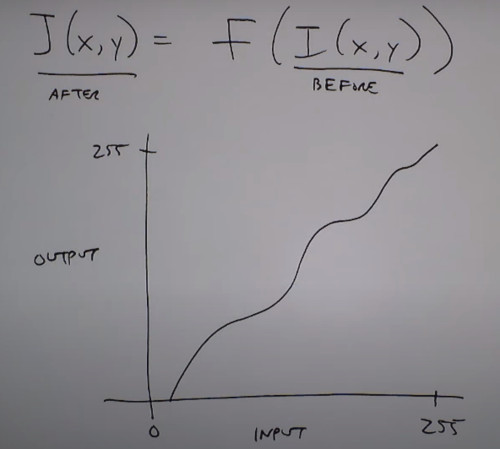

1. Threshold, helps you find bright spots

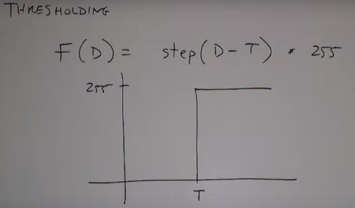

2. Digital Negative

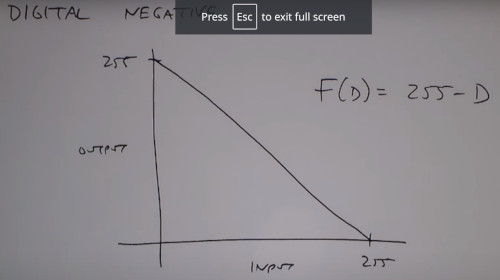

3. Contrast Stretching
- A darker image can be enhance via linearly stretching its values
- You are not changing the image information (specially if you use a mask), you are showing them differenty


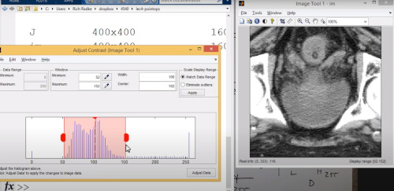

4. Histogram Equalization
- Sometimes, the linear mapping is not enought, different parts of the picture may require different stretching.
- think of an image histogram as a probability mass function
- Or better compute de cumulative density function

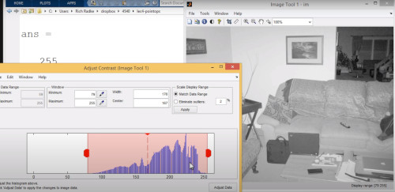


How to transform the original image to a flat uniform distribution?

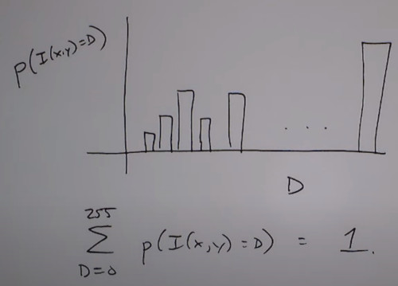

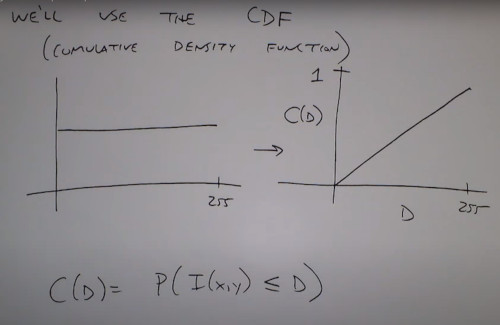

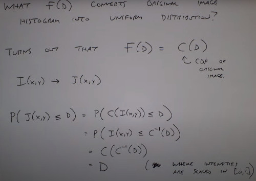

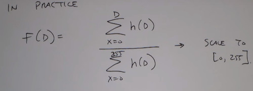

```
histeq
```

5. Histogram Specification
- you can map the histogram into any particular function

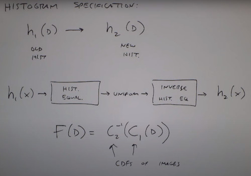


6. Gamma Correction
- Every display, has diferernt nonlinear relation between pixels input intensity and display output intensity.
- What i see on my screen is different from my projector.
- Ideally i want a linear relation from what i input to the screen vs what the screen actually shows
- If you konw the gamma of your device, you can compensate the correction

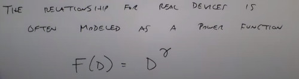

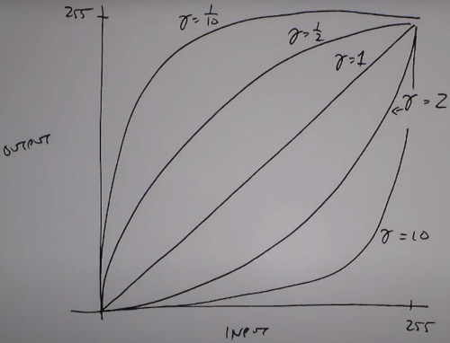

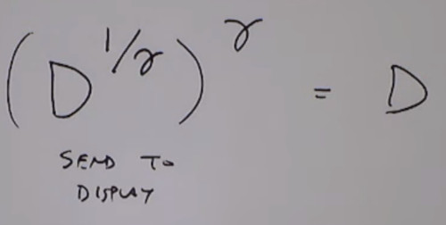

### Local operations
- Many image operations are locally

Spatial Filter
1. AVG filter
- filter an image by the average of its neighbors
- Helps you smooth noise
        
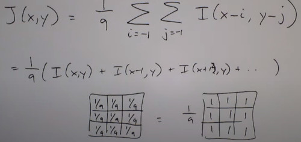


2. Edge detecting Filter

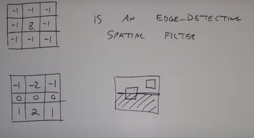

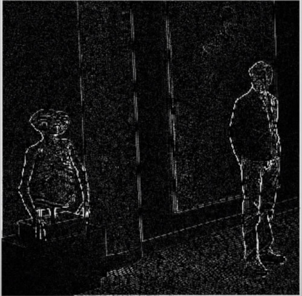

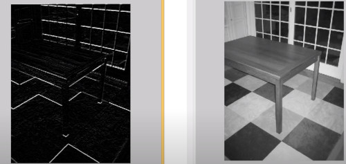

# So far
so far we are changing the pixel intensity of the pixels
Next we will apply spatial transformations, as rotating, scaling...
