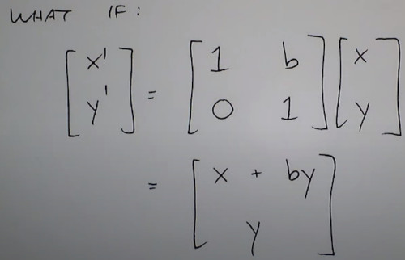
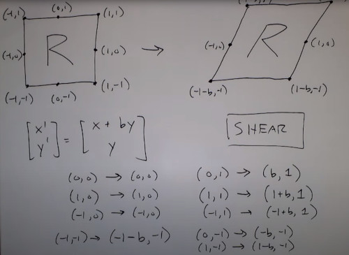
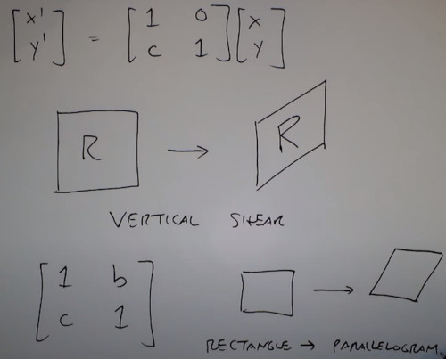
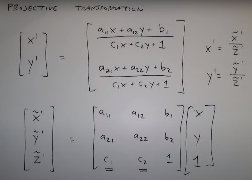
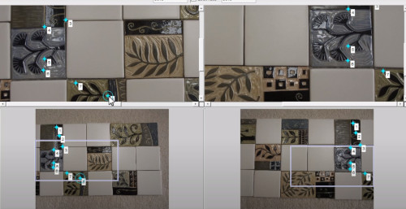
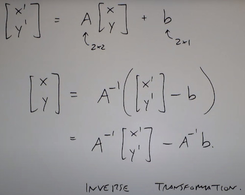
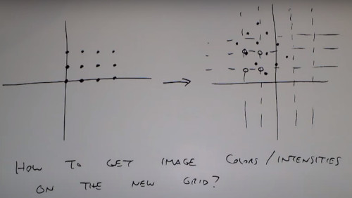
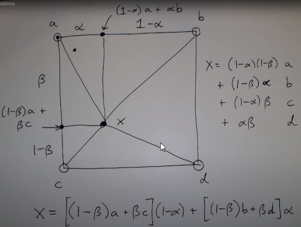

# Geometric operations
- In euclidean transformations


- Translation


- Scaling
 


- Flip


- Rotation


- Shear








### Forward Mapping
Similarity transformation
- Scale + Shift + Flip
- Preserves Parallel lines


Isometric Transformation
- Preserves shapes, angles


Projective Transformation



### Automatic Alignament
- (dual align is a more robust version)
Align a collection of image to build a bigger picture
1. Find the same points in multiple images.
2. Find the affine transformation for each image
3. Use linear regression to find the best alignments

Version 2
Repeat but with a projective transformation

Version 3
Can you model the lens distortion?

version 4
can the points be found automatically?
```
cpselect(im1, img2) #selects those points in both images

function mosaic(I, J, pt1, pt2):
  S = size(I)
  T = fitgeotrans(pt1, pt2, 'affine)
  Iregistered = imwarp(I, T, 'OutputView', imref2d([s(1), 2*s]))
  Jregistered = imwarp(J, affine2d(eye(3)), 'OutputView', imref2d([s(1), 2*s]))
  
  Imask = any(Iregistered, 3) > 0
  Jmask = any(Jregistered, 3) > 0
  
out = mosaic(im1, im2, movingPoints, fixedPoints)
```







### color interpolation
Bilinear Interpolation
- Given 4 fixed points, you want a linear interpolation between 2 pivel values




