# Geometric operations
- In euclidean transformations

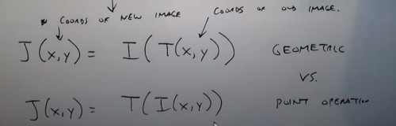

- Translation

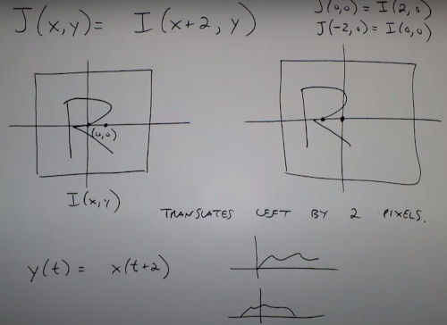
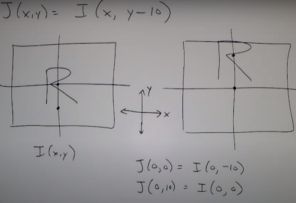

- Scaling
 
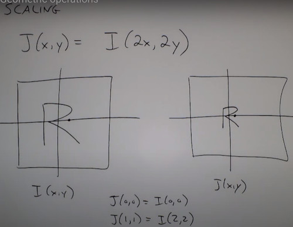
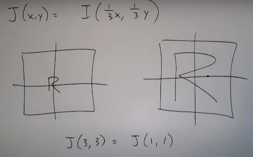
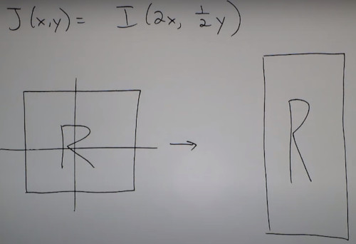

- Flip

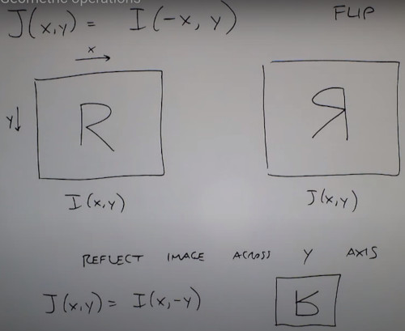

- Rotation

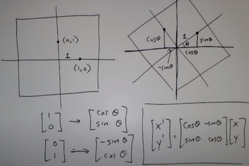

- Shear

### Forward Mapping
Similarity transformation
- Scale + Shift + Flip
- Preserves Parallel lines

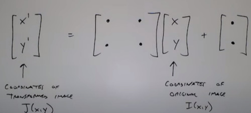

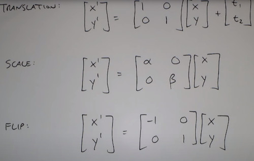

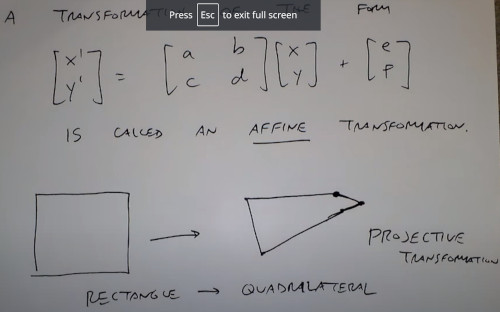

Isometric Transformation
- Preserves shapes, angles

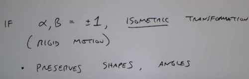

