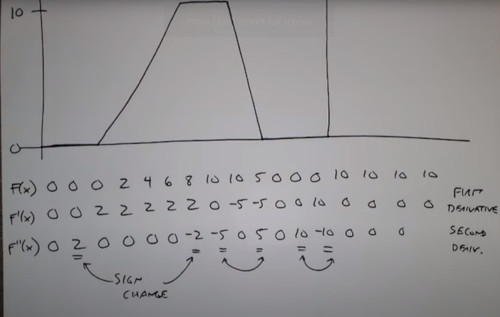

# Book Robot vision
# Lecture 6: Spatial filter


Recall 1-D filter
- 2D filter, odd dimension (symetrical respect origin)


Looks almost like correlation
- The only difference is wheather you flip the filter or not.

If filters components adds to 1, then you preserve the original intensity.

Note.
```
Filter2(h, img)
# Gets actual floating point results
#Not scaled to  [0, 255

imFilter(h, img)
#uint8 -> uint8
#works with color
#May loose important values <0 or >255
```


### Low pass Filters
Moving avg
- Repleace each filter via a weighted average of its neighbors
- Pros: Reduces certain kind of noise
- Cons: Blur the image


You can combine, filtering and threshold


Gaussian Filter
- Adjusting sigma you control the cut-off frequency
- 


### High pass filter
Instead of looking the sum of pixels (int), take the difference of pixels
- result is sharpening

1D example.
- large slopes, larger derivatives




