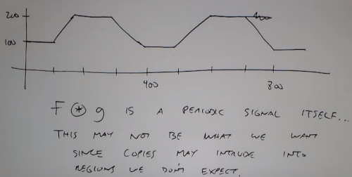

## Lecture 7: 2D discrete fourier transform
1D fourier transform

2D fourier transform

2D fourier transform is separable
- The first term is the sum of all pixels intensities (makes sense to plot in a logarithmic scale)

Basis functions
- Symetric respect NFFT/2
- High freq at NFFT/2

DFT of an image
- High frequency = edges
- Low frequency = planes

In the shifted version, 
- You can see low frequency strong lines
- Remember DFT, the image is periodically repeated
- you can see that the discontinuity of the borders of the image, implies a delta response in frequency at both axis

In this example you can see a strong diagonal lines

In this example, you don't have a missmatch border, and the pattern is kind of circular

### Fourier transform properties
Note. we didn't talk about phase yet.

Shifting
- You don't change the absolute value but the phase

Scale/Flip
- **Scale Brightness**, scaling the intensity of the image corresponds to scaling the frequency of the image
- **Scale Size**, Scale the size of the image

Rotation

Convolution
- Appling convolution in the time domain is more efficient than in the frequency domain
 

Linear convolution 

Circular Convolutio

### Correlation

Stripes lines are rotates 90º in frequency domain

