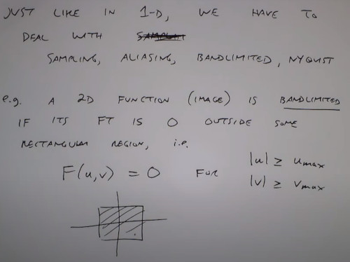

Books:
  Gonzalez and Woods, Sections 4.7-4.9, 4.11

# Frequency domain filtering, sampling and Aliasing 

Pipeline
- Spatian Domain convolution <-> Frequency Domain Multiplication

### Box mask & Circle mask

### Impulse response
- Smaller the cutoff freq => more blurring & bigger the ringing
- The solution is a smoother filter design 

### Gaussian filter
- Is good at time domain as well as frequency domain
- You can smooth the image without the ringing artifact 

### High pass filter

### Laplacian filter
- Laplacian's filter represents the second derivatives of the image for both directions aka laplacian
- Also you can combine a low pass Gaussian filter with a high pass laplacian, achieving a band-pass filter

### Sampling & Aliasing

You have to sample at least 2ble nyquist frequency, otherwise if you want to sample a chessboard you will end up sampling a black image

Antialiasing filter

The Woman on the right was downsampled by 4

You can apply an antialiasing filter, but you are loosing the detail
- However you can downsampling it now without problems
 

In video games, you want to have a good render for text.
- The idea here is to upsample the image by 4, then apply some blundering techinique

Moire patterns
- 2 images with different frequency, any rotation doesn't change the frequency.
- maybe an aliasing of our vision

