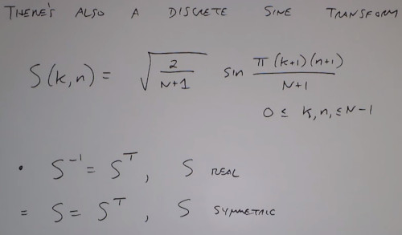

# Lecture 9: Unitary Image Transforms

### General Image transformations
- In 2D a rotation is like a change of basis of the coordinate system

Unitary Transform

Fourier Transform
- Fourier coeficients for an image
- 90% more energetic coefficients in red
 

Spatial Basis
- Spatial coeficients for an image
- 90% more energetic coefficient in red

Compression & Parseval Theorem
- You can choose the coefficients who describe the 90% of the image energy

Different Basis distribute different the energy.
- Pros cons DFT
- Impusle response has infinite coeficients. 
  - A very Localized point, require infinite frequencies to describe it

![pros_cons_dft.jpeg]

### Discrete Cosine Transform
- Critical part of the Jpeg algorithm

### Discrete Sine Transform

### Hadamart Transform
- Doesn't require to compute trigonometric functions
- Recursive definition

### Haar Transform
- The simpler Wavelet Transform
- Has more local property
- Has a recursive pattern

### Wavelet Transforms
- Unitary
- Can Represent Both smooth and discontinuous images without using lots of coefficients
- Local Basis functions
- Computationaly Efficient

There are wavelet transform algorithms jpeg2000
- .jp2
- .j2c

A mixture between time and Frequency
- Resolution in time vs resolution in freq
- High frequency more localized

Wavelets as filter banks
- wavelet filter bank

Multiscale/Multiresolution analysis
- Represent what's important at different levels of the image
- Many resolution at different scales

