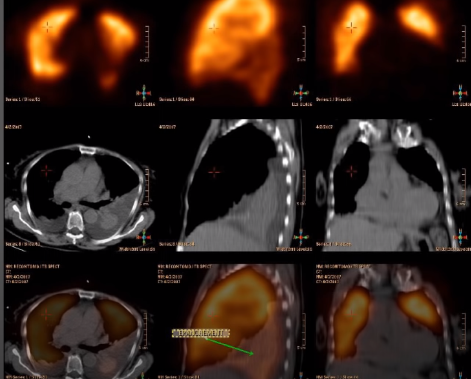
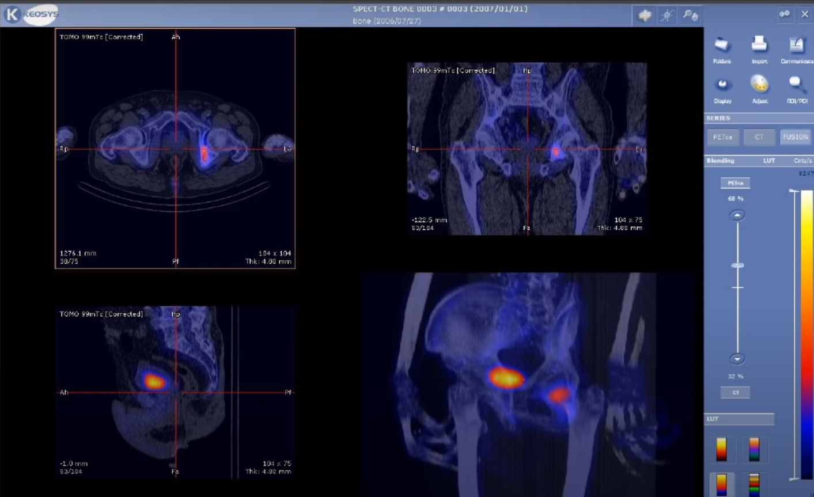
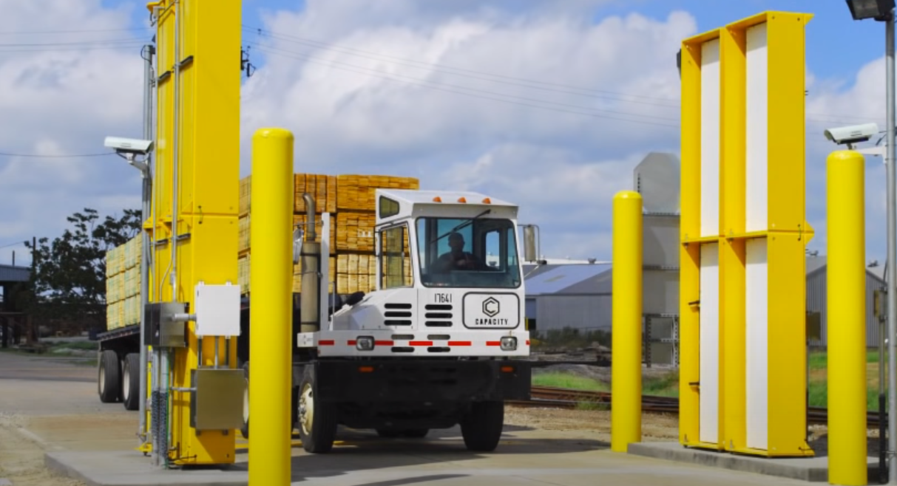

**NOTES of the Digital Image Processing course by Ruch Radke**

Source:
  Rich Radke Youtube channel:
  https://www.youtube.com/watch?v=UhDlL-tLT2U&list=PLuh62Q4Sv7BUf60vkjePfcOQc8sHxmnDX
  
  
  
## Lecture 1. Introduction

What is a digital Image?

- Radar Image (RPI)
- Camera
- Medical Imaging

    Patient get injected some sort of isotope, the gamma rays get detected by a detector
    - Gamma Ray Imaging
 

