```
Author: Eichenbaum Daniel
Email: eichenbaum.daniel@gmail.com
```
This is a practical demo to understand the theory behind:
```
DIP Lecture 12b: Snakes, Active Contours and level sets ¬Rich Radke
    https://www.youtube.com/watch?v=RJEMDkhVgqQ&list=PLuh62Q4Sv7BUf60vkjePfcOQc8sHxmnDX&index=14

Textbook: ch. 11 Digital Image Processing
  Gonzalez and Woods, 4th ed.  
  https://www.amazon.com/-/es/Rafael-Gonzalez/dp/0133356728  
```

# Lecture 14: Image segmentation continuation

Instead of dealing with Pixel level segmentation, we are about to deal with curved level segmentation.
- The idea is to segment curves, not pixels.
- The convex hull evolves shrinking like a rubber band


Its an iterative process, we want a segmentation curve that.
1) Conforms to Image Edges
2) Is a smoothly varying curve vs lots of jagged rooks and crannies Tradeoff

What is a good curve? Define a cost function.
How to define a curve.

# Snakes
Parametric representation of a curve.
- A function of X(t) and a function of Y(t). as we change t\in[0,1] we trace a contour in the plane.
- We assume X,Y and t are continuous.


- Now we want to define an Energy function $E(C)$, where C is a curve, that matches an intuition of how well our curve is.
- The curve will iteretarively evolve to reduce / minimize $E(C)$.

We descompose $E(C)$ into 2 parts


- $E_{internal}$ only depends on the shape of the curve
    - Can be thought as Tension Energy, the higher the squigglyier
    - Or the Elastic Energy of the curve
    - The first term (first derivative or speed) is related to how stretchy a curve is. Sampling the curve leads you to close points.
    - The second term (second derivative) low C'' means not too 'bendy'. Keeps points on the curve from oscilating.


- $E_{external}$ depends on image intensities (Edges)
    - What makes a curve good externally?
    - Final curve should basically lie in top of strong edges of the image


NOTE: Assuming Image is grayscale
- If there is no edge, then its gradient is zero
- If i have a big edge, then $||\nabla I|| is big, meaning $E_{ext}$ lower energy (negative)
    
Intuition is that I want the snake being attracted to edges
    
### How to Minimize E(c) via variational calculus?

Finding the Curve function, which minimize its Energy.
- In practice we solve the problem by creating a curve $C(s,t)$ with $s, t$ discrete.

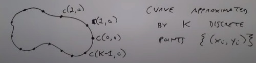

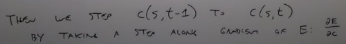

In practice, this results in a $2K \times 2K$ linear system solved at each iteration.
- lot of tips under the hood.
- You may want to resample the curve to uniform points

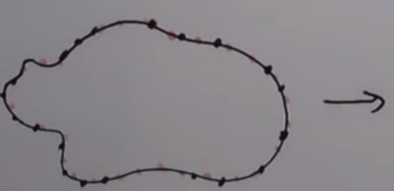

```
#Matlab: SNAKE ALGORITHM
```
It is not always robust

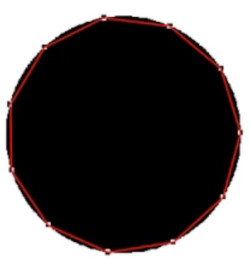
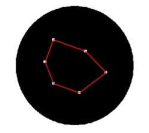
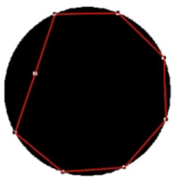
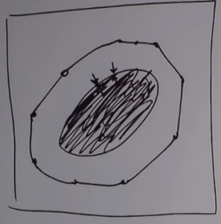

Problem with basic snake 
- Flat regions (white or black) have $E_{ext}=0$ 
- Contour never sees strong edges that are far away
- Image noise implies small gradients hunging up the snake

The solution is **Gradient Vector Flow** (GVF)

Idea:
- Instead of using exactly the image gradient, create a new vector field over image plane

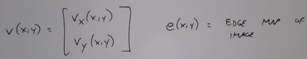

so $v$ is defined to minimize:

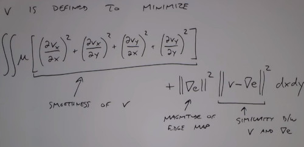

Where $||\nabla e||^2$ is basically the magnitud of the edge map

Where $||v - \nabla e || ^2 is basically saying, how similar is the thing i'm creating $v$ to the thing i want $\nabla e$

When i'm in a really edging region, then the $v$ i'm creating agrees with what's going on with the edges $\nabla e$.
- As Those terms are multyping, when $\nabla e$ is big, $v-\nabla e$ must be small.

Where $u$ is a tunning parameter who trades off how smooth is the vector field vs how close it is from the edges.

Intuition:
- If $\nabla e$ is big, gradient is large and $v$ is going to follow edge gradient faithfully.
- If $\nabla e$ is small, gradient is small and $v$ is following along to be as smooth as possible.
- $u$ trades off 'how smooth' vs 'how faithfull'

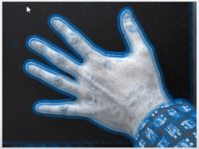
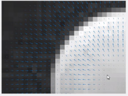

There are little vectors who normally would have zero gradient pushing toward the edge.

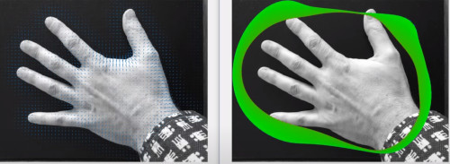

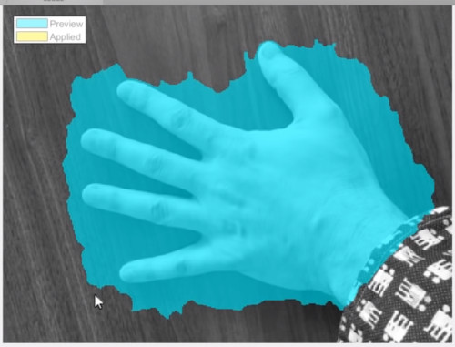

It doesn't work well with texturized background, 

also its slow
