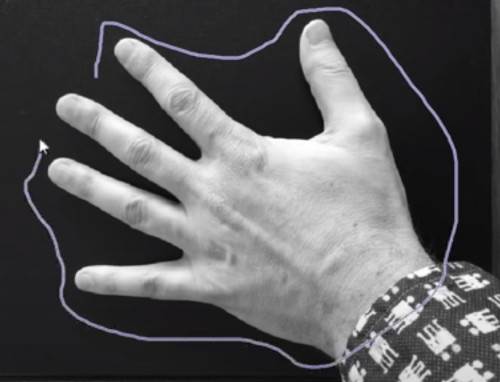
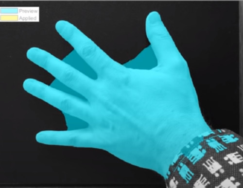
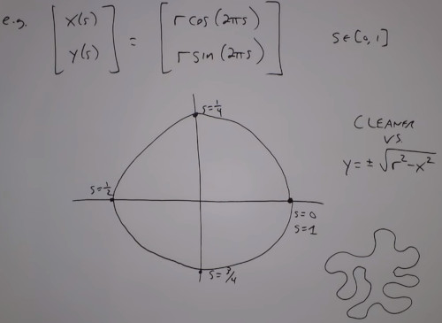
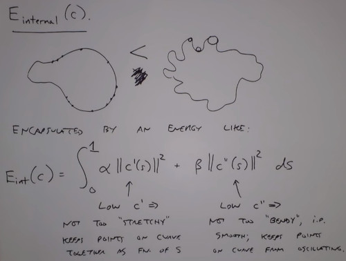
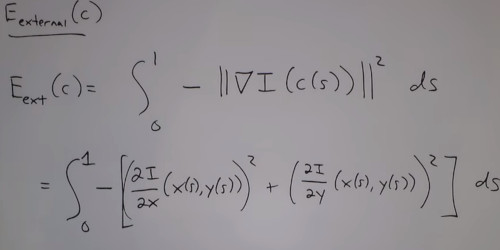

```
Author: Eichenbaum Daniel
Email: eichenbaum.daniel@gmail.com
```
This is a practical demo to understand the theory behind:
```
DIP Lecture 12b: Snakes, Active Contours and level sets ¬Rich Radke
    https://www.youtube.com/watch?v=RJEMDkhVgqQ&list=PLuh62Q4Sv7BUf60vkjePfcOQc8sHxmnDX&index=14

Textbook: ch. 11 Digital Image Processing
  Gonzalez and Woods, 4th ed.  
  https://www.amazon.com/-/es/Rafael-Gonzalez/dp/0133356728  
```

# Lecture 14: Image segmentation continuation

Instead of dealing with Pixel level segmentation, we are about to deal with curved level segmentation.
- The idea is to segment curves, not pixels.
- The convex hull evolves shrinking like a rubber band





Its an iterative process, we want a segmentation curve that.
1) Conforms to Image Edges
2) Is a smoothly varying curve vs lots of jagged rooks and crannies Tradeoff

What is a good curve? Define a cost function.
How to define a curve.

# Snakes
Parametric representation of a curve.
- A function of X(t) and a function of Y(t). as we change t\in[0,1] we trace a contour in the plane.
- We assume X,Y and t are continuous.



- Now we want to define an Energy function $E(C)$, where C is a curve, that matches an intuition of how well our curve is.
- The curve will iteretarively evolve to reduce / minimize $E(C)$.

We descompose $E(C)$ into 2 parts


- $E_{internal}$ only depends on the shape of the curve
    - Can be thought as Tension Energy, the higher the squigglyier
    - Or the Elastic Energy of the curve
    - The first term (first derivative or speed) is related to how stretchy a curve is. Sampling the curve leads you to close points.
    - The second term (second derivative) low C'' means not too 'bendy'. Keeps points on the curve from oscilating.


- $E_{external}$ depends on image intensities (Edges)
    - What makes a curve good externally?
    - Final curve should basically lie in top of strong edges of the image



NOTE: Assuming Image is grayscale
    - If there is no edge, then its gradient is zero
    - If i have a big edge, then $||\nabla I|| is big, meaning $E_{ext}$ lower energy (negative)
    
    
