```
Author: Eichenbaum Daniel
Email: eichenbaum.daniel@gmail.com
```
This is a practical demo to understand the theory behind:
```
DIP Lecture 13: Morphological image processing ¬Rich Radke
  https://www.youtube.com/watch?v=IcBzsP-fvPo&list=PLuh62Q4Sv7BUf60vkjePfcOQc8sHxmnDX&index=15

Textbook: Sections 9.1-9.5 of Digital Image Processing
  Gonzalez and Woods, 3th ed.  
  https://www.amazon.com/-/es/Rafael-Gonzalez/dp/0133356728  
```

# Lecture 15: Morphological Image Processing

We want to operate in a binary image. (i.e. after thresholding)

There might be some pixels that should be black and other ones that should be white.

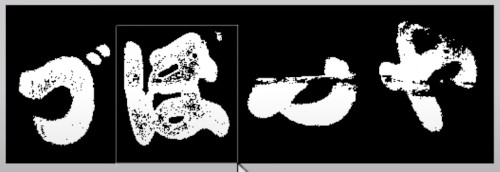

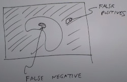
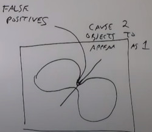


Morpho = shape based processing.

Morphological operators takes a **set of pixels** and returns a **set of pixels**
- A set of pixels is a list of coordinates $(x_i, y_i)\ x,y\in Integer$

Key Element "**Structure element**" is a small template that helps produce the new image from the old one.

Translation Operation:

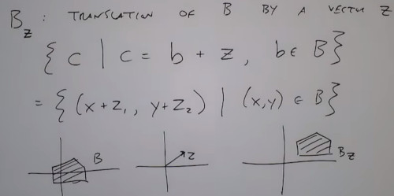

Reflection Operation:

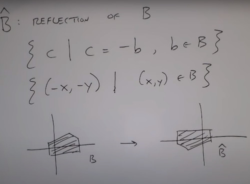

Structuring element: small Binary Array

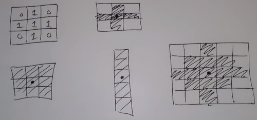

Erosion:
- Set of points $Z$ such that the Structure element (Strel) translated by $Z$ fits fully inside $A$

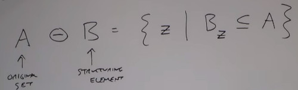

Example of breaking the islands with 2 structure elements.

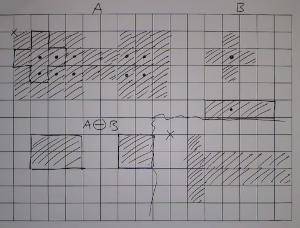

```
#matlab STREL('disk',1)
[0 1 0]
[1 1 1]
[0 1 0]
#its not just a matrix, it has a center
```
In this exmaple, skinny lines doesn't fit the structure element, also it thickers the rest of the image
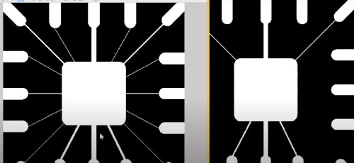

So Erosion Removes thin lines, isolated dots. Is peeling away layers (edges)

## Dilation

Now we want to flatten out pixels

Erosion is always a subset of the image A
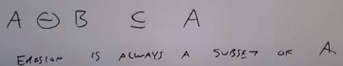

Dilation finds pixels such that shifted STREL has any overlap with the original set.
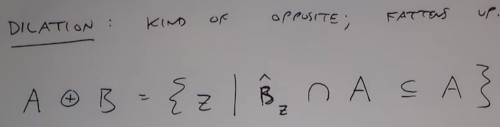

```
#matlab imdilate(im, strel)
```

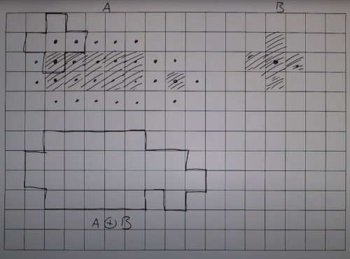

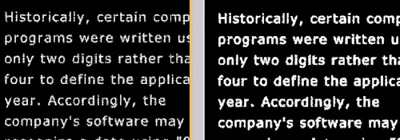
