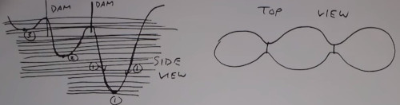
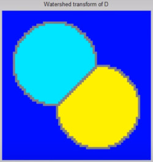

```
Author: Eichenbaum Daniel
Email: eichenbaum.daniel@gmail.com
```
This is a practical demo to understand the theory behind:
```
DIP Lecture 13: Morphological image processing ¬Rich Radke
  https://www.youtube.com/watch?v=IcBzsP-fvPo&list=PLuh62Q4Sv7BUf60vkjePfcOQc8sHxmnDX&index=15

Textbook: Sections 9.1-9.5 of Digital Image Processing
  Gonzalez and Woods, 3th ed.  
  https://www.amazon.com/-/es/Rafael-Gonzalez/dp/0133356728  
```

# Lecture 15: Morphological Image Processing

We want to operate in a binary image. (i.e. after thresholding)

There might be some pixels that should be black and other ones that should be white.


Morpho = shape based processing.

Morphological operators takes a **set of pixels** and returns a **set of pixels**
- A set of pixels is a list of coordinates $(x_i, y_i)\ x,y\in Integer$

Key Element "**Structure element**" is a small template that helps produce the new image from the old one.

Translation Operation:


Reflection Operation:


Structuring element: small Binary Array


Erosion:
- Set of points $Z$ such that the Structure element (Strel) translated by $Z$ fits fully inside $A$


Example of breaking the islands with 2 structure elements.


```
#matlab STREL('disk',1)
[0 1 0]
[1 1 1]
[0 1 0]
#its not just a matrix, it has a center
```
In this exmaple, skinny lines doesn't fit the structure element, also it thickers the rest of the image


So Erosion Removes thin lines, isolated dots. Is peeling away layers (edges)

## Dilation

Now we want to flatten out pixels

Erosion is always a subset of the image A


Dilation finds pixels such that shifted STREL has any overlap with the original set.


```
#matlab imdilate(im, strel)
```


Next, what we want are operators that bridge gaps/fill but don't change overall are of objects.

## Opening 

Erode, then dilate.
- Break narrow bridges
- Eliminate thin structures


## Closing

Dilate, then erode.
- Fuses narrow breaks
- Eliminates small holes


In this example, the first image is the original fingerprint, the second is eroded with ```strel('diamond', 1)```, and the third is closed with ```strel('square', 3)```


There many combinations of Erosion, Dilation

## Boundary extraction

Take the original shape and erode by 1 pixel then substract ```xor``` that from the original shape.


Here we want to extract the hole or flood it.
- Starting inside the whole you keep dilating as long as you stay in that region


There are more morphological operators...

## Watershed transform

The idea is to reconstruct shape through ilumination.
Application: For counting blobs or disconnected shapes


Given a grayscale image, we think of this as a height map of ilumination.


1. Find a local minima (lowest intensity value)
2. Punch a hole in each one
3. Start rising the water level from the bottom 1 unit at a time
4. Keep track of which points are asociated with which minima. (group through gradient)
5. At the point two basins are about to merge, build a single pixel "dam" to make it separate (list of pixels)




How is this related to morphological image processing?
- Lets revisit the flooding of 2 basins at time N.
- The flooding is a dilation operation which makes the basins a little bit bigger.
- So you keep flooding and building a wall as needed
- 'Floot at time N' all pixels which $I(x,y)<N$


The inverse process is also available
- Given a binary Image, you want to convert to a gray scale image.
- What is the furthest distance that any pixel is from a given value point
- The closer to the boundry the lower its value
- Once you have the gray scale image you can plot apply the watershed algorithm




For example, if you have an image of cells made from different blobs, you want to count the number of cells.

