```
Author: Eichenbaum Daniel
Email: eichenbaum.daniel@gmail.com
```
This is a practical demo to understand the theory behind:
```
DIP Lecture 13a: Region Description and filtering ¬Rich Radke
  https://www.youtube.com/watch?v=_kwZj-EB1OU&list=PLuh62Q4Sv7BUf60vkjePfcOQc8sHxmnDX&index=16

Textbook: Sections 12.1-12.4 of Digital Image Processing
  Gonzalez and Woods, 3th ed.  
  https://www.amazon.com/-/es/Rafael-Gonzalez/dp/0133356728  
```

# Lecture 16: Boundary, Region Description and Filtering

So far we talked about Finding shapes like Graph cutting, active contours or just playing with thresholding
- They were focused on finding a single shape that we called 'foreground' and trying to separate from the 'background'
- We also talked about Erosion, Dilation, opening, closing to get rid of undesirables objects
- A real life example involves the finding of many shapes like in a petri dish

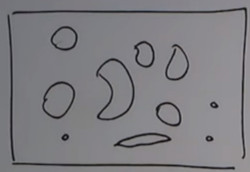

We will talk about
- Shape of objects
- Texture of objects
- matlab 'regionprops' (properties of an object)

## SHAPE PROCESSING

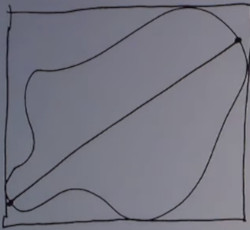

- Perimeter
- Area
- Diameter (the longest path between two points that are on the boundary)
- Bounding Box (smallest rectangle enclosing the object)

Compactness of the blob
- The smallest you can do is a circle
- With the same Area you can increase the perimeter

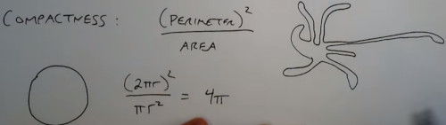


Centroid or Center of mass.
- Where are most of the pixels locates. (avg of all points)

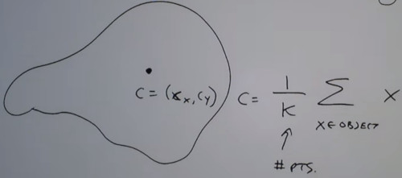

What is the best fit ellipse?
- How to fit the best ellipse in the object
- Eigenvalues and Eigenvectors tell us the size and orientation of the ellipse

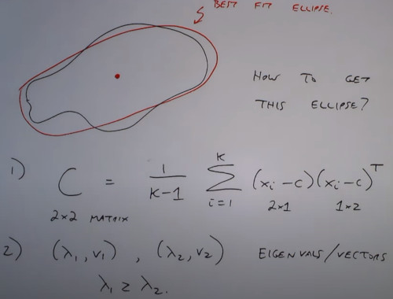

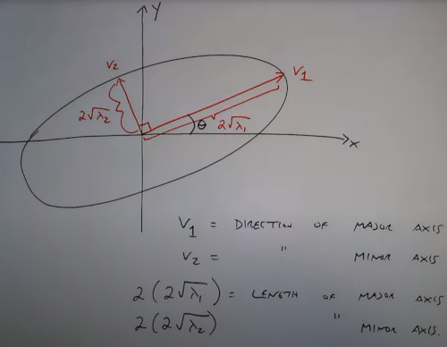

```
#Matlab
[x, y] = meshgrid([-100:100], [-100:100]);
z = (x/5).^2 + (y/3).^2;
im = z < 100;
imshow(im)

r = regionprops(im)
>>> Area = 4689
>>> Centroid = [101, 101]
>>> bounding box = [51, 71, 99, 59]
```


Eccentricity of the ellipse
- Circle has ECC = 0
- Line has ECC = 1

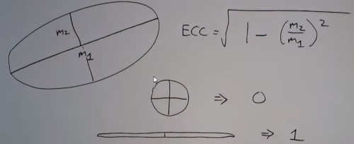

```
r = regionprops(im, 'area', 'eccentricity')
a = [r.Area]
e = [r.Eccentricity]

ind = a > 50 & e<0.4;
find(ind)
```

```
function highlight(bw, ind, im)
r=bw;
g=bw;
b=bw;

if nargin >2
  rim = im(:,:,1)
  gim = im(:,:,2)
  bim = im(:,:,3)
end

if islogical(ind)
  f = find(ind);
else
  f = ind;
end

L = bwlabel(bw);

for i=1:length(f)
  ob = (L==f(i));
  r(ob) = 1;
...
```

```
bwlabel(bw) %Each blob in different color
```

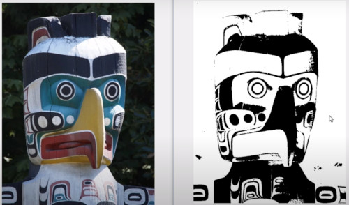
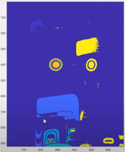

Now show the thing who passed the test

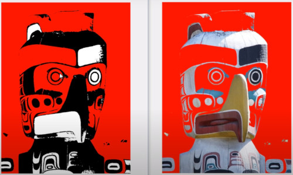

Now we want 
` ind = a > 50 & a <50000 & e<0.7`

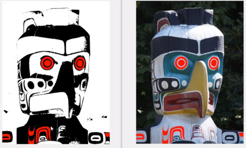

Solidity test
` ind = a > 50 & a <50000 & e<0.7 & s>0.7`

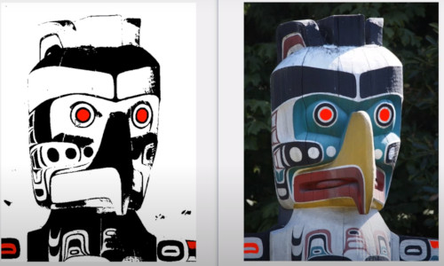

# Topology of the Blob
The Euler number counts how many conected components has minus num of holes.

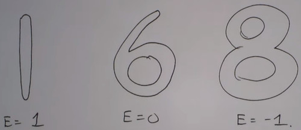

Magnetic Ink character recognition.
- How to design numbers that are easily identificable

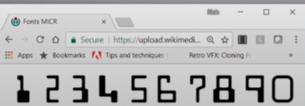


