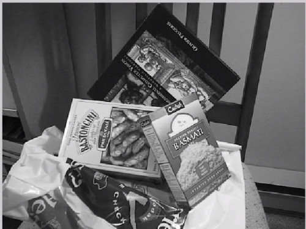

```
Author: Eichenbaum Daniel
Email: eichenbaum.daniel@gmail.com
```
This is a practical demo to understand the theory behind:
```
DIP Lecture 14: Object and feature detection ¬Rich Radke
  https://www.youtube.com/watch?v=ddXvs1Wp95A&list=PLuh62Q4Sv7BUf60vkjePfcOQc8sHxmnDX&index=17

Textbook: Sections 12.1-12.2 of Digital Image Processing
  Gonzalez and Woods, 3th ed.  
  https://www.amazon.com/-/es/Rafael-Gonzalez/dp/0133356728  
```

# Lecture 17: Object and Feature Detection
Up to this point we talk about how to get primitives
- Lines
- Use Sobel Edge detector to find edgy points
- And use Hough transform to connect those edgy points with straight lines
- How to use morphological image processing
- How to use Binary image processing to find those points or lines around the boundary

But how do i detect specific objects in the image?
- if i want to detect faces or chairs
- How to go from the low level stuff to higher levels
- Today we will overview how those kind of processes work


EDGES -> LINES -> BOUNDARIES

## Basic Template Matching
Idea. try to slide a template into an image to find where there is a high probability match
- Where the fundamental concept is spatial filtering, like sobel filter
- Same as convolution or correlation
 


### Correlation between a template and an image
Think about the image, and the Image as Random Variables.


Let $\bar{W(x,y)}$ the avg value of the template
Let $\bar{I_{XY}}$ the avg value of the image inside that window


If the $\gamma$ correlation is $+1$ then the template matches perfectly the window (or its a constant times it)
If the $\gamma$ correlation is $-1$ then the template is the flipped intensities (digital negative)
If the $\gamma$ correlation is $0$ then the template is not close the image

`normxcorr2()'

```
%matlab
function findtemplate(im, temp, th, showtemp)
out = normxcorr2(temp, im);
[m,n] = size(temp);
out = out(m+1:end , n+1:end);
bw = out > th;
r = regionprops(bwlabel(bw));

if nargin > 3
  im(1:m, 1:n) = temp;
end

clf
imshow(im, [])
hold on;
for i = 1:length(r)
  rectangle('position', [r(i).Centroid(1), r(i).Centroid ...])
end
```


If you allow lower correlation threshold, then you can find similar objects


It can perform well with noise, but not that much neither


Another example is trying to find all windows


Increasing the window size makes no match in the image


# Image Features
not necesary try to find the whole object in the image, but instead a little pieces of an object.
So you break out the object of interest into so called 'feature points' 

For example, instead of trying to find a particular face you may try to do is to make corner points or features points
that describes different regions of the face.
- you may run tiny detectors on the image
- The idea is to describe an object as a collection of smaller features
  


## What makes a good feature?
A feature should be something distinctive in the image
- Are the following pixels good features of the image?
  


The middle feature has nothing inside but a flat texture, not best option.


What about this guy? is this a better representation?
- Its an edge
- moving up and down you can find the contour of the object
  


Then it is this sticker feature
- This guy is good, it has edges in both directions, if you try to correlate this feacture you would have high correlation


So lets test how good is each feature.
- You would like to have a feature to tell you how good is that feature


So you want to define a detector and a cost function 
- A good feature should have lots of edge strenght in 2 directions.
- They should be locally disctintive
  (like a puzzle piece)
- Have high gradients in both directions
  


### Shi-Tomasi Corner Detection
1. Compute gradients $g_x, g_y$ at each point in the image (ussually Sobel or 1-1 detectors)
2. For every $N \times N$ block $B$ of pixels
   - create matrix of gradients
  


  - Compute eigenvalues and eigenvectors of the matrix ($\lambda_1, \lambda_2$)
  - If $\labmda_1, \lambda_2 are both > \tau$  then Accept $B$ as a feature.

The idea is that the eigenvalues of that block, has something to do how edgy the block is 
And the eigenvectors tells you where are the dominant edges of your edges.

Here u, v si basically saying what do i get if i correlated with all of its neighbors. u,v are how do i move away from the center
- The flat patch is saying that all blocks are basically the same
- The edge patch, is saying that in one direction i have high differences while in the other i have no correlation
- The last both patches are saying that the image only matches at the zero point.


```
%matlab
corner()
```
Another example 


Non maximum supremum
- instead of trying to find the stronger corner in the neighborhood

Shi-Tomasi (related to Harris corner detector) is good for finding corners at a certain scale, but has some issues:
- There may be many corners (1Mega pixels image would give you thouthens of points)
- Only at a small scale


### Invariance
The idea behind point feature detection is to be scale independent.
- I want to draw a circle arround the feature to know how long it extends
- Also you would want to take a picture of the same feature at different perspectives 


The center of the circle is showing you where the feature is located and the radius is kind of showing you what is the information that should make up that feature when i described it.


Even with scaled the feature should be invariant to transformations
- Defining a circle or a square about that feature wouldn't help you


So i want something that i can compare independant of the orientation of the feature.


### Better Features than simple Corners
- Multi-scale (windows of different sizes)
- 'Best' scale for a feature (characteristic scale)
- viewpoint or rotation invariant neighborhoods to describe the feature (that is instead of comparing a square of blocks of pixels here, i want to be able to understand how to normalize a region that is directly comparable to each image very differently looking)

Harris-Laplace (how to find the corners and how to find the scale)

### SIFT feature detector
Scale Inveariant Feature Transform
- Finding the pixels that should describe certain feature
- For template matching, we're directly comparing pixel intensities.

- Instead, i extract what's called 'the descriptor' from the region of pixels
- a different way of thinking what's inside that square or circle for direct comparison.

Suppose i found those regions
- Suppose i found the pixel at the left, and the circle is kind of telling you how does this feature excells
- First thing is to assign an orientation to that feature
- Based on the gradients of that picture,
- you can draw a histogram of the gradients inside that box
- There's a lot of pixels pointing in the same direction
  


No matter how big that block is, you will end with an 16-grid of different directions


Then you can compare from multiple images, the direction of each feature.


Another example:



I have this book, that i want to find in the image
- The book is found in the image even when it has been obscured by the other objects
  


Even with different perspective, orientation and scale it performs well


Feature detectors are also used in movies to track some texture to the character.


Homework,
compare template matching with SIFT or modern detectors
