```
Author: Eichenbaum Daniel
Email: eichenbaum.daniel@gmail.com
```
This is a practical demo to understand the theory behind:
```
DIP Lecture 15: Lossless image coding ¬Rich Radke
  https://www.youtube.com/watch?v=EiD0PuL2yhk&list=PLuh62Q4Sv7BUf60vkjePfcOQc8sHxmnDX&index=18

Textbook: Sections 8.1-8.2 of Digital Image Processing
  Gonzalez and Woods, 3th ed.  
  https://www.amazon.com/-/es/Rafael-Gonzalez/dp/0133356728  
```

# Lecture 18: Lossless Image coding
So far we tried to understand what this data is. Now we will deep about image compression.

Image formats
- BMP (low quality and takes a lot of space)
- PNG
- GIF
- JPEG
- TIFF

There are 2 versions of formats
- Loseless (no corruption of information)
  - For medical diagnosis (no artefact)
  - For legal reasons (preserve evidence)
  - Satellite Imagery (so expensive)
  - High quality imaging
  - General file compression (don't loose your information)
- Lossy

To meassure performance
- Use Compression Ratio: num of compressed bits / num of original bits
- For loseless compression ratios are in the order of 2-10
  
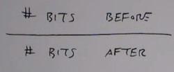

## Lossy compression (next lecture)
I'm going to tolerate some difference between my compress image and my original image
As long as the compression ratio is better.

What's our visual system is able to tolerate?


## Lossless compression

## Image histogram
What can be compressed depends a lot of the probability mass function of the image.

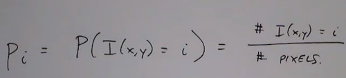

How many bits it takes to represent the image in avergar
- The sum of all histogram labels times the number of bits i need to code that label
- The expected number of compressed bits
  
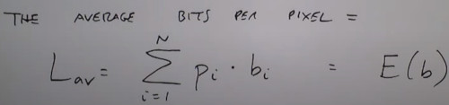


For Uniform histogram Coding ($b_i=b$ i.e. 8bits)

### Morse Code
The idea is to use fewer bits to describe more frequent symbols
- E = "."
- Q = "_ _ . _ ."

### Optimal codeword
Consider an 8-level  image and the probability of that level

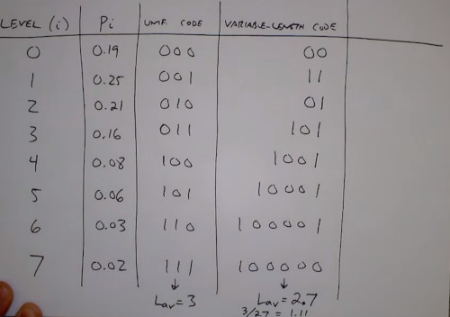

What's the best you can do? 
- related to Entropy of the distribution
- How uncertain a random variable is
- Worst case scenario is uniform distribution, everybody is equally likely
- Best case is delta or deterministic
    
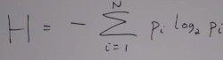
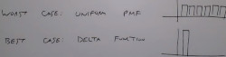

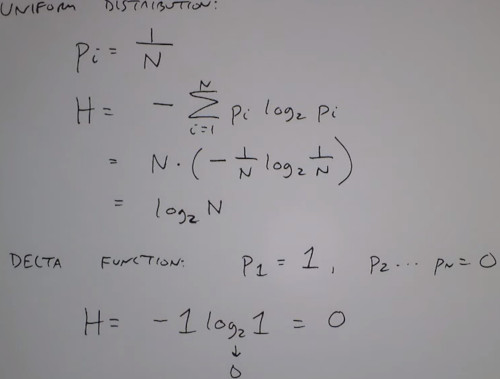

The entropy is the lowest number of average bits per symbol that can be used to code the distribution


### Huffman coding
How to design code that approach that entropy Value
- For independently coding N symbols

1. Arrange symbols in decreased number of probabilites (think of them as nodes/leaves of a tree)
2. Merge 2 nodes with lowest probability
3. Assign 0/1 to the top/bottom of that branch
4. Read code from root to leaf

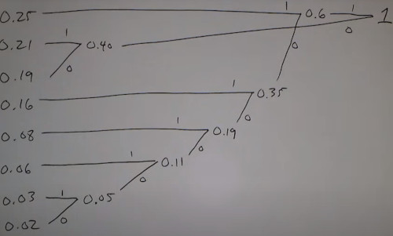

And that's what we got in the previous table

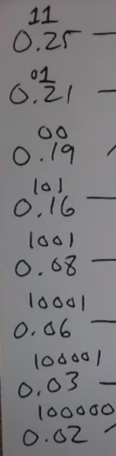


Bonus: The Huffman code is a **prefix code** No codeword is a prefix of any other codeword
- its easier to decode instanstaneously (don't need to wait next symbol to determine the current one)
  
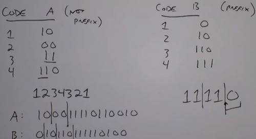


Can do better considering pairs of symbols or more.
- instead of looking for symbols independently, can match pair of symbols

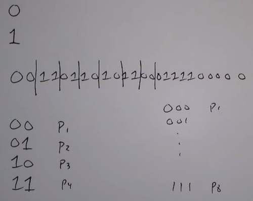

### Truncated Huffman coding
The lengths of the code, that occour very often takes very long.
- to avoid extremelly long codewords for infrequent symbols

Huffman code for most probable K symbols in the source
- Then replace the rest with a prefix + a fixed length code
- Little worst than Huffman, but with fixed length bits

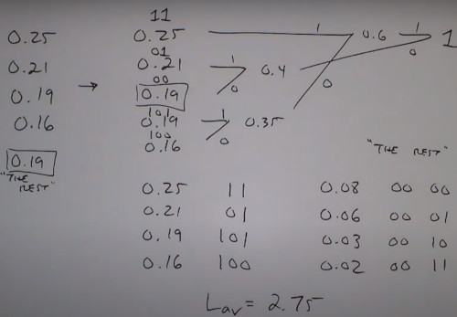

## Lempel-Ziv Coding
Basis for
- Gif
- Tiff
- PNG
- ZIP
- PDF

1. Parse the source string sequentially into 'Phrases'
- 'strings' that haven't appeared before
2. Code each phrase by giving location of the **prefix** (fixed-length code) plus last bit


Keep looking until find the one i didn't seen
- (where did i see that pixel, new last symbol)

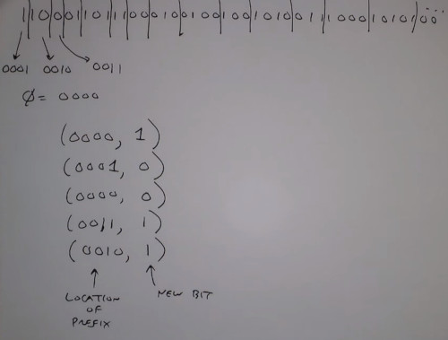

- Unlike huffman code, there's no knowledge of PDF of symbols
- Exploits how symbols occur together
- Really pays off for very long strings


### Run length Encoding (RLE)
There are some images that are very structured
- Fax, almost white

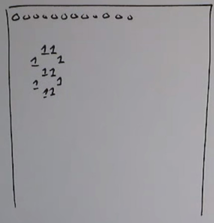

Encode the number of zeros between successive 1's
Or code the length of continuous Black/White rows

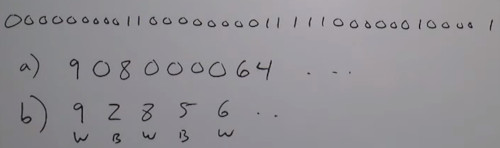

You can then apply huffman coding
