```
Author: Eichenbaum Daniel
Email: eichenbaum.daniel@gmail.com
```
This is a practical demo to understand the theory behind:
```
DIP Lecture 16: Lossy image compression ¬Rich Radke
  https://www.youtube.com/watch?v=wyb5S8QsCSA&list=PLuh62Q4Sv7BUf60vkjePfcOQc8sHxmnDX&index=19

Textbook: Sections 8.2.8 of Digital Image Processing
  Gonzalez and Woods, 3th ed.  
  https://www.amazon.com/-/es/Rafael-Gonzalez/dp/0133356728  
```

# Lecture 19: Lossy Image Compression

The idea behind Lossy compression is that some types of data are less sensitive to little change in values.
- You won't notice if an image had changed a bit
- Jpeg

Block Transform Encoding
- Given an $M\times N$ image
- Break it into $n\times n$ blocks (i.e. n=8,16)
- Apply forward $n\times n$ Transform for each block
- Quantize (round some information)
- Symbol Encoder
- Compressed Image File

Block Transform Decodeing
- Given the compressed image
- Symbol decoder
- Inverse $n\times n$ transform
- Resemble blocks
- Decompressed image

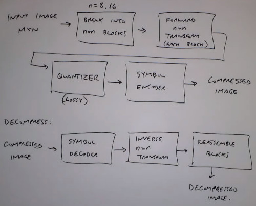

There's a choise of which 2D transform to choose
- We've seen the DFT, but it has complex values
- Discrete Cosine Transform DCT (jpeg)
  - Has only real values
  - compact energy into low frequency
- wavelet transform is used in jpeg 2000
- Hadamart
- Haar

DCT transform is as follows:
- from 8 x 8 block pixels to 8 x 8 block coefficients
  
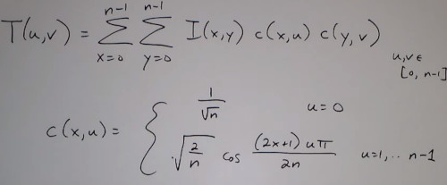

One opportunity for compression is **Zonal Coding**
- How many bits per coeficcient as a function of $(u,v)$
- The fact is that we expect the important information in the top left position.

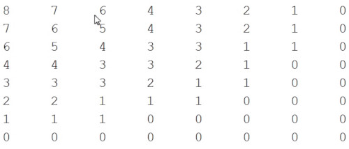

An alternative is to use **Threshold coding**
- Select the largest coefficients, throw others away
- Select coefficient that account (say) 95% energy of the total energy in the block
- Select all coefficients (whose magnitud +/-) above a threshold $\tau$

Last two are a bit more adaptive (variable size image) different blocks have different coefficients


### JPEG
1. Specify Normalization Matrix $T(u,v)$
- How many levels for each coefficient
- How to make the quantization
  
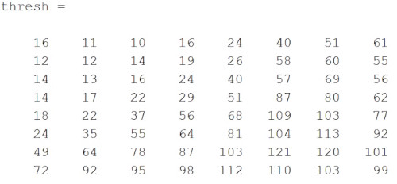

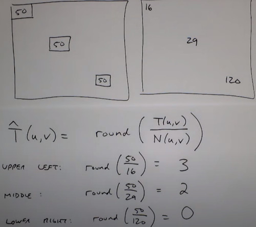

What i reconstruct when i decompress

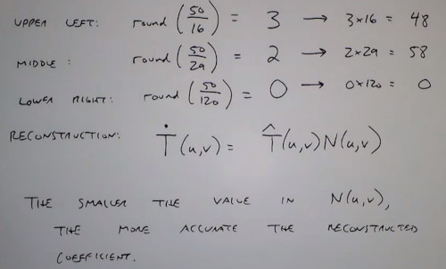

To adjust the 'JPEG Quality' the normalization matrix $N(u,v)$ can be multiplied by a
- less than 1 number for a Higher quality
- greater than 1 number for a lower quality

When zoomed out with low resolution you start seeing the 8 x 8 block

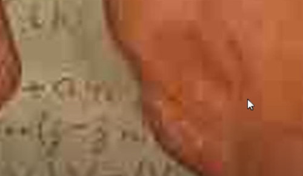

### Further detail
After quantization, Jpeg re-orders the coefficients in a zig-zag pattern, then applies a lossless compression alogirthm
- Huffman, RLE, etc.


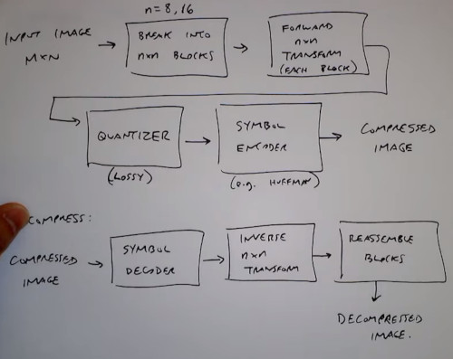

Demo:

Original Block of JPEG coefficients

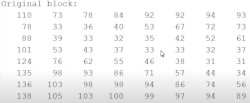

Substract 128 just to the average of coefficients is zero.

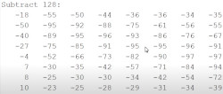

Apply DCT, so many coefficients are zero in the high frequency.

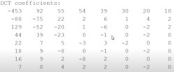

Applies the quantization matrix 

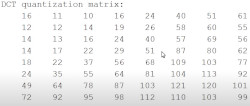

The result of dividing the last matrix by the previous one is:
After quantization we got a lot zeros

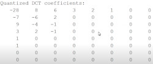

Now we apply Zig-Zag ordering
- from the top corner in diagonal sequence.
- You get a list of numbers
  
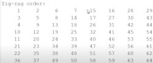

**NOTE** Zig zag encoding tries to left behind all high frequency zeros to the end of the list.

Then applies a lossless compression to that list of numbers
- huffman coding


DC coefficient is coded diferently, separetely with respect of the DC for the previous block

For Color, you convert to a luminance/Chrominance colorspace.
- Intensity + 2 color channels

The intensity is coded as described before, while the color channels as the eye is less sensitive to color intensities,
- Chroma channels are coded at lower Bitrate
- Maybe 4x4 blocks instead of 8x8


## Predictive Coding
Take something from the previous step, predict what's going to happen in the next step and then code the error between my prediction and what actually have.

The Hypothesis is that the errors are going to have a much tighter distribution, meaning they're easier to code.
- Images have a better correlation between neighboring pixels,
- so use previous pixels to predict the value of the next pixel.
- Simply code the error in the prediction

Instead of coding blocks, suppose we are coding pixel values
- Predict value from a sequence
- Predict value from a neighborhood

As i don't need to look ahead, this system is causal.

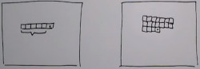

Take the original image, as a streamer of values
- Make a prediction of the current pixel value

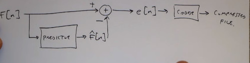

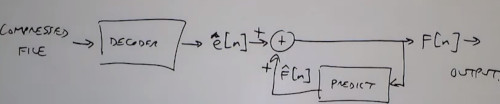

The idea is to reduce the entropy of the distribution.

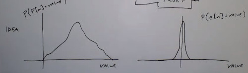

The predictive process could be an autoregressive process.
- Weighted average of pixels in row.

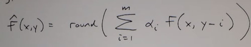

Also could be applied to any neighborhood.

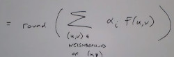

- if lossless of $e[n]$ there's no problem
- If lossy coding of $e[n]$ then we also need the quantizer inside the predictor to ensure the compressor/decomressor agree on predictions.

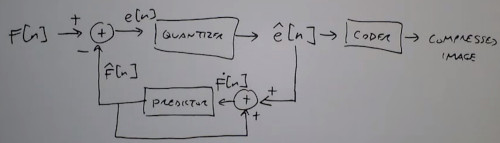


## Video Compression
Think of a series of image compression problems, images are spaced very closely 1/24 of sec

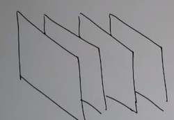

Many of video compression algorithms use **Block based motion compensation**.

### MPEG-1
I define whats called a group of pictures (GOP)
- i'm going to code this video in this group of pictures. (e.g. 15 frames)


**I** frame stands for 'independently coded frames' 
**P** frame stands for 'predict macroblocks based on previous P or I frame'

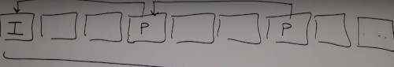

The prediction process is trying to find that location in the I frame.
- Try to find the best mesh

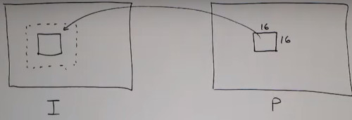

Instead of coding **P** pixel by pixel, 
- Send the **Motion vector** + Residual Block

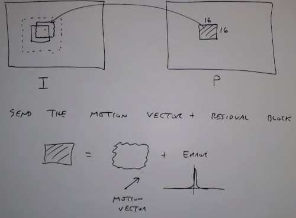

For the other blocks called **B** frame
- Bidirectional Frames
- you can predict macroblocks from P/I frames in either side.

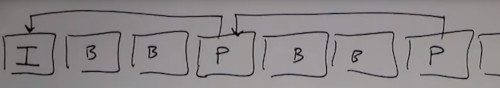

Anything between P/I can be allucinated...

This way you achieve compression rates really high
